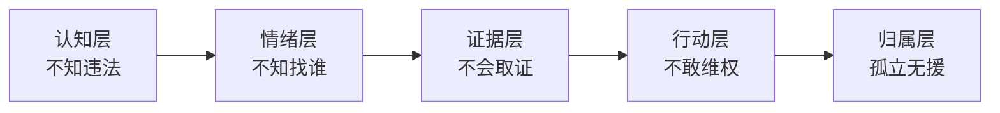
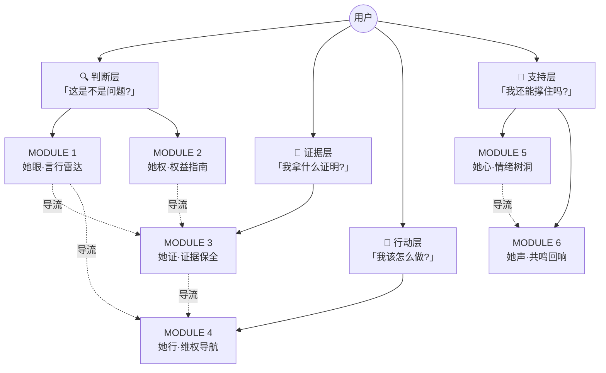

# 「她盾」项目介绍

> **2026 腾讯开悟全球 AI 公开赛 · D06 法律 AI 应用创新与实践**
> 第十七届中国大学生服务外包创新创业大赛 AI 专项赛
> 团队:她说了算队

---

## 1.1 项目基础信息

| 项目要素 | 内容 |
|----------|------|
| **项目名称** | 「她盾」——职场性别权益守护智能体 |
| **参赛赛道** | 2026 腾讯开悟全球 AI 公开赛 · D06 法律 AI 应用创新与实践 |
| **团队名称** | 她说了算队 |
| **作品链接** | https://huangjwwen.github.io/her_shield/ |
| **代码仓库** | https://github.com/Huangjwwen/her_shield |
| **核心技术栈** | 腾讯元器(5个智能体) + 腾讯 CloudBase 后端 + 得理开放平台 + 北大法宝 + Vanilla JS + Web Crypto |
| **开发工具** | CodeBuddy / Claude Code |
| **一句话定位** | 在职场遭遇性别歧视或性骚扰?先别慌,我们帮你接住这一刻。 |
| **核心价值** | 让每一位职场女性在面对性别歧视或性骚扰时不再孤立无援——知道自己有什么权利、知道对方哪里违法、知道下一步怎么办。 |
| **目标用户** | 求职期及入职初期女性;遭遇职场性别不平等或性骚扰的在职女性 |

### 项目宣言

> **你的身后,站着一个懂法更懂你的"她"**
>
> AI 驱动的职场女性权益守护伴侣
> 精准识别 · 证据保全 · 路径指引 · 情感支持
>
> 在你犹豫时,给你破局的底气
> 在你受伤时,给你拥抱的温度

---

## 1.2 项目需求分析

职场性别歧视与性骚扰问题隐蔽而普遍,呈现「**隐形化、举证难、维权贵**」三大特征。

### 1.2.1 市场数据

| 数据 | 来源 |
|------|------|
| **60.9%** 的求职女性被询问婚育情况 | 智联招聘 2026 调查报告 |
| 职场性别歧视案件原告胜诉率 **< 30%** | 中国裁判文书网数据 |
| 性骚扰受害者中仅 **7%** 最终选择报警或起诉 | 全国妇联统计 |
| "职场性骚扰"话题阅读量超 **12 亿**,多为匿名吐槽 | 社交媒体数据 |

### 1.2.2 五层用户困境

| 层级 | 困境 | 具体表现 |
|------|------|----------|
| 认知层 | **不知违法** | 70% 女性遭遇歧视却不知违法,法律条文晦涩,信息碎片化 |
| 情绪层 | **不知找谁** | 愤怒、羞耻、害怕交织,缺乏即时低门槛的情绪承接渠道 |
| 证据层 | **不会取证** | 不清楚保存什么怎么保存,事后补救往往证据已灭失 |
| 行动层 | **不敢维权** | 担心报复、不了解流程、律师费高昂,缺乏可操作指南 |
| 归属层 | **孤立无援** | 缺少安全匿名的倾诉渠道,受害者易陷入孤立感 |

### 1.2.3 竞品分析

「她盾」填补国内「**职场性别权益 + AI 智能体**」垂直赛道空白:

| 方案 | 即时响应 | 法条精准 | 取证指导 | 场景垂直 | 低门槛 | 情感支持 |
|------|:--------:|:--------:|:--------:|:--------:|:------:|:--------:|
| 通用法律咨询平台(律图、找法网) | ✗ | ✓ | ✗ | ✗ | ✗ | ✗ |
| 女性社区(小红书、豆瓣小组) | ✓ | ✗ | ✗ | 部分 | ✓ | ✓ |
| 传统法律援助(妇联、援助中心) | ✗ | ✓ | 部分 | ✓ | ✗ | 部分 |
| **「她盾」(本作品)** | **✓** | **✓** | **✓** | **✓** | **✓** | **✓** |

### 1.2.4 真正的差异化

很多项目在做"AI + 法律",但我们做的是**「弱势情境下的决策辅助系统」**:

| 维度 | 传统法律 AI | 「她盾」 |
|------|------------|---------|
| 🧠 认知辅助 | 仅检索法条 | 在用户被情绪裹挟时,接管复杂的法律逻辑分析,提供客观判断 |
| 🧭 行动引导 | 给一份"百科" | 把抽象路径拆解为"下一步做什么"的具体指令 |
| 💖 心理缓冲 | 无 | 承接焦虑与恐惧,用共情式交互让用户感到"背后有人" |

---

## 1.3 项目使用场景

### 场景一:面试遭遇婚育隐形歧视(求职期)

**用户画像:** 小李 · 25 岁应届生 · 面试互联网公司产品经理岗

**痛点:** 面对 HR 关于"近期是否有结婚/生育计划"的追问,感到被冒犯却不知如何得体反击,担心拒绝回答会丢 Offer。

| 步骤 | 用户动作 | 系统响应 |
|---|---|---|
| 1 | 面试结束后立即打开「**她眼·言行雷达**」,输入 HR 的追问原话 | 5 秒内返回**结构化报告卡**:风险等级**中危**、性骚扰要件分析、法条引用、三句应对话术 |
| 2 | 查看法律定性 | 系统判定该问题涉嫌违反《妇女权益保障法》第 43 条,属于就业性别歧视;提示"这并非你的问题,无需自我怀疑" |
| 3 | 一键复制话术 | 获取高情商回应——"这个问题涉及个人隐私,与岗位胜任力无关,我们可以聊聊我的项目经验吗?" |
| 4 | 若因此未被录用 | 「**她行·维权导航**」给出向劳动监察大队投诉的具体流程与证据清单 |

**结果:** ✅ 小李不再内耗,当场用生成的话术礼貌反问,面试官意识到失言并道歉,面试顺利进入下一轮。

---

### 场景二:孕期被恶意调岗降薪(在职博弈)

**用户画像:** 张女士 · 32 岁 · 怀孕 4 个月 · 被口头通知调至边缘行政岗、薪资减半

**痛点:** 领导口头施压,未发红头文件,既想保住孩子又不想丢掉原本的高薪职位,陷入恐慌。

| 步骤 | 用户动作 | 系统响应 |
|---|---|---|
| 1 | 进入「**她权·权益指南**」描述现状 | 立刻显示:《妇女权益保障法》第 48 条明确禁止因怀孕降低工资或单方调岗 |
| 2 | 切到「**她证·证据保全**」 | 生成取证攻略:指导张女士给领导发微信"领导,关于您刚才口头提到的调岗降薪决定,我想确认一下从哪天开始生效?"——将口头通知转化为书面证据 |
| 3 | 「**她行·维权导航**」规划三步走 | 发送《被迫调岗异议函》 → 正常打卡考勤 → 申请劳动仲裁 |
| 4 | 「**她眼·言行雷达**」二次确认 | 输入"怀孕被降薪",获得高危判定 + 上海港行案(沪 02 民终 6339 号)类案参考 |

**结果:** ✅ 攻守逆转。公司收到正式的《异议函》及完整的证据链后,意识到违法成本过高,主动撤回调岗通知,恢复原薪资待遇。

---

### 场景三:深夜遭遇职场性骚扰(危机应对)

**用户画像:** 王女士 · 28 岁 · 深夜收到直属领导露骨的暧昧微信

**痛点:** 感到恶心、恐惧,担心截图留证会激怒领导导致被穿小鞋,更担心没人相信自己。

| 步骤 | 用户动作 | 系统响应 |
|---|---|---|
| 1 | 第一时间进入「**她心·情绪树洞**」 | AI 温柔接住情绪:"这不是你的错,你不需要为他人的越界行为感到羞耻。" |
| 2 | 切到「**她证·证据保全**」 | 系统一步步指导:如何完整截图(含对方微信号、时间轴) → 如何录屏 → 如何申请可信时间戳 — 确保证据法律效力,且不打草惊蛇 |
| 3 | 「**她声·共鸣回响**」 | 看到类似案例的胜诉经历,确认"这不是潜规则,而是违法",获得反击的勇气 |
| 4 | 「**她眼·言行雷达**」生成正式举报话术 | 一键生成可直接发给 HR 的实名举报模板 |

**结果:** ✅ 证据链闭环。王女士在掌握完整证据后向公司合规部实名举报,公司介入调查并处理了涉事领导,王女士获得了应有的尊重与赔偿。

---

## 1.4 关键功能说明

「她盾」由 **6 大功能模块**构成,围绕「识别 → 取证 → 行动 → 支持」四层任务模型,**每一层各司其职,模块之间相互导流**。

### 🔍 判断层 — 让用户"看清"

#### MODULE 1 · 她眼·言行雷达

**识别职场不当言行,提供应对建议**

用户输入面试问题、聊天记录或场景描述,AI 通过**三节点工作流**进行专业分析:

1. **宽松门控判断(召回优先)** — 快速筛出可能涉及性别歧视或性骚扰的内容
2. **结构化案情要素抽取** — 客观提取事实信息,输出标准 JSON
3. **要件式法律评估与温暖回应** — 输出风险等级 + 法条引用 + 类案匹配 + 三级话术 + 温情叙事

设「友好提示」及「通用建议」两条降级分支保证可用性。**特别设计反误判机制**——若用户认为 AI 将自己的求助误判为"不涉及",可一键触发**深度分析**,跳过门控直接进入要件式评估,确保即使算法犯错,用户也有发言权。

**功能亮点:**
- ⚡ 宽松门控 + 召回优先,5 秒内给出明确结论,不漏判
- 🔁 反误判机制:一键触发深度分析,跳过门控直达专业评估
- 📋 结构化案情要素抽取,为后续评估提供精准输入
- ⚖️ 要件式法律评估:行为与性有关 / 违背意愿 / 职场情境三要件
- 📖 法条引用(《妇女权益保障法》《女职工特别规定》等)+ 类案匹配(法院/案号/年份/裁判要点),增强说服力
- 💬 三级话术生成(gentle/firm/formal),适配不同沟通场景
- 🎚️ 风险四级映射(高危/中危/低危/无风险)由代码节点确定性映射,告别"同问不同答"

**标签:** `宽松门控` `反误判机制` `要件式评估` `法条引用` `类案匹配` `3 级话术` `情绪安抚` `核心差异化`

---

#### MODULE 2 · 她权·权益指南

**快速检测权益状况,明确维权方向**

用户描述职场场景(求职/在职/孕期/哺乳期等),智能体列出**法定权利清单**并附法律依据(法律名称 + 条款序号),用白话解释每条权利。

**功能亮点:**
- 🎯 场景化匹配,精准定位用户所处阶段
- 📊 权利清单可视化,一键获取完整权益图谱
- 🔍 法律依据可追溯,增强维权底气

**标签:** `场景化权利清单` `法条引用` `白话解释` `温馨提示`

---

### 🧾 证据层 — 让用户"有底气"

#### MODULE 3 · 她证·证据保全

**专业指导证据收集,增强维权底气**

引入**证据链思维**,提供**操作级取证指导**:
- 口头提问 → 「**确认式追问**」转化为文字证据
- 聊天记录 → **截图 + 录屏 + 导出**三步走
- 合法录音边界(参与对话、不剪辑)
- **可信时间戳**固化关键证据

内置怀孕调岗、聊天记录骚扰、监控盲区等**六大典型场景**专项指导,帮助用户构建「时间-地点-人物-行为-后果」的完整证据闭环。

**前端技术亮点:**
- 🔐 **浏览器端 Web Crypto SHA-256 哈希指纹**:用户上传截图、文档后,前端浏览器内直接计算 SHA-256,**原文件永不上传服务器**,只存储指纹
- 📄 **自动生成《存证凭证》**:包含文件名、SHA-256 哈希值、时间戳,可下载留档,**支持事后防篡改演示**(再次上传同文件,验证哈希一致)
- ☑️ **结构化取证清单(checklist)**:把原本一大段文字结果升级为**可勾选 checklist + 进度条**,完成度实时可见
- 📚 **案型 → 证据规则库**:内置 6 大典型场景的取证规则,AI 自动把用户描述分类到对应案型,并按规则生成对应取证项

**功能亮点:**
- 🔗 证据链思维引导,告别零散无效取证
- 📋 六大典型场景专项方案,覆盖高频维权痛点
- ⚖️ 合法边界提示,避免因取证不当反被追责
- ☑️ 可勾选清单 + 进度条,从"读完就忘"升级为"逐项确认"

**标签:** `证据链思维` `操作级指导` `SHA-256 指纹` `存证凭证` `防篡改` `结构化 checklist` `案型规则库` `进度条` `合法录音边界` `时间戳固化` `核心差异化`

---

### 🧭 行动层 — 让用户"能行动"

#### MODULE 4 · 她行·维权导航

**全流程维权路径,专业步骤指导**

**六步阶梯路径**(现场反应 → 内部投诉 → 行政举报 → 劳动仲裁 → 法院诉讼 → 专业帮助),提供:
- 关键时效(**仲裁 1 年 / 起诉 15 日**)
- 所需材料清单
- 具体操作话术
- 配合/不配合两种分支建议

**功能亮点:**
- 📊 阶梯式路径拆解,降低维权心理门槛
- ⏰ 关键时效强提醒,避免错过维权窗口期
- 📞 内置维权热线一键转接(**12333 劳动监察 / 12338 妇联 / 12348 法律援助 / 12388 纪检监察**)
- 🔀 分支决策支持,适配不同用户的选择偏好

**标签:** `6 步维权路径` `时效提醒` `分支决策` `模板话术` `热线一键转接`

---

### 💬 支持层 — 让用户"不崩溃"

#### MODULE 5 · 她心·情绪树洞

**情感倾诉支持,暖心陪伴倾听**

AI 扮演温暖陪伴者,核心原则「不解决问题,只接住情绪」——
1. 承认感受(用用户原词)
2. 正常化处境(不评判)
3. 表达陪伴(轻轻托住)

**特别设计:**
- 🚨 **危机干预弹窗(强制层)**:识别"自杀""活不下去"等高危关键词后,**强制显示求助弹窗**,提供心理援助热线 400-161-9995 + 紧急联系建议。**该弹窗不会被任何后续普通回复覆盖**,确保紧急信息触达
- 🧠 **CBT 轻度支持逻辑**:升级 harbor 智能体 Prompt,对自我否定、灾难化、过度自责等表达,温和的"重新理解",但**不让用户觉得被"教育"**,保持朋友聊天感
- 🔊 **SpeechSynthesis 语音引导**:基于浏览器原生 SpeechSynthesis API,**支持播放 / 停止放松引导词**,在情绪密集时段提供听觉陪伴(无需服务器,纯前端实现,隐私零外传)
- 🚫 禁止把痛苦快速"正能量化",允许负面情绪存在

**功能亮点:**
- 💖 情绪优先原则,先安抚再引导
- 🌈 非评判式回应,营造安全倾诉空间
- 🫂 共情式交互设计,缓解用户孤独感
- 🚨 自伤倾向自动干预(强制弹窗,不可关闭覆盖)
- 🔊 浏览器内语音引导,触觉与听觉双通道安抚

**标签:** `情绪承接` `有温度陪伴` `不评判不说教` `CBT 轻度支持` `危机干预强制弹窗` `SpeechSynthesis 语音` `核心差异化`

---

#### MODULE 6 · 她声·共鸣回响

**分享维权经历,互助成长社区**

匿名故事社区,用户浏览他人维权经历与心得,打破「**只有我一个人遇到这种事**」的孤立感,在情感上感受同伴支持,在实践上获得真实案例参考。

**内容来源:** 所有故事**改编自真实判例和新闻**(脱敏处理),不编造、不杜撰。

**后端架构:**
- 📁 **CloudBase 云数据库**持久化存储用户投稿故事,支持千万级文档
- 🎭 **自动脱敏**:发帖时自动识别并打码**手机号 / 身份证号 / 邮箱**等敏感信息,即使用户不小心写入也不会泄露
- 🏷️ **标签筛选**:按"性别歧视 / 性骚扰 / 怀孕调岗 / 同工不同酬"等主题筛选
- 🔄 **本地 + 云双层**:localStorage 即时展示历史浏览 + CloudBase 真社区存储新投稿

**功能亮点:**
- 🎭 匿名化保护 + 自动脱敏双保险
- 📚 真实案例库,提供可复制的维权经验
- 🤝 同伴互助机制,构建情感支持网络
- 🏷️ 主题标签筛选,精准查找同类经历

**标签:** `匿名经历分享` `互助社区` `打破沉默文化` `真实判例改编` `三类敏感信息自动脱敏` `CloudBase 持久化`

---

## 1.5 评测与质量保障

为对齐"AI 给出的判定是否专业、可信",我们构建了**标准化评测体系**:

| 评测维度 | 数据 |
|---|---|
| 测试集规模 | **100 条** = 50 精标 + 50 变体 |
| 案例锚定 | **17 条**直接锚定具体司法判例(含案号 + 法院 + 年份) **6 条**锚定法律条文明文禁止 **27 条**由判例规则推导 |
| 变体策略 | 同义改写 / 细节扰动 / 干扰句 / 要件边界 / 长文本扩展 5 类 |
| **整体准确率** | **79.0%** (95% CI 71.0% – 87.0%) |
| **高危召回率** | **90.0%** (45/50)— **法律 AI 最关键指标** |
| **无风险准确率** | **100%** (16/16)— 不刷存在感 |
| **±1 级容忍准确率** | **96.0%** — 误差仅在相邻一级 |
| 方法学 | 标注者只标"事实层要件状态",**风险等级由产品同一份代码自动映射**,标准答案与产品输出走同一映射代码,差异只来自 AI 对事实的判断 |

测试集、评测脚本完整开源,所有标注理由公开在 `eval/test_set.json` 的 `notes` 和 `anchor` 字段。
