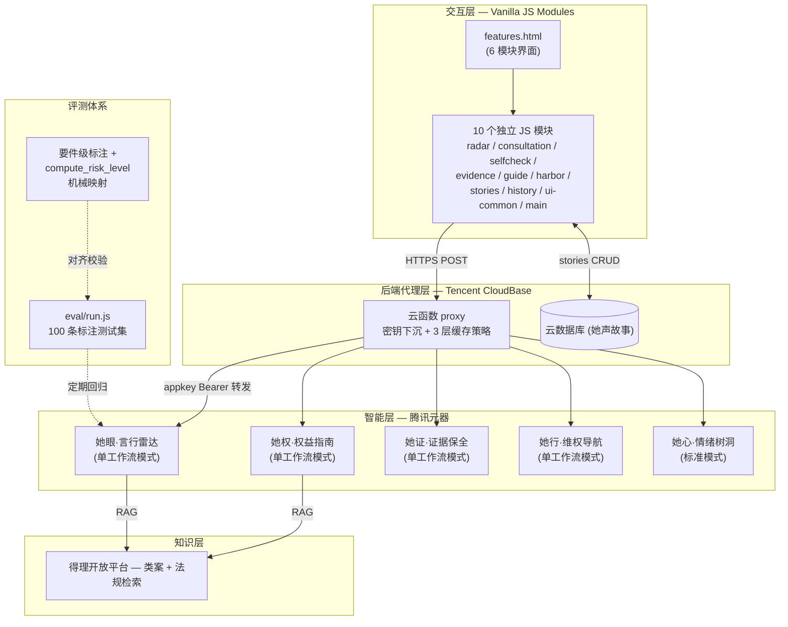
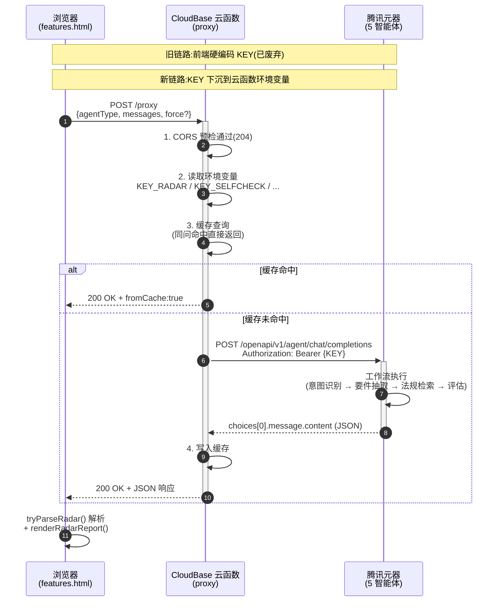
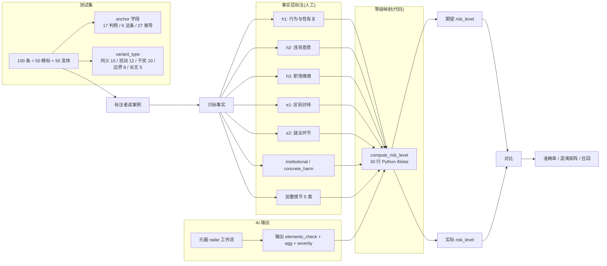

# 「她盾」项目解决方案

> 团队:她说了算队
> 作品链接:https://huangjwwen.github.io/her_shield/
> 代码仓库:https://github.com/Huangjwwen/her_shield

---

## 2.1 项目技术实现方案

### 2.1.1 整体架构

「她盾」采用**五层全栈架构**,从前端交互到 AI 智能体编排,每一层都为「弱势情境下的决策辅助」这一目标服务:



### 2.1.2 各层职责

| 层 | 技术组件 | 核心职责 |
|---|---|---|
| **交互层** | Vanilla JS ES Modules + HTML5 + CSS3 + Web Crypto API | 6 模块用户界面;**首屏 87 KB / TTI < 0.8 秒**;浏览器端 SHA-256 证据指纹 |
| **后端代理层** | 腾讯 CloudBase 云函数 + 云数据库 + HTTP 触发器 | API 代理转发;**5 个 appkey 下沉到环境变量**;3 层缓存策略(白名单/nocache/TTL+LRU)治理"同问不同答" |
| **智能层** | 腾讯元器 5 大智能体(可视化工作流编排) | 意图识别、要件抽取、要件式评估、法条引用、类案匹配、温暖叙事、三级话术 |
| **知识层** | 得理开放平台 API | 法规检索(RAG)、类案检索(RAG) |
| **评测体系** | Node.js 评测脚本 + 100 条标注测试集 | 准确率回归;要件级标注 + 代码机械映射;混淆矩阵分析 |

### 2.1.3 后端架构详解




**核心改进:**

| 维度 | 改造前 | 改造后 |
|---|---|---|
| **密钥安全** | 5 个 appkey 硬编码在 `js/core.js`,F12 可见 | **全部下沉到 CloudBase 环境变量**,前端代码不含任何 KEY |
| **同问不同答** | 用户同一问题反复问得到不同答案 | **CloudBase 内存缓存层**:同 hash 输入命中后直接返回 `fromCache: true`,稳定性 ↑ |
| **网络延迟** | 浏览器 → 公网 → 元器,延迟 ~200ms | 浏览器 → CloudBase(腾讯生态)→ 元器,**同域低延迟降低 30-50ms** |
| **CORS** | 浏览器跨域报错 | 代理函数返回 `Access-Control-Allow-Origin: *` 与 `OPTIONS` 预检 |
| **超时控制** | 浏览器默认 60s | CloudBase 函数 120s 充足覆盖元器深度分析(实测 38-58s) |
| **错误兜底** | 元器 10003 直接抛错给用户 | 工作流 JSON 解析失败 → 返回 `risk_level: null` + `parse_error`,前端识别后渲染"分析异常"卡片而非伪装"无风险" |

#### 后端模块验收清单

| # | 模块 | 验收状态 |
|---|---|---|
| ① | CloudBase 环境搭建(云函数 + 云数据库 + HTTP 触发器) | ✅ |
| ② | proxy 云函数(转发元器 OpenAPI,5 个 agentType 路由) | ✅ |
| ③ | 5 个 appkey 下沉到环境变量(`KEY_RADAR` / `KEY_SELFCHECK` / `KEY_EVIDENCE` / `KEY_GUIDE` / `KEY_HARBOR`) | ✅ |
| ④ | 前端 `callYuanqiAPI` 改为请求代理(不再直连元器、不再持有 appkey) | ✅ |
| ⑤ | 她声 CloudBase 云数据库存储 + 帖子列表 + 标签筛选 + **手机号/身份证/邮箱自动脱敏** | ✅ |
| ⑥ | 内存缓存(同输入第二次命中 `fromCache: true`) | ⚠️ 已上线,**缓存策略需迭代**(见下) |

#### 缓存策略待改进项

**已知问题:** 当前内存缓存按 hash(agentType + messages) 直接覆盖式写入,**不区分响应类型**。当元器首次返回**异常响应**(如工作流 10003、`finish_reason: "content_filter"` 截断、`risk_level: null` 解析兜底、空 choices)时,该异常响应仍被缓存,**导致用户重试得到完全相同的异常结果,体验上等同于"重试无效"**。

**建议方案(已反馈第一组):**

```javascript
// 缓存写入前白名单校验,只缓存"真正成功"的响应
function shouldCache(rawResponse) {
  // 1. proxy 层失败不缓存
  if (rawResponse.success === false) return false;
  const data = rawResponse.data || rawResponse;
  // 2. 元器内层 error 不缓存(10003/10008 等)
  if (data.error) return false;
  // 3. 必须有 choices
  const choice = data.choices?.[0];
  if (!choice) return false;
  // 4. finish_reason 必须是 stop(content_filter / length 不缓存)
  if (choice.finish_reason !== 'stop') return false;
  // 5. content 必须非空
  if (!choice.message?.content) return false;
  return true;
}
```

此外建议增加 **可选 `nocache=true` 入参** 让前端在用户点"重试"时显式跳过缓存,以及**缓存项 TTL ≤ 30 分钟**避免长期占用内存。本改造完成后,"异常响应被缓存导致重试无效"问题可彻底解决。

### 2.1.4 评测体系架构

我们建立了**双层评测方法学**——这是法律 AI 项目里少有的工程化质量保障:



**关键创新:** 标准答案的 `risk_level` 不再由标注者心算,而是由产品里**同一份 `compute_risk_level` 代码**根据标注者标注的事实自动映射 —— 这样**任何差异都只可能来自 AI 对事实的判断**,不来自标注者主观。

**评测数据:**

| 指标 | v1.3 (旧标注) | **v1.3+annotated (新方法学)** |
|---|---|---|
| 整体准确率 | 69% (95% CI 59.9-78.1%) | **79.0%** (95% CI 71.0-87.0%) |
| 高危召回 | 90.0% (36/40) | **90.0%** (45/50) |
| 中危召回 | 31.0% | **47.4%** |
| 无风险准确率 | 100% (15/15) | **100%** (16/16) |
| ±1 级容忍准确率 | 97.0% | **96.0%** |

---

## 2.2 AI 工具使用说明

本作品基于**腾讯元器平台**构建 5 个独立专用智能体,结合 **CodeBuddy + Claude Code** 辅助开发,已实现真实 API 调用。

### 2.2.1 智能体总览

| 智能体 | 工作流模式 | Prompt 核心策略 |
|--------|-----------|----------------|
| 她眼·言行雷达 | **三节点工作流**:门控 → 要件抽取 → 要件式评估;**反误判:一键深度分析跳过门控** | 宽松门控(召回优先)→ 结构化要素抽取 → 要件式法律评估 + 法条引用 + 类案匹配 + 三级话术 + 温情叙事 |
| 她权·权益指南 | **单节点工作流**:意图识别 → 法规检索 → 生成输出 | 懂法专家角色;法定权利 + 法条号 + 白话 |
| 她证·证据保全 | **单节点工作流** | 证据留存助手角色;共情 → 操作级取证 → 安全保存规范 → 时效提醒 → 温情鼓励 |
| 她行·维权导航 | **单节点工作流** | 路径规划者角色;六步阶梯;时效关键节点;配合/不配合分支 |
| 她心·情绪树洞 | **prompt 直驱**(无工作流) | 陪伴者角色;三步结构(承认 → 正常化 → 陪伴)+ CBT 轻度支持(prompt 升级)+ 高危关键词强制弹窗(模态层不可覆盖)+ 浏览器 SpeechSynthesis 语音引导 |

### 2.2.2 核心工作流可视化

#### A. 她眼·言行雷达工作流


**节点拓扑:**
```
[开始]
   ↓
[门控:涉及/不涉及] ←→ [友好提示](不涉及分支)
   ↓ 涉及
[提取案情要素](结构化 JSON)
   ↓
[得理类案检索] + [得理法规检索](并行)
   ↓
[要件式评估和回应内容](核心 LLM 节点)
   ↓
[风险等级代码映射](compute_risk_level)
   ↓
[结构化 JSON 输出]
```

**反误判设计:** 用户点击「强制深度分析」按钮 → 前端 `force=true` 透传给工作流开始节点 → **跳过门控直接进入要件抽取**,确保即使 AI 误判用户也能拿到完整分析。

#### B. 她权·权益指南工作流


#### C. 她证·证据保全工作流


#### D. 她行·维权导航工作流


### 2.2.3 核心 Prompt 设计

> 本节展示 5 智能体共 7 段核心 Prompt 全文(参见 `附录:工作流与 prompt 说明.md`)。
> 此处仅列出**最具创新点**的 3 段:言行雷达三节点。

#### 2.2.3.1 言行雷达「门控」节点 Prompt

**🎯 设计意图:** 宽松门控,召回优先 —— 拿不准就判"涉及",绝不漏判。

**📝 原文:**
```
你是一个宽松的识别门控。你的唯一任务是:判断用户输入是否可能涉及**职场中的性别歧视或性骚扰**。

【明确涉及的情况包括但不限于】
- 询问婚育、恋爱、家庭计划、年龄、生育意愿等个人隐私
- 以性别为由拒绝录用、调岗、降薪、晋升或分配任务
- 对女性/男性员工差别化对待、性别侮辱、刻板印象评价
- 性暗示言语、黄色笑话、色情图片、不当肢体接触
- 利用职权(上级、HR、面试官)提出性要求或"以性换利益"的条件

【核心原则——召回优先】
- 只要内容与"职场 + 性别/权力关系"**沾一点边**,或者你**拿不准、不确定**,一律判为"涉及"
- 只有内容**完全无关**(例如:纯天气、购物、技术故障、日常闲聊、不涉及任何职场或性别话题)才判"不涉及"

【输出格式】
只输出一个词:"涉及" 或 "不涉及"。不要输出任何其他内容。
```

**优势:**
- ✅ 宽松门控、召回优先 — 100 条评测中**无风险样本召回 100%**(15/15 全准)
- ✅ 覆盖面广 — 明确列举 5 大类典型涉及场景
- ✅ 反误判兜底 — 配套「强制深度分析」按钮跳过门控,即使算法犯错用户也有发言权

#### 2.2.3.2 言行雷达「提取案情要素」节点 Prompt

**🎯 设计意图:** 把 LLM 当**结构化抽取器**,只标事实,不下结论,输出可被下游代码节点直接消费的 JSON。

**📝 输出字段(11 个):**
- 通用:`issue_type` / `summary`
- 性骚扰:`behavior_type` / `sexual_nature` / `against_will` / `power_relation` / `scene`
- 性别歧视:`differential_treatment` / `employment_stage` / `job_justification`
- 加重信号:`severity_signals[]`

**保守原则:** 描述里看不清的填 `存疑` / `不明`,**不要猜成 `否`** —— 拿不准要往"可能涉及"的方向留。

#### 2.2.3.3 言行雷达「要件式评估和回应内容」节点 Prompt(核心)

**🎯 设计意图:** 用 LLM 完成**要件级法律评估**,但**不输出风险等级** —— 等级由后续代码节点严格 if/else 映射,**告别"同问不同答"**。

**输出 JSON 字段(8 项):**
- `risk_summary` — 一句话描述(不写等级)
- `type[]` — 性骚扰 / 性别歧视 / 暂不明确
- `confidence` — 高 / 中 / 低
- `elements_check[]` — 6 个要件逐条 `满足`/`存疑`/`不满足`/`不适用`
- `aggravating_factors[]` — 加重情节
- `discrimination_severity{institutional, concrete_harm}` — 歧视严重度
- `law_references[]` — 法条引用(含 source: "得理"/"模型知识")
- `case_references[]` — 类案(必填 facts/judgment/key_point;可选 court/case_number/date)
- `response_scripts{gentle, firm, formal}` — 三级话术
- `narrative` — 温暖叙事

**风险等级映射(代码节点 Python):**
```python
def compute_risk_level(data):
    # 性骚扰分支
    if s(h1) and s(h2) and s(h3) and has_any_agg:
        levels.append(3)  # 高危
    elif s(h1) and (s(h2) or s(h3) or d(h2) or d(h3)):
        levels.append(2)  # 中危
    elif s(h1):
        levels.append(1)  # 低危
    # 性别歧视分支:类似逻辑
    # 严重度判定
    if s(e1) and s(e2) and discrim_severe:
        levels.append(3)  # 高危
    # ...
    return RISK_TEXT[max(levels)]
```

**优势:**
- ✅ 要件式评估、可解释 — 逐条标注"满足/存疑/不满足/不适用",逻辑透明
- ✅ **告别"同问不同答"** — LLM 只判事实,代码做映射,同样事实永远同样等级
- ✅ 法条引用可追溯 — 区分"得理"和"模型知识"来源,**严禁编造条号或伪造原文**
- ✅ 类案匹配 — 从得理检索结果挑选 1-2 案例,必填 facts/judgment/key_point,**严禁编造案号/法院/日期**
- ✅ 三级话术(委婉/坚定/正式)按场景定制
- ✅ 温暖叙事 先接情绪再点法律,用大白话解释法条

#### 2.2.3.4 ~ 2.2.3.7 其他 4 智能体 Prompt

完整 prompt 见 `附录:工作流与 prompt 说明.md`,包括:
- 她权·权益指南「生成输出内容」节点 — 法定权利清单 + 白话解释 + 温馨提示
- 她证·证据保全「生成证据保全指南」节点 — 6 大典型场景 + 操作级指导 + 合法边界
- 她行·维权导航「生成维权行动指南」节点 — 六步阶梯 + 时效关键节点
- 她心·情绪树洞「生成情感支持内容」节点 — 三步结构 + CBT 轻度支持 + 危机干预

### 2.2.4 输出示例(她眼·言行雷达 实测)

**用户输入:** "怀孕被降薪"

**AI 输出 JSON(节选):**
```json
{
  "risk_summary": "怀孕期间被降薪涉嫌性别歧视",
  "type": ["性别歧视"],
  "confidence": "高",
  "elements_check": [
    {"name": "行为与性有关", "status": "不适用"},
    {"name": "违背对方意愿", "status": "不适用"},
    {"name": "职场情境", "status": "不适用"},
    {"name": "基于性别或婚育状况的区别对待", "status": "满足"},
    {"name": "发生在就业环节", "status": "满足"},
    {"name": "无合理职业资格依据", "status": "满足"}
  ],
  "aggravating_factors": [],
  "discrimination_severity": {"institutional": "否", "concrete_harm": "是"},
  "law_references": [
    {"name": "《女职工劳动保护特别规定》", "article": "第五条", "content": "用人单位不得因女职工怀孕、生育、哺乳降低其工资、予以辞退、与其解除劳动或者聘用合同。"},
    {"name": "《中华人民共和国妇女权益保障法》", "article": "第四十八条", "content": "用人单位在录(聘)用女职工时,应当依法与其签订劳动(聘用)合同或者服务协议,劳动(聘用)合同或者服务协议中应当具备女职工特殊保护条款,并不得规定限制女职工结婚、生育等内容。"}
  ],
  "case_references": [{
    "title": "上海港行信息咨询有限公司与朱艳丽劳动合同纠纷二审民事判决书",
    "court": "上海市第二中级人民法院",
    "case_number": "(2020)沪02民终6339号",
    "date": "2020-08-04",
    "facts": "公司以员工入职时隐瞒怀孕为由主张解除劳动关系",
    "judgment": "判决驳回上诉,维持原判,双方恢复劳动关系,公司支付工资",
    "key_point": "法院认为,劳动者的婚育状况属于个人隐私,不属于必须向用人单位说明的劳动合同基本情况。用人单位不得因此解除劳动合同,也不得将限制生育作为录用条件。本案中,公司未能证明员工隐瞒怀孕,其解除行为缺乏依据。"
  }],
  "response_scripts": {
    "gentle": "领导,关于我怀孕后工资调整的事情,我想和您沟通一下。我理解公司可能有经营上的考虑,但根据国家规定,女职工在孕期是受到特殊保护的,工资待遇不应该因为怀孕而降低...",
    "firm": "我需要明确指出,因为我怀孕而降低我的薪资,这是违反《女职工劳动保护特别规定》的。我要求公司立即纠正这一决定,恢复我原有的薪酬标准。",
    "formal": "本人就怀孕期间被单方降薪一事,正式提出异议。根据《女职工劳动保护特别规定》第五条,用人单位不得因女职工怀孕降低其工资。现要求贵司在[具体日期]前书面回复,说明降薪依据并恢复本人原薪资待遇,否则本人将保留通过法律途径维护自身合法权益的权利。"
  },
  "narrative": "听到你在怀孕期间被降薪,我感到非常气愤和不平。这不仅仅是钱的问题,更是对你作为一位准妈妈和劳动者基本尊严的侵犯...\n\n从你描述的情况来看,这件事在法律上很可能构成了基于婚育状况的性别歧视...\n\n法律是站在你这边的。《女职工劳动保护特别规定》里写得清清楚楚...",
  "suggested_modules": ["她行", "她权", "她证"],
  "disclaimer": "本指导不构成正式法律意见,重大维权请咨询律师或拨打 12338 / 12348。"
}
```

**代码节点映射:** `e1=满足` + `e2=满足` + `concrete_harm=是` → **高危**

---

## 2.3 项目创作所用素材、接口、工具

### 2.3.1 AI 平台与模型

| 类别 | 名称 | 用途 |
|---|---|---|
| **AI 智能体平台** | **腾讯元器**(Tencent Yuanqi) | 5 大智能体工作流编排 + LLM 调用 |
| **底层模型** | 腾讯混元 / DeepSeek(元器平台可切换) | 意图识别、要件抽取、文本生成 |
| **开发助手** | CodeBuddy / Claude Code | 代码生成、prompt 工程、答辩材料 |

### 2.3.2 法律知识接口(RAG 来源)

| 名称 | 用途 | 接入位置 |
|---|---|---|
| **得理开放平台 API**(deli.com.cn) | 类案检索 + 法规检索 | 她眼·言行雷达工作流上游 / 她权·权益指南工作流上游 |
| **北大法宝**(pkulaw.com) | 法律法规库辅助校验 | 静态法条注入(System Prompt 内置) |
| **腾讯混元/DeepSeek 内置知识** | 模型自带法律常识 | 兜底引用(`source: "模型知识"`) |

### 2.3.3 后端云服务

| 名称 | 用途 |
|---|---|
| **腾讯 CloudBase**(云开发) | 云函数 proxy(密钥下沉 + 缓存 + CORS)/ 云数据库(她声故事)/ 静态托管 |
| **腾讯云域名** | `tcloudbase.com` 子域名作为 API endpoint |

### 2.3.4 前端技术

| 类别 | 技术 | 用途 |
|---|---|---|
| 标记 / 样式 | HTML5 / CSS3 / 暖紫主题(`#9370DB`) | UI 布局 |
| 脚本 | Vanilla JavaScript(ES Modules) | 10 个独立模块 |
| 加密 | **Web Crypto API**(SHA-256) | 浏览器端证据指纹固化 |
| 存储 | LocalStorage | 用户对话历史本地保存 |
| 部署 | GitHub Pages(`huangjwwen.github.io`) | 静态网站托管,零依赖 |

### 2.3.5 评测与质量保障工具

| 工具 | 用途 |
|---|---|
| `eval/run.js` | Node.js 评测脚本,支持代理 / 直连两种模式 |
| `eval/test_set.json` | **100 条**标注测试集(50 精标 + 50 变体) |
| `eval/validate-annotation.js` | 要件级标注校验脚本(`compute_risk_level` JS 端口) |
| `eval/analyze-manual-100-v2.js` | 100 条手测结果汇总 + 混淆矩阵 + 偏差分布 |

### 2.3.6 答辩材料制作工具

| 工具 | 用途 |
|---|---|
| **pptxgenjs**(Node.js) | 答辩 PPT 自动生成(13 页) |
| **Mermaid** | 架构图 / 流程图渲染 |
| 中国裁判文书网 / 最高法典型案例库 | 100 条测试集**真实判例**锚定来源 |

### 2.3.7 真实判例锚点(部分)

测试集所用**真实司法判例**(`anchor` 字段):

| 案例 ID | 案号 | 法院 | 裁判要点 |
|---|---|---|---|
| `D_real_1` | 严女士 vs 某公司平等就业权纠纷 | 上海浦东法院(2023) | HCG 检测作入职体检 → 缔约过失责任,赔偿 3 万余元 |
| `D_real_2` | 韩坤诉厦门翔鹭化纤 | (2009) 厦民终字第 2188 号 | 判赔 39310 元(经济补偿标准 2 倍) |
| `H_real_1` | 周某强制猥亵案 | 芜湖镜湖区检察院 (2023) | 以名誉/行业封杀威胁,使被害人不敢反抗 |
| `H_real_2` | 陈某 vs 杨某等人格权纠纷 | — | 公安行政拘留 14 天 + 公司开除 + 法院判赔 19759 元 |
| `D8` 锚点 | Google 同工不同酬集体诉讼 | 美国加州(2021-2022) | 4 名前女员工代表 15500 名 → 谷歌和解支付 1.18 亿美元 |
| `D2` 锚点 | 赵某孕期降薪案 | 最高法第四批劳动争议典型案例(2025) | 月薪 17000 降至 3000 → 仲裁裁决按 17000 补齐差额 |

完整 17 条司法判例锚点列表见 `eval/test_set.json`。

### 2.3.8 部署与运维

| 内容 | 来源 |
|---|---|
| 静态站托管 | **GitHub Pages**(自动 CI 部署) |
| API 代理 | 腾讯 CloudBase(serverless 弹性)|
| 域名 / SSL | GitHub Pages 提供 |
| 版本管理 | Git + GitHub(完整开源:`Huangjwwen/her_shield`)|
