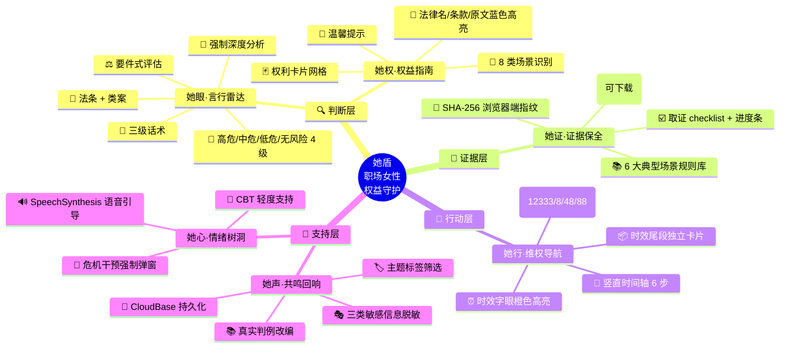
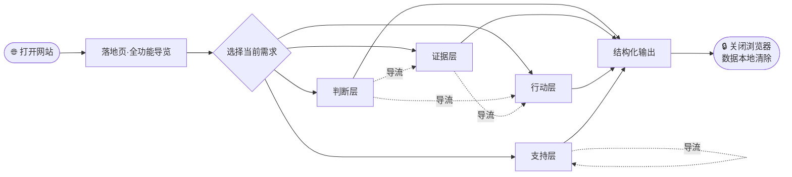

# 「她盾」项目说明书

> 团队:她说了算队
> 作品链接:https://huangjwwen.github.io/her_shield/
> 代码仓库:https://github.com/Huangjwwen/her_shield

---

## 3.1 项目总览

「她盾」是一款面向**职场女性**的 AI 法律陪伴工具,部署在公网,**零注册、零安装、打开即用**。用户在任意设备的浏览器中访问网站即可使用全部 6 大模块功能。

### 3.1.1 整体使用流程

**思维导图风格 — 中心向四周辐射,模块按"判断/证据/行动/支持"四层着色:**



**完整用户旅程(从打开到完成):**



### 3.1.2 关键设计原则

| 原则 | 实现 |
|---|---|
| **零注册** | 用户不需要登录,localStorage 本地存对话 |
| **零安装** | 纯 Web 应用,GitHub Pages 直接托管 |
| **隐私优先** | 用户输入不存储到服务器(除「她声」匿名故事自愿提交),证据指纹在浏览器内计算 |
| **召回优先** | 「言行雷达」门控宽松,拿不准就判涉及,绝不漏判;配套反误判按钮 |
| **结构化输出** | 所有判定结果为 JSON,法条 + 案号 + 法院 + 日期均可追溯 |
| **风险等级稳定** | 同样事实永远同样等级(代码节点确定性映射) |

---

## 3.2 各模块详细使用说明

### 3.2.1 她眼·言行雷达 — 识别职场不当言行

**入口:** 主导航 → 「她眼·言行雷达」

**使用步骤:**

| 步骤 | 操作 | 反馈 |
|---|---|---|
| 1 | 在输入框描述发生的事(如:"怀孕被降薪") | 输入框自动展开,可上传图片(聊天记录截图等) |
| 2 | 点击「**🔍 识别**」按钮 | 显示「分析中...」loading,约 30-60 秒 |
| 3 | 查看结构化报告卡 | 自上而下展示: |
| | | **① 风险标:** 高危 / 中危 / 低危 / 无风险 + 一句话摘要 |
| | | **② 暖心叙事 narrative:** 4-5 段温暖文字,先接情绪再讲法律 |
| | | **③ 三句话术:** 委婉 / 坚定 / 正式 三种语气,带"复制"按钮 |
| | | **④ 法律依据:** 法律名称 + 条款序号 + 原文 |
| | | **⑤ 相似案例:** 法院 + 案号 + 日期 + 案情 + 判决 + 裁判要点 |
| | | **⑥ 判定依据(可折叠):** 6 个要件状态 + 加重情节 + 严重度 |
| 4 | 若觉得 AI 判得不准 | 点击「**🔄 强制深度分析**」按钮,跳过门控重新分析 |

**界面元素:**

| 元素 | 位置 | 说明 |
|---|---|---|
| 输入框 | 顶部 | 多行文本框,placeholder 提示 |
| 上传图片按钮 | 输入框右下 | 仅言行雷达保留(其他模块已去除) |
| 识别按钮 | 输入框下方 | 主按钮(暖紫色) |
| 历史记录 | 输入框下方 | 时间倒序,可逐条删除 |
| 报告卡 | 历史记录每条 | 左侧颜色边框对应风险等级 |

**风险等级颜色规范:**

| 等级 | 颜色 | 边框色 | 背景色 |
|---|---|---|---|
| 🔴 高危 | `#E5484D` | 红 | 浅红 |
| 🟠 中危 | `#F76808` | 橙 | 浅橙 |
| 🟡 低危 | `#F5A623` | 黄 | 浅黄 |
| 🟢 无风险 | `#30A46C` | 绿 | 浅绿 |
| 🟣 异常 | `#9370DB` | 紫 | 浅紫(工作流解析失败时) |

---

### 3.2.2 她权·权益指南 — 查询法定权利(可视化升级)

**入口:** 主导航 → 「她权·权益指南」

**使用步骤:**
1. 在输入框描述当前所处的职场场景(求职 / 在职 / 孕期 / 哺乳期 / 调岗 / 解雇等)
2. 点击「立即查询」按钮
3. 查看**可视化权益图谱**

**核心特性(2026-06 升级):**

| 特性 | 说明 |
|---|---|
| 🎯 **场景识别头部** | 顶部胶囊标签自动展示识别到的场景(8 类:🤰 孕产期 / 🔍 求职 / 💼 在职 / 📉 薪酬调岗 / 🚪 解雇 / ⚠️ 性骚扰 / ⚖️ 性别歧视 / 🏥 医疗保障) |
| 🃏 **权利卡片网格** | LLM 自然语言被解析为结构化卡片(自适应 1-3 列),每卡:**序号徽标 + 权利名 + 蓝色法律引用胶囊 + 灰底法律原文段 + 💡 紫色白话解释** |
| 💎 **法律名/条款号/原文三级蓝色高亮** | `《...》` + `第X条` + 原文段 三个层级独立颜色,即使解析失败兜底为纯文本时也保留高亮 |
| 🌸 **温馨提示独立暖黄卡** | 跟主卡片网格视觉分层 |
| 🔄 **重试按钮** | 跳过缓存重新查询,治理"同问同答"问题 |

**示例输入:** "在职怀孕女性受到哪些法律保护"

---

### 3.2.3 她证·证据保全 — 取证指导 + SHA-256 指纹

**入口:** 主导航 → 「她证·证据保全」

**使用步骤:**
1. 在输入框描述需要取证的场景(如:"怀孕被调岗想留证据")
2. 点击「生成取证清单」
3. 查看**可勾选的结构化 checklist**:AI 自动按案型归类生成的取证项,每完成一项点击 ☑️,**进度条实时显示完成度**
4. (可选)在「**证据指纹**」区上传文件 → 浏览器端实时计算 SHA-256 → 显示哈希值 → **生成《存证凭证》**(含文件名 + 哈希 + 时间戳)→ 下载留档

**核心特性:**

| 特性 | 说明 |
|---|---|
| ☑️ **结构化 checklist** | 不再是大段文字,而是可勾选清单,完成情况一目了然 |
| 📊 **进度条** | 按勾选比例实时显示,降低用户"无从下手"的茫然 |
| 📚 **案型规则库** | 内置 6 大典型场景的证据规则;AI 自动分类用户描述到对应案型,按规则生成取证项 |
| 🔐 **SHA-256 指纹** | 浏览器端 Web Crypto 计算,原文件永不上传 |
| 📄 **《存证凭证》** | 文件名 + 哈希 + 时间戳,支持下载;后续可上传同文件验证哈希一致(**防篡改演示**)|

**SHA-256 指纹工作原理:**
```
用户选择文件 → FileReader 读取 ArrayBuffer
            ↓
window.crypto.subtle.digest('SHA-256', buffer)
            ↓
Uint8Array → hex string(64 字符)
            ↓
本地展示 + 生成《存证凭证》 + 复制到剪贴板
原文件永不上传服务器
```

**防篡改演示流程:**
```
原文件 → SHA-256 → 哈希 A → 保存《存证凭证》
                          ↓
                  (一段时间后)
                          ↓
存证凭证 + 待验证文件 → 重新计算 SHA-256 → 哈希 B
                          ↓
A == B ? → "未被篡改" / "已被篡改"
```

---

### 3.2.4 她行·维权导航 — 六步维权路径

**入口:** 主导航 → 「她行·维权导航」

**使用步骤:**
1. 在输入框描述遇到的不公(如:"怀孕被降薪我该怎么办")
2. 点击「查询维权路径」
3. 查看**竖直时间轴**:六步路径自顶向下排列

**核心特性(2026-06 升级):**

| 特性 | 说明 |
|---|---|
| 📏 **竖直时间轴渲染** | 每一步 = 一个紫色圆形数字徽标 ① ② ③ + 白色光环 + 暖紫渐变竖线连接,每步内容卡片化展示 |
| 📞 **热线胶囊化** | 12333 / 12338 / 12348 / 12388 自动转换为**暖黄色 📞 胶囊**,点击直接 `tel:` 拨号(移动端体验更佳) |
| ⏰ **时效字眼橙色高亮** | "1 年""15 日""3 年" 等关键时效自动 ⏰ 橙色胶囊,强提醒避免错过窗口期 |
| 📦 **时效尾段独立暖橙卡片** | 跟主时间轴视觉分层,关键信息一眼可见 |
| 🔄 **重试按钮** | 跳过缓存重新规划 |

**内置热线一键拨打:**

| 编号 | 部门 | 用途 |
|---|---|---|
| **12333** | 劳动监察 | 欠薪、违法调岗、不提供产假 |
| **12338** | 妇联 | 性别歧视、骚扰 |
| **12348** | 法律援助 | 免费法律咨询、援助申请 |
| **12388** | 纪检监察 | 涉公职人员 |
| **400-161-9995** | 心理援助 | 自伤倾向 |

---

### 3.2.5 她心·情绪树洞 — 共情陪伴 + 语音引导

**入口:** 主导航 → 「她心·情绪树洞」

**使用步骤:**
1. 在输入框倾诉(如:"我好难受""我感觉是我太敏感了")
2. 点击「我想倾诉」
3. 查看 AI 共情回应(承认 → 正常化 → 陪伴 三步结构,**已升级 CBT 轻度支持逻辑**)
4. (可选)点击「🔊 语音引导」播放放松引导词,再次点击停止

**核心特性:**

| 特性 | 说明 |
|---|---|
| 🧠 **CBT 轻度支持** | harbor 智能体 Prompt 升级,对自我否定、灾难化等表达温和"重新理解",**保持非说教、陪伴式体验** |
| 🔊 **SpeechSynthesis 语音引导** | 浏览器原生 API 直接合成语音,**无需服务器、无需联网模型**,隐私零外传;支持播放 / 停止 |
| 🚨 **危机干预强制弹窗** | 见下方说明 |

**危机干预触发(强制层):**

| 触发关键词 | 系统响应 |
|---|---|
| "自杀"、"活不下去"、"伤害自己"、"想死"等 | **立即强制弹出模态框**(本次会话内**不可被普通 AI 回复覆盖**):显示心理援助热线 400-161-9995 + 紧急联系建议 + 鼓励联系信任的人 |

**为什么"强制不可覆盖":** 早期版本中,危机弹窗有时会被后续普通 AI 回复滚动覆盖,导致用户在情绪激动时看不到求助信息。本次升级把危机干预弹窗提升到**模态层**,**只有用户主动关闭才能继续对话**,确保紧急信息一定触达。

---

### 3.2.6 她声·共鸣回响 — 匿名故事社区

**入口:** 主导航 → 「她声·共鸣回响」

**使用步骤:**
1. 浏览首页故事卡片(改编自真实判例和新闻)
2. 使用**顶部标签筛选**(性别歧视 / 性骚扰 / 怀孕调岗 / 同工不同酬 等),精准查找同类经历
3. 点击故事查看完整内容
4. (可选)点击「提交我的故事」匿名发布;发布前**前端自动扫描并打码**手机号、身份证号、邮箱等敏感信息;发布后存储至 CloudBase 云数据库,公开可见

**核心特性:**

| 特性 | 说明 |
|---|---|
| 🎭 **匿名化** | 无需注册,无需登录;不绑定身份 |
| 🔒 **三类敏感信息自动脱敏** | 发帖前正则识别 + 自动打码:**手机号**(11 位)/ **身份证**(18 位)/ **邮箱**(`@xxx.xxx` 格式),避免用户不小心写入泄露 |
| 🏷️ **标签筛选** | 按主题维度筛选故事,精准查找 |
| 📁 **CloudBase 真社区存储** | 故事持久化在云数据库,千万级文档容量 |
| 💾 **localStorage 本地缓存** | 历史浏览记录本地保存,无网络环境也能查看已读 |

---

## 3.3 完整 Demo 案例

### Demo 案例 1:她眼·言行雷达 — "怀孕被降薪"

#### 用户输入

```
怀孕被降薪
```

#### 系统响应(完整结构化输出)

**① 风险标**

> ● **高危**  怀孕期间被降薪涉嫌性别歧视

**② 暖心叙事**

> 听到你在怀孕期间被降薪,我感到非常气愤和不平。这不仅仅是钱的问题,更是对你作为一位准妈妈和劳动者基本尊严的侵犯。你此刻的委屈和担忧,我完全能够理解。
>
> 从你描述的情况来看,这件事在法律上很可能构成了基于婚育状况的性别歧视。简单来说,法律明文规定,不能因为女性怀孕、生育、哺乳就降低她的工资、辞退她或者给她"穿小鞋"。怀孕是女性的合法权益,不应该成为被不公平对待的理由。
>
> 法律是站在你这边的。《女职工劳动保护特别规定》里写得清清楚楚:"用人单位不得因女职工怀孕、生育、哺乳降低其工资"。简单说就是,怀孕期间,你的工资一分钱都不能少。在类似的情况里,法院也多次支持了孕期女职工的合法权益,明确指出婚育状况是个人隐私,不能成为被降薪、解雇的借口。
>
> 请相信,维护自己的权利不是"找麻烦",而是在捍卫法律赋予每个人的公平。你并不是一个人在战斗,有很多人和法律条文在支持你。
>
> 接下来,如果你想了解如何与公司正式沟通或投诉,可以看看「她行·行动导航」;想全面了解孕期女职工有哪些法定权利,可以参考「她权·权益指南」;如果想学习如何收集和保存证据,为可能的维权做准备,「她证·证据保全」模块会很有帮助。

**③ 你可以这样回应**

| 语气 | 话术 |
|---|---|
| 💗 **委婉** | 领导,关于我怀孕后工资调整的事情,我想和您沟通一下。我理解公司可能有经营上的考虑,但根据国家规定,女职工在孕期是受到特殊保护的,工资待遇不应该因为怀孕而降低。我们能不能一起看看,有没有其他更合适的安排? |
| 🟠 **坚定** | 我需要明确指出,因为我怀孕而降低我的薪资,这是违反《女职工劳动保护特别规定》的。我要求公司立即纠正这一决定,恢复我原有的薪酬标准。 |
| 💼 **正式** | 本人就怀孕期间被单方降薪一事,正式提出异议。根据《女职工劳动保护特别规定》第五条,用人单位不得因女职工怀孕降低其工资。现要求贵司在[具体日期]前书面回复,说明降薪依据并恢复本人原薪资待遇,否则本人将保留通过法律途径维护自身合法权益的权利。 |

**④ 法律依据**

- **《女职工劳动保护特别规定》第五条**
  用人单位不得因女职工怀孕、生育、哺乳降低其工资、予以辞退、与其解除劳动或者聘用合同。

- **《中华人民共和国妇女权益保障法》第四十八条**
  用人单位在录(聘)用女职工时,应当依法与其签订劳动(聘用)合同或者服务协议,劳动(聘用)合同或者服务协议中应当具备女职工特殊保护条款,并不得规定限制女职工结婚、生育等内容。

**⑤ 相似案例**

> **上海港行信息咨询有限公司与朱艳丽劳动合同纠纷二审民事判决书**
> 上海市第二中级人民法院 · (2020) 沪 02 民终 6339 号 · 2020-08-04
>
> - **案情:** 公司以员工入职时隐瞒怀孕为由主张解除劳动关系。
> - **判决:** 判决驳回上诉,维持原判,双方恢复劳动关系,公司支付工资。
> - **裁判要点:** 法院认为,劳动者的婚育状况属于个人隐私,不属于必须向用人单位说明的劳动合同基本情况。用人单位不得因此解除劳动合同,也不得将限制生育作为录用条件。本案中,公司未能证明员工隐瞒怀孕,其解除行为缺乏依据。

**⑥ 查看判定依据(可折叠)**

| 要件 | 状态 | 说明 |
|---|---|---|
| 行为与性有关 | `不适用` | — |
| 违背对方意愿 | `不适用` | — |
| 职场情境 | `不适用` | — |
| **基于性别或婚育状况的区别对待** | `满足` | 因怀孕这一与性别直接相关的婚育状况而遭受不利待遇 |
| **发生在就业环节** | `满足` | 发生在在职期间的薪酬调整环节 |
| **无合理职业资格依据** | `满足` | 怀孕本身不构成降低薪酬的合理职业资格理由 |

| 严重度 | 值 |
|---|---|
| 制度性 | 否 |
| **实质后果** | **是** |

**风险等级代码映射:** `e1=满足` + `e2=满足` + `concrete_harm=是` → **高危** ✅

---

### Demo 案例 2:她权·权益指南 — "在职怀孕女性受到哪些法律保护"

#### 用户输入

```
在职怀孕女性受到哪些法律保护
```

#### 系统响应

> 在职怀孕的女性,法律为你提供了多方面的保护,这些保护旨在保障你的健康、工作稳定和基本权益。下面我为你梳理一下主要的法定权利。
>
> **法律给你的权利包括:**
>
> · **不被随意解雇的权利**。根据《劳动合同法》第 42 条,用人单位在女职工孕期、产期、哺乳期,不得依照该法第 40 条、第 41 条的规定解除劳动合同。简单说,公司不能因为你怀孕、休产假或哺乳就单方面辞退你,除非你有严重违纪等特定情况。
>
> · **获得产假的权利**。根据《女职工劳动保护特别规定》第 7 条,女职工生育享受 98 天产假,其中产前可以休假 15 天;难产的,增加产假 15 天;生育多胞胎的,每多生育 1 个婴儿,增加产假 15 天。通俗讲,这是国家保障你生育后恢复身体和照顾宝宝的带薪假期。
>
> · **产假期间工资待遇不变的权利**。根据《女职工劳动保护特别规定》第 8 条,对已经参加生育保险的女职工,产假期间的生育津贴由生育保险基金支付;对未参加生育保险的,由用人单位按照女职工产假前工资的标准支付。这意味着,你休产假期间,收入来源是有保障的。
>
> · **不被因怀孕而降低工资、辞退、解除劳动合同的权利**,依据是《中华人民共和国妇女权益保障法》第 48 条,简单说就是公司不能因为你怀孕就给你降薪,更不能随便把你开除或者解除劳动关系。
>
> · **你享有在劳动时间内进行产前检查的权利**,所需时间计入劳动时间的权利,依据是《女职工劳动保护特别规定》第 6 条,就是说你去做产检的时间,公司要算你正常上班,不能扣你工资或者算你请假。
>
> · **你享有怀孕 7 个月以上不被安排延长工作时间和夜班劳动的权利**,依据是《女职工劳动保护特别规定》第 6 条,怀孕满 7 个月之后,公司不能让你加班,也不能安排你上夜班。
>
> · **你享有生育享受 98 天产假的权利**,其中产前可以休假 15 天,难产的增加产假 15 天,生育多胞胎的每多生育 1 个婴儿增加产假 15 天,依据是《女职工劳动保护特别规定》第 7 条,生宝宝的时候你有法定的产假可以休,遇到难产或者生多胞胎的情况还能多休对应的天数。
>
> · **你享有产假期间的生育津贴**,对已经参加生育保险的,按照用人单位上年度职工月平均工资的标准由生育保险基金支付;对未参加生育保险的,按照你产假前工资的标准由用人单位支付,依据是《女职工劳动保护特别规定》第 8 条,休产假的时候你也有收入,参加了生育保险就领生育津贴,没参加的话公司要按你之前的工资标准发给你。
>
> **温馨提示**
>
> 你可以留意保存好怀孕的相关证明、产检记录、工资发放记录等材料,要是后续遇到权益被侵犯的情况,这些都能作为相关证据。

---

## 3.4 评测数据与质量保障

### 3.4.1 评测体系

我们构建了 **100 条标注测试集** + 配套**评测脚本**(`eval/run.js`),所有评测过程公开可复现。

| 维度 | 数据 |
|---|---|
| 测试集规模 | **100 条** = 50 精标 + 50 变体 |
| 判例锚定 | **17 条**司法判例 + **6 条**法条 + **27 条**推导 |
| 变体覆盖 | 同义改写 15 / 细节扰动 12 / 干扰句 10 / 要件边界 8 / 长文本扩展 5 |

### 3.4.2 实测数据(2026-06-02 最新版)

| 指标 | 值 |
|---|---|
| **整体准确率** | **79.0%** (95% CI 71.0% – 87.0%) |
| **高危召回率** | **90.0%** (45/50) — 法律 AI 最关键指标 |
| **无风险准确率** | **100%** (16/16) — 不刷存在感 |
| 中危召回 | 47.4% (9/19) |
| 低危召回 | 60.0% (9/15) |
| **±1 级容忍准确率** | **96.0%** — 误差仅相邻一级 |
| 严重漏判(-2 级) | **仅 4 条** / 100 |
| 完全相反判定 | **0 条** / 100 |

### 3.4.3 方法学创新

**「事实层标注 + 代码机械映射」对齐校验**

- 标注者只标"要件事实"(行为与性有关 / 违背意愿 / 区别对待 / 就业环节 / 制度性 / 实质后果),**不标 risk_level**
- 风险等级由产品中**同一份 `compute_risk_level` 代码**自动映射
- 任何标准答案与产品输出的差异,**都只可能来自 AI 对事实的判断**,不来自标注者主观

**意义:** 答辩时可以直接说 — "**我们的标准答案与产品输出走同一份代码**"。

---

## 3.5 答辩材料与可复现性

| 资源 | 路径 | 用途 |
|---|---|---|
| 答辩 PPT | `docs/她盾_答辩_v0.5.pptx` | 13 页正式答辩稿 |
| 答辩文稿(逐页) | `docs/答辩文稿_完整版.md` | 10 分钟演讲 + 5 分钟 Q&A 15 题 |
| 工作流详细说明 | `docs/附录:工作流与prompt说明.md` | 7 段核心 prompt 全文 |
| 标注指南 | `docs/标注指南.md` | 标注员填写规范 |
| 评测结果 v2 | `docs/eval_manual_100_report_v2.md` | 完整数据分析报告 |
| 测试集 | `eval/test_set.json` | 100 条 + 17 判例锚定 |
| 评测脚本 | `eval/run.js` | Node.js 评测 + 节流 + 重试 |
| 校验脚本 | `eval/validate-annotation.js` | 标注 → 代码映射对齐校验 |

**项目代码 100% 开源:** https://github.com/Huangjwwen/her_shield

---

## 3.6 工程亮点:缓存策略「3 道防线」

详细方案见 `BACKEND_CACHE_PROPOSAL.md`。这是针对"同问不同答 → 加缓存 → 异常响应也缓存 → 重试无意义"这一典型反模式的工程化解决:

| 防线 | 实现 | 效果 |
|---|---|---|
| ① **写入白名单 `shouldCache()`** | 代理只缓存 `finish_reason: stop` + content 非空的成功响应 | 工作流 10003 / 内容审查截断 / 解析失败响应**一律不缓存**,重试有意义 |
| ② **`nocache=true` 显式跳过** | 前端在用户点「强制深度分析」或「🔄 重试」时自动加该入参 | 100% 重新打元器,答辩演示不暴露 fromCache |
| ③ **30 分钟 TTL + 1000 LRU 上限** | 代理控制内存 + 元器侧改 prompt 后自动失效 | 长期运行不堆积,prompt 调整后用户无感升级 |

**前端 4 个模块已支持「🔄 重试」按钮:** 言行雷达 / 权益指南 / 维权导航 / 智能咨询

---

## 3.7 部署与访问

### 3.7.1 在线访问

直接访问:**https://huangjwwen.github.io/her_shield/**

无需注册、无需安装、任意现代浏览器(Chrome / Edge / Firefox / Safari)即可使用。

### 3.7.2 本地运行(开发者)

```bash
git clone https://github.com/Huangjwwen/her_shield.git
cd her_shield
npx http-server . -p 8080
# 浏览器打开 http://localhost:8080/features.html
```

### 3.7.3 评测脚本运行

```bash
# 走代理(线上)
node eval/run.js --output eval/results.json

# 直连元器(需 KEY_RADAR)
node eval/run.js --direct --key <KEY_RADAR> --output eval/results-direct.json
```

---

## 3.8 团队成员与分工

> ⚠️ **待补充:** 请补充 4 位成员的姓名 / 学校 / 学号(如需)/ 各自负责模块

| 角色 | 负责模块 | 成员 |
|---|---|---|
| 法学背景 | 法条整理、要件式判定 prompt、100 条标注 | (待补) |
| AI / 算法 | 元器工作流编排、prompt 工程、评测体系 | (待补) |
| 前端 | 6 模块 UI、Vanilla JS 模块化、Web Crypto | (待补) |
| 产品测试 | 评测脚本运行、Bug 复现、答辩材料 | (待补) |

---

*法律免责声明:本智能体仅提供法律信息参考,不构成专业法律意见,具体维权请咨询执业律师。*
*全国劳动维权热线:12333 · 法律援助热线:12348 · 妇女权益保护热线:12338*

© 2026 她说了算队
