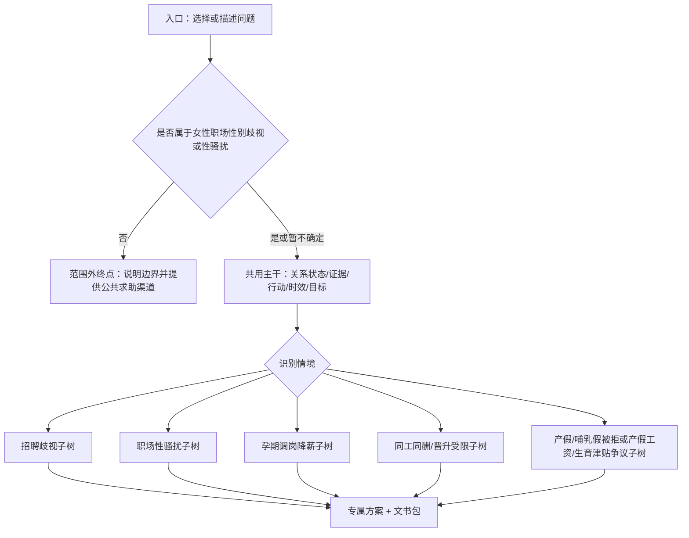
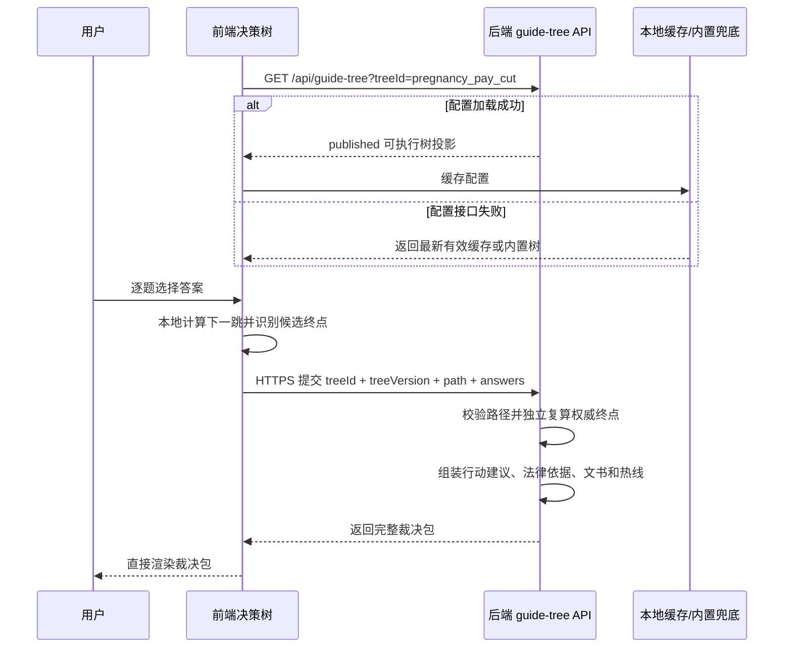
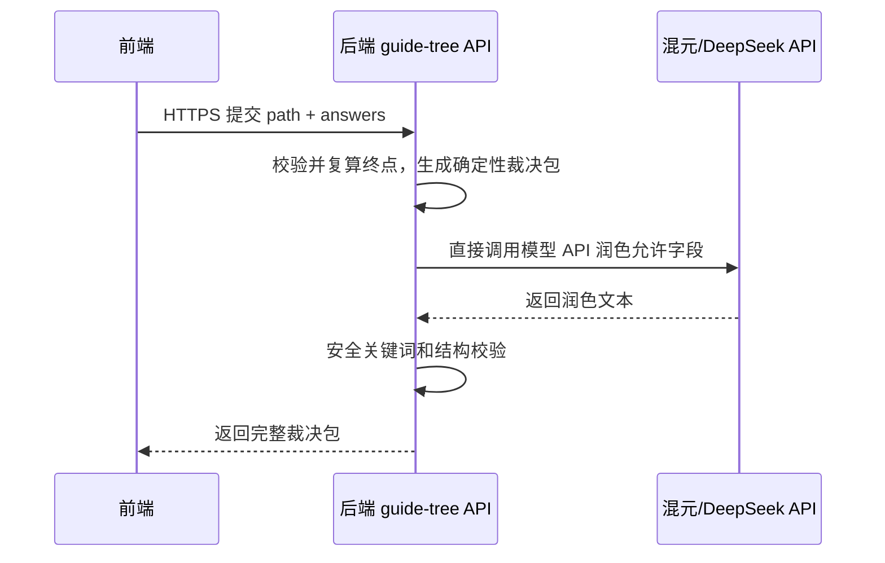

# 她行·维权导航交互式决策树优化方案

## 1. 优化目标

将现有「她行·维权导航」从“输入一个场景，一次性生成六步维权路径”的线性问答，升级为“跟着问答走完专属维权流程，并带走可直接使用的法律文书”的交互式决策树。

本方案的服务对象与内容边界保持不变：聚焦女性在求职和职场中遭遇的性别歧视、婚育与孕产歧视、性骚扰及投诉性骚扰后的报复性不利对待，不扩展为通用劳动争议或违法解除服务。

升级后的核心体验是：

- 用户不需要一次性把案情说完整，而是按问题一步步选择和补充。
- 系统根据答案动态判断下一步流程、维权渠道、时效风险和所需证据。
- 最终输出一份“专属行动方案”，包含流程路径、关键时间节点、证据清单、风险提醒和可复制的法律文书。
- 与现有「她眼」「她权」「她证」模块形成闭环：判断性质、确认权利、固定证据、采取行动。

## 2. 当前现状

当前实现集中在：

- `features.html`：她行模块使用 `textarea#guideInput` + `button#guideBtn` 作为入口。
- `js/guide.js`：调用 `callYuanqiAPI('guide', content)`，保存到本地历史，再用 `parseGuideSteps()` 和 `renderGuideRecord()` 渲染为竖直时间轴。
- `css/style.css`：已有她行时间轴、热线胶囊、时效高亮等样式。
- `js/core.js`：她行已接入 CloudBase proxy，对应 agentType 为 `guide`。

现有能力的优点：

- 已有独立模块、独立历史记录和成熟的时间轴渲染。
- 已支持热线高亮、时效关键词高亮、重试按钮。
- 现有 Prompt 已覆盖“现场反应、内部投诉、行政投诉、劳动仲裁、法院诉讼、专业帮助”的六步框架。

现有短板：

- 用户需要自己概括案情，门槛较高。
- 输出是一整段路径，缺少“我现在处在哪一步”的互动感。
- 不会根据用户选择动态分流，例如“是否已离职”“是否有书面通知”“是否超过仲裁时效”。
- 没有沉淀成可填写、可复制、可下载的法律文书。
- 历史记录只保存原始问答，不保存决策树状态和用户答案。

## 3. 新体验设计

### 3.1 页面结构

建议将「她行」页面改为三段式工作台：

1. 左侧/顶部：流程进度条
   - 基本情况
   - 事件类型
   - 证据状态
   - 已采取行动
   - 时效判断
   - 生成方案

2. 中间：决策树问答区
   - 每次只问 1 个关键问题。
   - 以选项按钮为主，必要时提供简短文本框。
   - 支持“上一步”“重新开始”；每次提交答案后自动保存草稿，不设置显式“保存草稿”按钮。

3. 右侧/底部：实时结果面板
   - 当前推荐路径
   - 下一步行动
   - 需要补齐的证据
- 可能由后端生成并返回的文书

### 3.2 用户路径

典型路径：

1. 用户进入「她行·维权导航」。
2. 系统先询问“你遇到的主要问题是哪一类？”
3. 用户选择“孕期被调岗/降薪”。
4. 系统询问“你目前和单位的关系是？”
5. 用户选择“仍在职”。
6. 系统追问“公司是否已经发过调岗、降薪或取消待遇的通知？”
7. 用户选择“只有口头通知”。
8. 系统依次确认孕产阶段、公司行为、实际影响和现有证据。
9. 系统询问“你已经采取过什么行动？”
10. 前端到达候选终点后提交路径和答案；后端复算权威终点、生成专属维权方案，并在裁决包中返回当前路径匹配的《调岗/降薪异议函》和《证据目录》，前端仅负责展示。

本节展示的是 `P1 → P2 → P3/P3A → P4 → P5 → P6 → P7/P8/P9 → P10 → 终点` 的典型路径；措施尚未实施时在 `P4` 分流到 `PE/PF`，实际分流以 4.0.3 的节点表为准。

草稿恢复流程：系统在用户每次提交答案后自动写入 `guideTreeDraft:v1`。用户刷新或再次进入她行时，如检测到未完成且未过期的 `sessionId`，入口显示“检测到未完成的流程，是否继续？”，提供“继续上次流程”和“重新开始”两个按钮；“重新开始”需要用户确认，并清除旧草稿后创建新会话。

## 4. 决策树设计

### 4.0 设计原则：共用主干 + 情境专树

不建议把所有情境都塞进同一棵“万能树”，也不建议每个情境完全从零设计一套互不相通的流程。更适合本项目的方案是：

> 共用主干问题负责确定法律关系、证据状态、已采取行动、时效风险和用户目标；不同情境进入各自的专业子树，由法学同学精细设计关键分支。

这样做的原因：

- 维权流程有共性：事件阶段、劳动关系、歧视或骚扰表现、证据状态、已采取行动和时效风险，是本项目各类女性职场权益场景都需要判断的基础事实。
- 法律要件有差异：招聘歧视、职场性骚扰、孕产期歧视、同工同酬和晋升歧视的构成要件、证据重点、救济路径并不相同，不能只用一套通用六步法覆盖。
- 产品体验要轻：用户先走 3-5 个共用问题，系统判断情境后再进入精细子树，避免一开始就被大量法律问题劝退。
- 比赛展示更专业：可以明确说明“我们把法学同学的专业判断沉淀为可执行的规则树，而不是完全依赖大模型现场发挥”。

推荐结构：



服务边界说明：本项目不处理与性别歧视、婚育歧视、孕产期歧视或性骚扰无关的普通违法解除、经济性裁员、合同到期不续签、一般劳动争议和单纯逼迫离职。若解除、要求辞职或不续签与女性身份、婚育状态、孕产哺乳期、拒绝性骚扰或投诉性骚扰存在关联，则不单独进入“违法解除”树，而是作为相应歧视/性骚扰子树中的不利后果继续判断。

### 4.0.1 共用主干问题

共用主干建议只问最影响分流的基础事实：

- 服务范围判断：是否涉及性别、婚育、孕产哺乳、性骚扰或投诉后的报复性不利对待；明确无关则进入 `OOS` 范围外终点。
- 事件发生阶段：求职、在职、离职中、已离职。
- 劳动关系状态：是否已入职、是否签劳动合同、是否仍在职。
- 对方行为形态：口头、书面、聊天记录、制度规定、实际处分。
- 证据基础：有无聊天/邮件/录音/合同/工资流水/通知/证人。
- 已采取行动：未行动、内部沟通、投诉、仲裁、诉讼。
- 时间节点：发生时间、收到通知时间、离职时间、仲裁裁决时间。
- 用户目标：保住工作、恢复待遇、要求道歉/处理、争取赔偿、先了解流程。

`OOS` 范围外终点由后端返回范围外提示，不生成本项目法律文书，前端也不展示文书区；系统不继续询问普通解除的实体问题。若用户暂时无法判断解除或不利对待是否与性别、婚育、孕产或性骚扰投诉有关，系统应允许进入对应专树补充关联事实，不能过早拒绝。

`OOS` 结果页固定展示以下内容：

> 很抱歉，您描述的情况不属于「她行」当前的服务范围。
>
> 我们专注的是：招聘性别歧视、职场性骚扰、孕产期歧视、同工同酬及晋升中的性别歧视。
>
> 如果您遇到的是普通劳动争议，例如违法解除、合同到期不续签等，建议联系劳动监察 12333、法律援助 12348 或当地劳动争议仲裁委员会。
>
> 如果您不确定问题是否与性别、婚育、孕产或性骚扰有关，可以重新描述，或使用「她眼·言行雷达」进行初步判断。

页面按钮：

- 主按钮：“重新描述”，返回入口并保留原描述供用户修改；
- 次按钮：“去她眼判断”，保存当前她行草稿后切换至她眼；
- 辅助按钮：“返回功能首页”；
- 热线按钮：“拨打 12333”“拨打 12348”；
- 不显示“查看文书”“AI 个性化”或“继续下一题”。

### 4.0.2 首版完整范围

首版一次性交付五个场景的完整决策树、后端终点复算、裁决包、成品文书、历史保存和异常处理，不设置“基础指引页”、占位入口或“下一版上线”提示。五棵树必须经过同一套配置校验、路径测试和法学审核后统一发布。

首版入口行为：

| 入口 | 点击结果 |
|---|---|
| 孕期、产期、哺乳期被调岗降薪 | 进入完整 `P1-P10`（含 `P3A`）子树，后端可裁决至 `PA-PF`；解除/逼迫离职只进入边界终点，已仲裁用户优先进入 `PD` |
| 招聘/面试性别歧视 | 进入完整 `R1-R6` 子树，后端可裁决至 `RA-RC` |
| 职场性骚扰 | 进入完整 `H1-H8A` 子树，后端可裁决至 `HA-HE`；紧急安全提示始终优先 |
| 同工不同酬、晋升受限 | 进入完整 `E1-E6` 子树，后端可裁决至 `EA-EC` |
| 产假、哺乳假被拒或产假工资、生育津贴争议 | 进入完整 `L0-L6`（含责任主体节点 `L3A/L3B`）子树，后端可裁决至 `LA-LD` |
| 不确定 | 进入简短描述、候选场景确认和无法归类处理流程；确认后进入对应完整子树 |

各场景的法律依据、证据提醒和求助渠道直接配置在节点侧栏与后端裁决包中，不再通过独立基础指引页承载。招聘歧视等场景的证据建议仍须由法学同学编写和审核，不得由开发人员自行补写法律性内容。

“不确定”入口的完整流程：

```text
用户选择“不确定”
  -> 显示简短描述框，placeholder 为“请用 1-2 句话简单描述您遇到的情况”
  -> 用户提交 1-500 字描述
  -> 第一阶段使用后端场景目录下发的关键词在前端本地匹配；第二阶段起优先调用入口分类模型，API 不可用时回退本地匹配
  -> 返回最多 2 个候选场景及置信度
  -> 前端展示“根据您的描述，这可能属于【候选场景 1】或【候选场景 2】，请确认或修改”
  -> 用户确认某个场景：进入对应完整子树
  -> 用户选择“都不是”：保存草稿并展示“去她眼判断”按钮
  -> 模型无法识别且本地关键词无匹配：进入 OOS-unclassified 页面
```

候选结果不能直接替用户选定场景。`OOS-unclassified` 使用 OOS 页面结构，但标题改为“暂时无法判断您的情况属于哪类场景”，不得断言问题一定不在服务范围；页面提供“修改描述”“去她眼判断”“返回选择场景”。后端按 OOS 规则不返回文书，前端不展示文书区。

### 4.0.3 完整场景节点设计

下面每张表都按“节点 ID → 问题 → 选项/下一跳 → 终点判断”设计。后续可直接转成 `GUIDE_TREE` JSON。

#### A. 孕期/产期/哺乳期调岗降薪子树

场景目标：判断用户当前应先内部书面异议、行政投诉、仲裁准备，还是优先处理时效/法律援助问题。

| 节点 | 问题 | 选项与下一跳 | 终点判断 |
|---|---|---|---|
| `P1` | 你现在遇到的是哪类问题？ | 孕期/产期/哺乳期被调岗降薪 → `P2`；其他 → 对应场景子树 | - |
| `P2` | 你目前和单位的关系是？ | 仍在职 → `P3`；因孕产问题已离职 → `P4`；因孕产问题被口头辞退但没办离职 → `P4`；因孕产问题已收到解除通知 → `P4`；不确定解除是否与孕产有关 → `P4` 并标记 `relation_uncertain`；明确确认解除与孕产、性别或婚育无关 → `OOS` | `OOS`：范围外终点 |
| `P3` | 公司是否已经发过调岗、降薪或取消待遇的通知？ | 有书面通知/只有明确口头通知 → `P4`；还没有正式通知但已暗示 → `P3A` | - |
| `P3A` | 公司暗示的具体内容是什么？ | 明确表示将调岗、降薪、取消待遇或要求离开 → `P4` 并写入对应 `anticipated_*` 标记；只有模糊预告或态度变化 → `PE` | `PE`：先固定线索终点 |
| `P4` | 这件事是否可能仍在劳动仲裁一般时效内？ | 措施尚未实施 → 有离职暗示时 `PF`，其余 `PE`；1 年内/不确定/超过 1 年 → `P5` | 尚未实施跳过不适用的事实评估；不确定/超过一年分别标记 `time_uncertain/time_risk` |
| `P5` | 你现在处于哪个阶段？ | 孕期 → `P6`；产假中 → `P6`；哺乳期 → `P6`；不确定 → `P6` | - |
| `P6` | 公司已经实际采取了什么行为？ | 调岗/降薪/二者同时发生 → `P7`；要求主动辞职/解除劳动合同 → `P8`；关联不明 → `P9` | 前三项本身表示已实施；解除或逼迫离职路径最终进入 `PF`，关联不明先补证 |
| `P7` | 调岗或降薪是否影响待遇、岗位级别、劳动强度、身体安全或职业发展？ | 各类影响或暂无明显变化 → `P8` | 暂无明显变化标记 `harm_low`，不代表行为合法 |
| `P8` | 你是否签过离职、调岗、降薪或协商解除文件？ | 没签 → `P9`；已签但不情愿 → `P9` 并标记 `signed_under_pressure`；主动提交过辞职 → `P9` 并标记 `voluntary_resignation_submitted`；不确定 → `P9` 并标记 `document_uncertain` | 只记录风险标记，不在 `P8` 提前结束 |
| `P9` | 你手上有哪些证据？（多选） | 聊天记录/邮件 → `P10`；工资流水 → `P10`；产检/怀孕证明 → `P10`；劳动合同/岗位说明 → `P10`；考勤记录 → `P10`；暂时没有 → `P10` 并标记 `evidence_weak` | - |
| `P10` | 你已经采取过什么行动？ | `P10=arbitration_started` → `PD`；**用户尚未仲裁，且（任一解除/逼迫离职边界条件成立）** → `PF`；其余按时效风险 → `PC`、签署风险和行动状态 → `PA/PB` | PF 实现条件为 `P10 != arbitration_started AND boundaryMatched`；权威顺序为 `PD → PF → PC → PA/PB` |

`relation_uncertain` 风险说明：当 `P2` 标记“不确定解除是否与孕产有关”时，`P4` 只用于记录可能影响后续救济的时间节点，不代表系统已经认定案件应进入仲裁。界面应先提示“建议继续确认解除原因及其与孕产状态的时间关联”，随后通过 `P5-P9` 补充孕产阶段、公司表述、行为时间和证据；即使用户选择“超过 1 年”，`PC` 也只能提示核实时效、关联事实及中断中止情形，不能直接得出权利消灭结论。

终点定义：

| 终点 | 触发条件 | 结果页重点 | 后端裁决包返回的文书 |
|---|---|---|---|
| `PA` 未正式行动 | `P10=未行动` 或仅口头沟通 | 先用书面方式提出异议，固定公司通知和本人反对意见 | 《调岗/降薪异议函》+《证据目录》 |
| `PB` 已沟通/已投诉/已签署风险 | 已内部投诉、已外部投诉或存在签署风险，但不属于解除/逼迫离职边界 | 按具体职责和可仲裁请求补强材料 | 《证据目录》必选；监察和仲裁材料按条件返回 |
| `PC` 时效风险 | 明确超过 1 年仲裁时效 | 不直接承诺可仲裁，提示尽快咨询 12348 或律师核实时效起算与中断情形 | 《法律援助咨询问题清单》+《证据目录》 |
| `PD` 已仲裁 | 已申请劳动仲裁 | 整理补充证据、庭前陈述、15 日起诉期限提醒 | 《证据目录》+《劳动仲裁补充材料清单》 |
| `PE` 尚无明确措施 | 只有模糊暗示、态度变化或可能调整，尚无具体调岗降薪安排 | 记录时间、原话和参与人，保留现岗位及待遇材料，等待并要求具体安排以书面形式确认 | 《证据目录》 |
| `PF` 孕产关联解除/离职边界 | 尚未仲裁，且因孕产问题离职、被辞退、收到解除通知或被要求主动辞职 | 仅固定孕产关联和解除/离职材料；不判断违法解除 | 仅《证据目录》；不生成法援问题、解除、赔偿、时效、仲裁或调岗降薪文书 |

#### B. 招聘/面试性别歧视子树

场景目标：判断是“先固定招聘歧视证据并要求说明”，还是“进入平台/人社投诉材料准备”。

| 节点 | 问题 | 选项与下一跳 | 终点判断 |
|---|---|---|---|
| `R1` | 歧视发生在哪个环节？ | 招聘广告/岗位要求 → `R2`；面试提问 → `R2`；录用前后被取消 offer → `R3`；投简历后被拒 → `R3` | - |
| `R2` | 对方是否明确提到性别、婚育、怀孕、生育计划？ | 明确提到 → `R4`；暗示或追问 → `R4`；没有，只是感觉不公平 → `R5` | - |
| `R3` | 是否已经出现不利结果？ | 未进入面试/未被录用/offer 被取消或降薪 → `R2`；还没有结果 → `RA` | 所有不利结果仍需核对性别婚育关联 |
| `R4` | 你有哪些证据？（多选） | 招聘广告截图 → `R6`；聊天/邮件 → `R6`；录音/面试记录 → `R6`；拒录通知 → `R6`；暂无证据 → `RA` | - |
| `R5` | 是否有可对比信息？ | 同岗位男性被正常推进/公司长期限制女性 → `R6`；没有对比信息 → `RA`；用户明确确认无性别婚育关联 → `OOS` | 不能由系统推断“无关” |
| `R6` | 你希望先走哪种方式？ | 要求企业说明/平台投诉/民事咨询 → `RB`；人社或劳动监察反映 → `RC`；只整理材料 → `RA` | `RA/RB/RC`：前端停止提问并提交后端裁决 |

终点定义：

| 终点 | 触发条件 | 结果页重点 | 后端裁决包返回的文书 |
|---|---|---|---|
| `RA` 证据固定优先 | 尚无结果、证据不足、只想整理材料 | 固定岗位信息、沟通记录、时间线，不急于删除或修改投递记录 | 《证据目录》 |
| `RB` 企业/平台沟通或民事咨询 | 想先问企业、平台投诉或了解民事救济 | 要求说明录用标准，提交可核验线索或准备咨询材料 | 《证据目录》必选；平台投诉返回投诉说明；要求企业说明且确有投递/面试经历时返回原因说明函；民事咨询不返回投诉函 |
| `RC` 行政投诉准备 | 已有明确歧视表达和不利结果 | 准备向人社、劳动监察等渠道反映 | 《招聘歧视投诉说明》+《证据目录》 |

#### C. 职场性骚扰子树

场景目标：先判断人身安全和紧急程度，再决定内部投诉、外部求助或证据固定。

| 节点 | 问题 | 选项与下一跳 | 终点判断 |
|---|---|---|---|
| `H1` | 对方行为主要是哪一类？ | 言语/黄色玩笑 → `H2`；文字/图片/聊天骚扰 → `H2`；肢体接触 → `H3`；以转正/晋升/考核交换性要求 → `H3`；跟踪威胁 → `H3` | - |
| `H2` | 你是否表达过拒绝或不舒服？ | 明确拒绝后仍继续 → `H4`；表达过不适但对方装作没听懂 → `H4`；还没有表达 → `H5` | - |
| `H3` | 现在是否存在紧急人身安全风险？ | 是，担心再次单独接触或威胁 → `HC`；否，暂时安全 → `H4` | `HC`：安全优先终点 |
| `H4` | 行为人身份是谁？ | 直属上级/有考核权、普通同事、客户/合作方、不确定 → `H4A` | 记录是否掌握考核权 |
| `H4A` | 当前安全状态下希望先走哪条路径？ | 固定证据 → `HA`；单位投诉 → `H6`；国家机关投诉/报案咨询或民事咨询 → `HD` | 外部与民事路径分别标记 |
| `H5` | 你希望先怎么做？ | 先固定证据，不直接冲突 → `HA`；想正式投诉 → `H6`；想先要拒绝话术 → `HA` | `HA`：证据/话术终点 |
| `H6` | 公司是否已有处理或投诉渠道？ | 有 HR/合规/工会或没有明确渠道 → `H7`；已经投诉但公司不处理 → `HD` | - |
| `H7` | 你有哪些证据？（多选） | 聊天、录音录像、证人、事后记录或暂时没有 → `H8` | 证据弱不阻断投诉 |
| `H8` | 你采取过哪些行动，公司是否因此对你作出不利处理？ | 未投诉 → `HB`；已内部投诉等待处理 → `HB`；公司不处理/包庇 → `HD`；投诉后出现不利对待 → `H8A` 并标记 `retaliation`；已报警/外部求助 → `HD` | `HB/HD` 或进入报复分级 |
| `H8A` | 投诉后的不利对待目前达到什么程度？ | 态度变化/排挤 → `HD`；实质调岗降薪/处分 → `HE`；要求辞职/解除 → `HE`；跟踪威胁 → `HC`；暂时无法分级 → `HD` 并标记 `retaliation_uncertain` | 兜底路径不中断；不得把未分级情况自动写成实质报复 |

终点定义：

| 终点 | 触发条件 | 结果页重点 | 后端裁决包返回的文书 |
|---|---|---|---|
| `HA` 证据固定/拒绝表达 | 暂未投诉或证据弱 | 固定证据、准备明确拒绝话术、避免单独接触 | 《证据目录》 |
| `HB` 内部投诉 | 准备或已经内部投诉 | 要求公司启动调查、保护投诉人、不报复 | 《证据目录》必选；首次投诉返回投诉说明，已有投诉记录并等待处理时改为调查处理函，两份函件不同时返回 |
| `HC` 安全优先 | 存在人身安全、威胁、跟踪、肢体侵害风险 | 优先离开危险环境、联系可信任的人，必要时报警 | 《紧急求助记录清单》+《证据目录》 |
| `HD` 外部求助/公司不处理或轻度、未分级报复 | 公司不处理、已外部求助、民事咨询，或投诉后出现轻度/未分级不利对待 | 区分主管部门、公安、人格权民事与劳动权益争议 | 默认《证据目录》；民事咨询附《人格权侵权民事咨询材料清单》，监察材料按条件返回 |
| `HE` 投诉后发生实质报复 | 投诉后已实际调岗降薪、扣绩效、书面处分、要求离职或妨碍正常工作 | 固定投诉在先、实质不利处理在后的时间线，区分报复事实与普通解除争议 | 《要求公司启动调查处理函》+《证据目录》；仅实际调岗降薪、绩效或处分且存在可量化劳动请求时附仲裁要点，要求离职/解除路径不生成解除或仲裁文书 |

`H8A/HE` 属于首版完整性骚扰子树，必须与 `H1-H8` 同期实现、测试和审核，不能以简化版替代投诉后报复分级。

#### D. 同工同酬/晋升受限子树

场景目标：判断是否有可比较对象和制度依据，决定先询问标准、内部申诉还是投诉/仲裁准备。

| 节点 | 问题 | 选项与下一跳 | 终点判断 |
|---|---|---|---|
| `E1` | 差异待遇主要体现在哪里？ | 工资低于同岗 → `E2`；奖金/绩效低 → `E2`；晋升受限 → `E2`；培训/项目机会被排除 → `E2` | - |
| `E2` | 是否有较具体的可比较对象或比较范围？ | 同岗同工、同级近似工作、同批晋升候选 → `E3`；只有感觉或信息不足 → `E3A` | 后两项标记 `comparison_weak`，进入关联线索过渡节点 |
| `E3` | 岗位职责、绩效、资历和任职条件是否大体可比？ | 大体可比/存在已知客观差异/不确定 → `E4` | 后两项写入对应风险标记，不直接排除 |
| `E3A` | 没有比较对象时，是否有直接性别/婚育表述或时间、模式线索？ | 有线索 → `E5` 并标记 `gender_link_clue`；只有感受/不确定 → `EA` | 避免用户在无比较基础时被迫判断因果 |
| `E4` | 差异是否可能与性别、婚育、怀孕或生育计划有关？ | 明确表述、婚育孕产表述、男性优先模式、时间关联或不确定 → `E5`；用户明确确认无关 → `OOS` | 不能由系统推断无关 |
| `E5` | 你有什么材料？（多选） | 工资绩效、岗位职级、制度标准、比较线索、沟通记录或暂无 → `E6` | 暂无标记 `evidence_weak` |
| `E6` | 是否已书面询问或申诉？ | 未询问、证据弱且无 `gender_link_clue` → `EA`；其余未询问 → `EB`；无回复、拒绝说明、已申诉、已外部反映或已仲裁 → `EC` | 明确关联线索覆盖证据弱的终点降级效果，但不删除历史标记 |

终点定义：

| 终点 | 触发条件 | 结果页重点 | 后端裁决包返回的文书 |
|---|---|---|---|
| `EA` 补事实 | 尚未书面询问且 `E5` 证据薄弱 | 先整理岗位职责、绩效、薪酬、晋升标准和可比较对象 | 《证据目录》 |
| `EB` 询问标准 | 未正式询问公司标准 | 用书面方式要求说明薪酬/晋升依据 | 《薪酬/晋升标准说明申请》+《证据目录》 |
| `EC` 内部申诉/外部准备 | 已问过但无解释、已申诉、已外部反映或已仲裁 | 按当前程序准备材料 | 《证据目录》必选；内部路径附《内部投诉邮件》，已仲裁路径附《劳动仲裁补充材料清单》且不返回内部投诉邮件，其他程序文书按条件返回 |

#### E. 产假、哺乳假被拒或产假工资、生育津贴争议子树

**场景目标：区分产假、哺乳假被拒（含不批假、不安排哺乳时间）与产假工资、生育津贴争议两类问题，由后端分别返回书面申请、待遇核对及投诉/仲裁方案。**

| 节点 | 问题 | 选项与下一跳 | 终点判断 |
|---|---|---|---|
| `L0` | 实际工作地和生育保险参保地是否已确认？ | 已确认/只确认一项/不确定 → `L1` | 后两项标记地区信息风险 |
| `L1` | 争议主要是哪一类？ | 国家法定产假、地方延长假、每日哺乳时间 → `L2`；产假工资、生育津贴、参保或医疗费用 → `L3` | 地方事项标记 `local_rule_required` |
| `L2` | 是否已书面申请，公司如何回复？ | 未申请 → `LA`；书面拒绝/口头拒绝/部分批准/未回复 → `L5` | 口头拒绝标记 `need_written_record` |
| `L3` | 参保和支付情况是什么？ | 已参保未收到、金额争议、单位收到未转付、未参保、不清楚或单位工资未付 → `L3A` | 不清楚标记 `insurance_status_uncertain` |
| `L3A` | 当前争议主要涉及谁的处理？ | 单位工资、转付、补差或参保手续 → `L4`；社保医保经办机构处理 → `L5`；责任主体不明 → `L3B` | 责任不明时先核对记录 |
| `L3B` | 现有记录更接近哪种情况？ | 单位未参保/未办理/收到后未支付 → `L4`；已有经办核定或拨付记录 → `L5`；暂无记录 → `L5` | 不向错误主体生成确定性申请 |
| `L4` | 对单位的工资、转付、补差或参保争议，何时知道权益可能受损？ | 一年内/不确定/超过一年 → `L5` | 只对单位责任路径展示；不确定/超过一年分别标记时效风险 |
| `L5` | 你有哪些材料？（多选） | 申请、回复、工资、参保、津贴、医疗、合同制度或暂无 → `L6` | 暂无标记 `evidence_weak` |
| `L6` | 你已经做过什么？ | 已仲裁 → `LD`；单位争议存在 `time_risk` → `LC`；未行动 → `LA`；内部无果或已行政投诉 → `LB` | 已仲裁优先，其后才判断单位争议时效 |

终点定义：

| 终点 | 触发条件 | 结果页重点 | 后端裁决包返回的文书 |
|---|---|---|---|
| `LA` 先书面申请/核对 | 未正式申请或材料不足 | 用书面方式申请假期、要求核对工资/津贴依据 | 《证据目录》必选；假期或单位责任路径附内部邮件，经办机构或责任主体不明路径不生成单位邮件 |
| `LB` 投诉/仲裁准备 | 内部沟通无果或已投诉 | 准备劳动监察投诉和仲裁材料，核对工资流水、社保、生育津贴 | 《劳动监察投诉材料清单》+《劳动仲裁申请书要点清单》+《证据目录》 |
| `LC` 单位争议时效风险 | 单位工资、转付、补差或参保争议明确超过 1 年 | 咨询 12348，核实仲裁时效及待遇连续拖欠情形；经办机构争议不得进入 | 《法律援助咨询问题清单》+《证据目录》 |
| `LD` 已仲裁 | 已申请仲裁 | 补充工资、社保、生育津贴相关证据 | 《劳动仲裁补充材料清单》+《证据目录》 |

### 4.1 第一层：事件类型

问题：你现在想处理的是哪类问题？

选项：

- 招聘/面试性别歧视
- 职场性骚扰
- 孕期、产期、哺乳期被调岗降薪
- 同工不同酬、晋升受限
- 产假/哺乳假被拒或产假工资/生育津贴争议
- 不确定，想先让系统帮我判断

分流逻辑：

- 首版入口展示上述全部 5 个场景，每个入口均进入对应完整决策树，不设置占位页或基础指引页。
- “不确定”按 4.0.2 的完整流程进入 1-500 字简短描述、候选场景确认和 `OOS-unclassified` 兜底；用户否认候选或仍无法判断时，再提供「她眼·言行雷达」入口。
- 涉及证据收集的节点，推荐跳转或联动「她证·证据保全」。
- 涉及法定权利解释的节点，推荐跳转或联动「她权·权益指南」。

### 4.2 第二层：劳动关系状态

问题：你现在和单位的关系是？

选项：

- 仍在职
- 因性别、婚育、孕产或性骚扰投诉已离职
- 疑似因上述原因被口头辞退，但还没办离职
- 疑似因上述原因收到解除/终止劳动合同通知
- 只是求职/面试阶段，还没有入职
- 属于其他普通劳动争议

影响：

- 在职：优先提示“不冲动签字、不口头承诺、不删记录”，推荐内部书面沟通。
- 疑似歧视或性骚扰报复导致离职：继续判断不利后果与受保护特征/投诉行为之间的关联、相关证据和时效。
- 求职阶段：重点走招聘歧视投诉、平台举报、人社渠道。
- 其他普通劳动争议：明确提示不在服务范围，并引导咨询 12333、12348 或当地专业机构。

### 4.3 第三层：证据状态

问题：你目前有哪些材料？

多选：

- 聊天记录/邮件/短信
- 录音/录屏
- 劳动合同/offer/岗位说明
- 工资流水/社保记录/考勤记录
- 公司制度/通知/公告
- 证人或同事知情
- 医院证明/孕检记录/产检记录
- 暂时没有明确证据

影响：

- 证据充分：后端裁决包可返回投诉、仲裁或谈判阶段所需文书。
- 证据薄弱：先给“补证据路径”，并提示使用「她证」。
- 有录音：提示合法边界，强调保留原始文件。

### 4.4 第四层：已采取行动

问题：你已经做过哪些事？

多选：

- 已和直属领导沟通
- 已找 HR/合规/工会
- 已拨打 12333/12338/12348
- 已提交劳动监察投诉
- 已申请劳动仲裁
- 还没有正式行动

影响：

- 未行动：从内部书面沟通开始。
- 内部无果：转行政投诉或仲裁。
- 已仲裁：进入补材料、庭前准备、后续起诉期限提醒。

### 4.5 第五层：时效节点

问题：这件事大概发生在什么时候？

输入：

- 选择日期，或选择“1 个月内 / 3 个月内 / 半年内 / 1 年内 / 超过 1 年 / 记不清”。

系统提醒：

- 劳动仲裁一般应在知道或应当知道权利被侵害之日起 1 年内提出。
- 对仲裁裁决不服，通常需在收到裁决书之日起 15 日内起诉。
- 人格权侵权等可能涉及 3 年诉讼时效，但具体要结合案情。
- 如果接近时效，输出中置顶“先保时效”的行动建议。

## 5. 输出结果设计

### 5.1 专属行动方案

结果页建议包含：

- 案情摘要：由后端根据经校验的用户选择生成 3-5 句话摘要。
- 当前阶段：例如“在职 + 口头调岗降薪 + 有聊天记录 + 未正式投诉”。
- 推荐路径：按阶段展示，不再机械固定六步。
- 今天就能做的 3 件事。
- 证据补强清单。
- 时效提醒。
- 风险提醒：不冲动签字、不删记录、不使用违法取证方式。
- 后端裁决包中包含的成品文书；前端仅负责展示、复制和下载。

### 5.2 后端可生成的文书类型

文书不应一次性全部展示。后端应按独立复算出的权威终点，只生成当前路径最需要的 1-3 份，并随裁决包返回；前端不选择模板、不拼装正文。第一版后端文书库建议支持以下类型：

1. 《证据目录》
2. 《内部投诉邮件》
3. 《调岗/降薪异议函》
4. 《恢复原岗位/原薪资申请函》
5. 《劳动监察投诉材料清单》
6. 《劳动仲裁申请书要点清单》
7. 《劳动仲裁补充材料清单》
8. 《法律援助咨询问题清单》
9. 《招聘歧视投诉说明》
10. 《要求说明不予录用原因函》
11. 《性骚扰内部投诉说明》
12. 《要求公司启动调查处理函》
13. 《薪酬/晋升标准说明申请》
14. 《紧急求助记录清单》

### 5.2.1 后端路径到文书映射规则

后端只在裁决包中返回与权威终点匹配的文书，前端原样渲染该文书列表。规则为：

- `OOS` 和 `OOS-unclassified` 终点均按 OOS 规则处理：后端不返回文书，前端仅展示范围/识别提示和公共求助渠道，不展示文书区。
- 必选文书：后端为每个非 OOS 正式终点至少生成 1 份核心文书。
- 证据文书：除纯热线求助类终点外，默认附带《证据目录》。
- 进阶文书：当用户已经内部沟通、投诉或仲裁时，后端才返回投诉/仲裁类文书。
- 风险文书：当出现“时效已过、已签署不利文件、人身安全风险”等标记时，后端优先返回咨询清单或紧急记录清单，而不是直接给仲裁模板。

| 用户路径/权威终点 | 后端裁决包返回的文书 |
|---|---|
| 不属于女性职场性别歧视或性骚扰 `OOS` | 不返回文书；仅说明服务边界并提供 12333、12348 等公共求助渠道 |
| 孕期调岗降薪 + 未正式行动 `PA` | 《调岗/降薪异议函》+《证据目录》 |
| 孕期调岗降薪 + 已内部沟通/已投诉 `PB` | 《证据目录》必选；监察和仲裁材料仅在职责或受案条件命中时返回 |
| 孕期调岗降薪 + 时效风险 `PC` | 《法律援助咨询问题清单》+《证据目录》 |
| 孕期调岗降薪 + 已仲裁 `PD` | 《劳动仲裁补充材料清单》+《证据目录》 |
| 孕期调岗降薪 + 尚无明确措施 `PE` | 《证据目录》 |
| 孕产关联解除/逼迫离职边界 `PF` | 仅《证据目录》；不返回法援问题、解除、赔偿、辞职效力、时效、仲裁或调岗降薪文书 |
| 招聘歧视 + 证据固定 `RA` | 《证据目录》 |
| 招聘歧视 + 企业/平台沟通或民事咨询 `RB` | 《证据目录》必选；平台投诉返回投诉说明，符合经历条件的企业说明返回原因说明函，民事咨询不返回投诉函 |
| 招聘歧视 + 行政投诉准备 `RC` | 《招聘歧视投诉说明》+《证据目录》 |
| 职场性骚扰 + 证据固定/拒绝表达 `HA` | 《证据目录》 |
| 职场性骚扰 + 内部投诉 `HB` | 《证据目录》必选；首次投诉返回投诉说明，已有投诉记录时返回调查处理函，两份函件互斥 |
| 职场性骚扰 + 安全优先 `HC` | 《紧急求助记录清单》+《证据目录》 |
| 职场性骚扰 + 外部求助/公司不处理/轻度报复 `HD` | 《证据目录》必选；仅同时存在劳动保障监察事项时附监察材料 |
| 职场性骚扰 + 投诉后实质报复 `HE` | 《要求公司启动调查处理函》+《证据目录》；仅存在可仲裁劳动请求时附仲裁要点 |
| 同工同酬/晋升受限 + 补事实 `EA` | 《证据目录》 |
| 同工同酬/晋升受限 + 询问标准 `EB` | 《薪酬/晋升标准说明申请》+《证据目录》 |
| 同工同酬/晋升受限 + 内部申诉/外部准备 `EC` | 《证据目录》必选；内部路径、已仲裁路径及其他程序分别返回匹配文书 |
| 产假/哺乳假被拒或产假工资/生育津贴争议 + 先申请/核对 `LA` | 《证据目录》必选；仅假期或单位责任路径附《内部投诉邮件》 |
| 产假/哺乳假被拒或产假工资/生育津贴争议 + 投诉/仲裁准备 `LB` | 《证据目录》必选；按责任主体、监察职责和仲裁受案条件返回对应材料 |
| 产假/哺乳假被拒或产假工资/生育津贴争议 + 时效风险 `LC` | 《法律援助咨询问题清单》+《证据目录》 |
| 产假/哺乳假被拒或产假工资/生育津贴争议 + 已仲裁 `LD` | 《劳动仲裁补充材料清单》+《证据目录》 |

文书输出格式：

- 文书标题
- 适用场景
- 使用前提醒
- 可复制正文
- 后端已填充字段和待核实提示
- 附件清单

以下字段应在提交 `/resolve` 前由前端表单收集，再由后端校验并填入文书：

- `[公司名称]`
- `[本人姓名]`
- `[岗位名称]`
- `[事件日期]`
- `[沟通对象]`
- `[要求回复日期]`
- `[证据附件编号]`

## 6. 前后端实现方案

### 6.1 后端配置服务

第一阶段即建立前后端分离架构。核心原则是：**后端拥有裁决权，前端拥有探路权。** 后端保存完整树配置、终点规则、法律依据和文书模板，对前端只下发完成本地跳转所需的“可执行树投影”。

“裁决包”是本文档对后端权威规则输出的内部技术名称，用户界面统一显示为“专属维权方案”，不表示劳动仲裁裁决、法院判决或个案法律意见。

- `GET /api/guide-tree`：不传 `treeId` 时返回五个完整场景的目录元数据；传入 `treeId` 时返回对应树的节点、选项、下一跳规则和候选终点标识，不返回完整裁决结果或文书模板；
- `POST /api/guide-tree/resolve`：接收前端通过 HTTPS 加密通道提交的 `treeId + treeVersion + path + answers`，校验并重放路径，独立复算权威终点，再组装行动建议、法律依据、文书和热线等完整裁决包；
- 第一版可手工维护经法学审核的 JSON 文件，或存入 CloudBase 数据库；
- 配置必须包含 `schemaVersion`、`treeId`、`treeVersion`、`status` 和审核信息；
- 只有 `published` 配置可被普通用户拉取；
- 第二阶段在后端裁决流程中增加模型润色，并新增入口分类接口；第四阶段增加审核发布、回滚和匿名统计。

### 6.2 前端通用引擎

建议新增：

- `js/guide-tree-api.js`：拉取配置、校验版本、写入缓存和读取降级配置；
- `js/guide-tree-engine.js`：通用决策树状态、节点流转、条件求值和候选终点识别；
- `js/guide-tree-ui.js`：按配置渲染问题、选项、进度和结果；
- `js/guide-documents.js`：只渲染后端裁决包中的成品文书，并提供复制和下载；不在前端补充字段、选择模板、填充或推导正文；
- `js/guide-tree-storage.js`：草稿、缓存和历史管理；
- `css/style.css`：追加五类决策树问答、进度条、安全提醒和文书卡片样式。

建议修改：

- `features.html`
  - 将 `guideChat` 内的单一 textarea 改为“决策树入口 + 传统自由输入备用”。
  - 增加 `guideTreePanel`、`guideResultPanel`、`guideDocumentsPanel`。

- `js/guide.js`
  - 保留现有自由输入和历史时间轴能力。
  - 新增入口按钮：“开始专属流程”。
  - 初始化配置加载器和通用引擎；到达候选终点后始终调用后端裁决接口。

- `js/ui-common.js`
  - 历史记录需要支持保存结构化对象，或新增 `guideTreeHistory`。

### 6.3 数据结构

完整决策树 JSON 只存在后端。前端启动时拉取并缓存可执行树投影，用于零延迟逐题跳转；新增场景时由后端发布新配置，前端通用引擎无需增加场景专用判断。

```js
const guideTreeConfig = {
  schemaVersion: 1,
  treeId: 'pregnancy_pay_cut',
  treeVersion: '1.3.0',
  conditionIndexVersion: '1.3.0',
  status: 'published',
  startNodeId: 'P1',
  nodes: {
    P1: {
      id: 'P1',
      type: 'single',
      title: '你现在遇到的是哪类问题？',
      options: []
    }
  },
  terminalRefs: ['PA', 'PB', 'PC', 'PD', 'PE', 'PF']
};
```

配置加载优先级：

```text
后端 published 配置 -> localStorage 各场景最新有效缓存 -> 前端内置五棵首版树的可执行投影
```

五棵内置投影只用于接口失败或首次离线访问，不是日常维护来源。后续规则更新或新增场景仍通过后端配置自动生效，前端不增加场景专用分支代码。

用户答案结构：

```js
const guideTreeState = {
  schemaVersion: 1,
  treeId: 'pregnancy_pay_cut',
  treeVersion: '1.3.0',
  currentNodeId: 'P1',
  answers: {},
  flags: [],
  path: ['P1'],
  candidateTerminalId: null,
  decisionPackage: null
};
```

`candidateTerminalId` 仅供前端判断“应停止提问并提交裁决”，不作为正式结论；`decisionPackage` 只能写入后端 `resolve` 接口的成功响应。

### 6.4 后端文书模板结构

```js
const guideDocumentTemplates = {
  salaryObjection: {
    title: '调岗/降薪异议函',
    appliesTo: ['pregnancy_pay_cut', 'position_transfer'],
    fields: ['companyName', 'userName', 'position', 'eventDate', 'replyDate'],
    body: `本人就贵司于[事件日期]提出的调岗/降薪安排正式提出异议...`
  }
};
```

文书模板不随树投影下发。后端复算出权威终点后，根据终点白名单选择模板、填入已确认事实，并将完整文书作为裁决包的一部分返回前端。

## 7. AI 调用策略

建议采用“前端本地探路 + 后端规则裁决 + AI 润色/补充”的混合模式。

后端规则层负责：

- 决定问什么。
- 校验前端提交的路径和每一步答案是否合法。
- 按相同规则独立重放路径并计算权威终点。
- 选择文书模板。
- 提醒固定时效和热线。

AI 层负责：

- 将用户选择整合成更自然的案情摘要。
- 对推荐路径进行语气润色。
- 根据用户补充文本补充个性化提醒。
- 后端调用模型时，可对固定模板允许的文书段落做场景化措辞调整。

这样能避免完全依赖模型导致流程不稳定，同时保留“被理解”的体验。

### 7.1 决策树实现位置与大模型调用方式

#### 7.1.1 推荐结论

不建议“每一步都调用大模型临时生成下一个问题”。推荐：

> 决策树规则由法学同学和产品同学预先设计，存成结构化配置；运行时由程序按规则推进。大模型只在入口分类、案情摘要、方案润色、文书个性化时调用。

原因：

- 法律流程需要稳定、可解释、可复核，不能让模型每次自由发挥决定问什么。
- 比赛 Demo 需要稳定，即使 API 慢或失败，决策树也要能继续跑。
- 法学同学的价值应沉淀为规则节点、判断条件、救济路径和文书模板。
- 模型更适合处理自然语言表达，而不是承担全部流程控制。

#### 7.1.2 前端、后端、大模型分工

推荐第一版直接采用“后端配置与裁决 + 前端通用探路引擎”的前后端分离架构。前端在配置加载成功后可离线完成逐题问答，但联网提交后端并取得裁决包，才展示正式结果和文书。

前端负责：

- 渲染问题、选项、进度条和后端返回的裁决包。
- 保存当前回答状态。
- 拉取、校验并缓存后端树配置。
- 使用通用引擎在浏览器本地执行下一跳并识别候选终点，不自行生成法律结论或文书。
- 到达候选终点后，通过 HTTPS 提交 `treeId`、`treeVersion`、`path` 和 `answers`。
- 配置接口失败时依次使用对应场景的有效缓存和内置首版树投影兜底。

后端负责：

- 从第一阶段开始存放完整决策树、终点规则、法律依据和文书模板，仅向前端下发可执行树投影。
- 校验树状态和版本，确保只发布经过审核的配置。
- 从第一阶段开始校验并重放 `path + answers`，复算权威终点并组装完整裁决包。
- 第二阶段开始直接调用混元或 DeepSeek API，由后端管理 API Key、超时、重试和安全校验。
- 第四阶段增加审核发布、匿名统计和回滚。

大模型负责：

- 当用户自由输入案情时，辅助识别情境类型和抽取要素。
- 将用户选项整理成自然语言案情摘要。
- 对行动方案进行温和、清晰的表达润色。
- 后端可调用模型润色固定模板中的允许字段，形成更贴合场景的文书草稿；前端不参与生成。

#### 7.1.3 三种实现形态对比

| 方案 | 描述 | 优点 | 风险 | 建议 |
|---|---|---|---|---|
| 前后端分离配置树 | 后端下发可执行树投影，前端本地探路，后端复算并裁决 | 跳转零延迟，结论不可由客户端篡改，规则可版本化审核 | 第一阶段需同时完成配置接口、裁决接口和通用引擎 | 第一阶段起采用 |
| 纯前端静态树 | 节点和规则全部写死在前端 | 开发快 | 新增场景要改前端，法学规则难以独立维护 | 仅保留一棵内置树作为故障兜底 |
| 大模型动态树 | 每一步由模型判断并生成下一题 | 看起来智能，灵活 | 不稳定、不可复核、成本高、法律风险大 | 不推荐作为主流程 |

#### 7.1.4 推荐调用流程

第一阶段的数据流：



第二阶段加入模型润色后的完整链路：



#### 7.1.5 后端接口草案

第一阶段必须提供：

```http
GET /api/guide-tree
GET /api/guide-tree?treeId=pregnancy_pay_cut&version=latest
```

不传 `treeId` 时返回五个完整场景的入口目录；传入 `treeId` 时返回当前已发布树的可执行投影，包括节点、选项、下一跳规则和候选终点标识。完整结果规则、法律依据和文书模板不下发。前端不逐题请求后端。

返回示例：

```json
{
  "schemaVersion": 1,
  "treeId": "pregnancy_pay_cut",
  "treeVersion": "1.3.0",
  "conditionIndexVersion": "1.3.0",
  "status": "published",
  "startNodeId": "P1",
  "nodes": {},
  "terminalRefs": ["PA", "PB", "PC", "PD", "PE", "PF"]
}
```

第一阶段同时提供：

```http
POST /api/guide-tree/resolve
```

该接口接收 `treeId + treeVersion + path + answers`，按后端完整配置验证并重放路径，返回权威终点和完整裁决包。前端提交的候选终点、标记或计算结果均不作为裁决依据。

第二阶段新增入口分类，并在 `resolve` 内部接入模型润色：

```http
POST /api/guide-tree/classify
```

#### 7.1.6 大模型调用节点

大模型不需要每题都调。建议只在 4 个节点调用：

1. 自由输入分类：用户不想点选时，模型把自然语言转成 `caseType` 和初始字段。
2. 结果摘要：决策树完成后，模型把结构化答案整理成案情摘要。
3. 行动方案润色：把规则生成的路径改写成更自然、更有陪伴感的文本。
4. 文书个性化：在固定模板基础上，根据案情补充具体事实。

模型调用统一采用“后端直接调用混元或 DeepSeek API”的方式。API Key 只保存在后端环境变量或密钥管理服务中。每次调用都由后端附带结构化约束并要求模型返回 JSON；后端完成解析和安全校验后，再向前端返回稳定字段。

示例 Prompt 方向：

```text
你只负责把以下结构化维权信息整理为温和、清晰、可执行的表达。
不要改变法律路径，不要新增不存在的事实，不要替用户做决定。
请返回 JSON：case_summary, action_intro, document_notes。
```

## 8. 与现有模块联动

- 她眼：当用户选择“不确定是否涉及骚扰或性别歧视”时，提供“去她眼判断”按钮。
- 她权：在结果页加入“查看相关法定权利”按钮，传递场景枚举和规则结果键。
- 她证：证据不足时，提供“一键生成取证清单”入口，传递当前场景和缺失证据类型。
- 她心：当用户选择“害怕报复/不敢行动”时，提供情绪支持入口。
- 她声：结果页底部按场景标签推荐相似故事，增强行动信心。

### 8.1 第一版联动机制

第一版采用“同页跨模块切换 + URL 上下文标识”，不内嵌另一套轻量模块。跳转前先把她行状态保存到 `guideTreeDraft:v1`，URL 只携带模块、来源和本地上下文 ID，不直接携带案情原文或个人信息：

```text
features.html?tab=radar&from=guide&contextId=guide_ctx_xxx
features.html?tab=evidence&from=guide&contextId=guide_ctx_xxx
```

实际上下文以 `contextId` 为键保存在本地，内容包括 `guideSessionId`、`caseType`、`terminalId`、`missingEvidenceKeys` 和安全裁剪后的 `preset`。这样既能预填目标模块，又避免敏感案情出现在 URL、浏览器历史或日志中。

联动流程：

1. 用户在她行点击跨模块按钮；
2. 系统保存当前节点、答案和路径，创建 `contextId`；
3. 页面切换到目标模块并读取本地上下文；
4. 目标模块展示适合该场景的预设提示，但由用户确认后再提交；
5. 目标模块结果页显示“返回她行继续”；
6. 点击后通过 `?tab=guide&from=radar&contextId=...` 返回，恢复原来的她行节点和答案；
7. 第一版不自动把她眼结论写回决策树，只作为参考展示，避免未经确认改变法律路径。

若上下文丢失或已过期，“返回她行继续”仍切回她行，并提示用户从本地草稿恢复；不能清空已保存的流程。

她声模块在决策树结果页底部按场景标签（例如 `pregnancy_discrimination`）推荐相似故事列表，不携带用户的具体案情、答案或文书字段，仅用于提供经验参考和增强行动信心。

## 9. 四阶段实施方案（前后端分离版）

### 9.1 架构概述

核心思路：后端保存五棵完整树配置和文书模板，前端只拉取并缓存可执行树投影，在浏览器本地完成零延迟问答跳转。到达候选终点后，前端通过 HTTPS 提交路径和答案；后端独立复算权威终点并返回完整裁决包。首版即完整上线五个场景，不设置渐进占位方案。

```text
后端存储完整树配置 -> 前端拉取可执行投影并缓存 -> 用户逐题选择且前端本地跳转 -> 到达候选终点 -> HTTPS 提交 path + answers -> 后端校验并复算 -> 返回完整裁决包 -> 前端渲染
```

### 9.2 第一阶段：基础架构 + 五棵树全部跑通

核心目标：一次跑通“后端配置接口 + 前端通用引擎 + 后端裁决接口 + 五棵完整树”的端到端链路。

| 工作项 | 说明 | 产出 |
|---|---|---|
| 后端：树配置接口 | 同一 GET 接口按参数返回场景目录或可执行树投影，包括节点、选项、下一跳规则和候选终点标识 | `GET /api/guide-tree` |
| 后端：裁决接口 | 校验 `treeId/treeVersion/path/answers`，独立重放路径、复算终点并组装完整裁决包 | `POST /api/guide-tree/resolve` |
| 后端：树配置管理 | 首版手工维护 JSON 文件或存入数据库，后续再发展为管理后台 | 五份经法学审核的树配置 |
| 前端：通用引擎 | 拉取投影并缓存；按配置渲染问题；本地执行下一跳；到候选终点后提交后端，不生成结论 | `guide-tree-engine.js` 等通用模块 |
| 录入五棵完整树 | 同期录入 `P/R/H/E/L` 五个子树及全部正式终点和 OOS 分支 | 五个场景全部可运行 |
| 完整文书库 | 后端录入五个场景终点映射的全部首版模板 | 各裁决包中的成品文书 |
| 本地存储 | 答案自动保存、刷新恢复、结构化历史 | 用户进度不丢失 |
| 降级兜底 | 配置拉取失败时依次使用有效缓存和内置默认配置；裁决接口失败时保存待提交会话并提示联网重试 | 断网可继续答题但不伪造正式结果 |

阶段交付物：

- 用户可完整走完五个场景中的任一问答流程，并到达对应正式终点或 `OOS`；
- 后端可对五棵树独立复算权威终点，生成匹配文书并随裁决包返回，前端展示后用户可复制或下载；
- 刷新页面不丢进度；
- 断网时可使用缓存或内置配置完成逐题选择，恢复网络后提交后端获取裁决包；
- 五棵树全部通过配置自检、路径自动化测试和法学逐路径审核。

时间估算：约 10-15 天，取决于法学审核和文书模板定稿速度。

### 9.3 第二阶段：大模型润色 + 入口分类

核心目标：在不改变规则路径的前提下增强表达，并让用户可通过自由描述进入候选场景。

| 工作项 | 说明 | 产出 |
|---|---|---|
| 后端：大模型调用封装 | 直接调用混元或 DeepSeek API，由后端管理 API Key、超时、有限重试和错误处理 | 模型调用模块 |
| 入口分类 | “不确定”描述提交后由后端识别场景，返回最多两个候选供用户确认 | 自由描述入口 |
| 结果润色 | 后端复算终点并生成确定性裁决包后，仅把允许润色的结构化字段发给模型 | 更自然的结果表达 |
| 安全校验 | 后端执行 JSON Schema、字段白名单和承诺性语言黑名单校验 | 安全合规拦截 |
| 降级兜底 | 模型不可用或响应不合格时由后端直接返回确定性裁决包 | 基础功能不中断 |

阶段交付物：

- 用户输入“我被调岗了”等简短描述后可获得候选场景并自行确认；
- 走完树后看到结合当前路径组织的行动建议；
- 模型不可用时仍能展示完整基础结果和文书。

调用链路：

```text
前端 -> 后端 resolve/classify API -> 后端直接调用混元/DeepSeek API -> 后端结构与安全校验 -> 前端展示
```

时间估算：约 2-3 天。

### 9.4 第三阶段：体验完善 + 模块闭环

核心目标：在五个场景均已完整可用的基础上，完善下载、跨模块、历史和可访问性体验。

| 工作项 | 说明 | 产出 |
|---|---|---|
| 结果页体验 | 优化五类场景裁决包的层级、风险提示和法律依据折叠 | 更易读的专属方案 |
| 文书质量复核 | 对首版全部模板进行二轮法学复核和用户可用性校对 | 稳定文书库 |
| 文书下载 | 支持复制和 `.txt` 下载，`.docx` 后续实现 | 实用下载功能 |
| 跨模块联动 | 她行与她眼、她证、她权之间传递安全上下文并支持返回 | 模块闭环 |
| 历史管理 | 决策树历史与旧版时间轴分开展示 | 清晰的历史记录 |

阶段交付物：五个场景的问答与裁决能力保持不变，用户可更顺畅地下载文书、管理历史，并在跨模块跳转后返回原流程。

时间估算：约 3-5 天。

### 9.5 第四阶段：合规治理 + 运营化

核心目标：让法学同学可直接参与审核和规则更新，使产品具备长期维护能力。

| 工作项 | 说明 | 产出 |
|---|---|---|
| 审核状态 | 配置增加 `draft/reviewing/published/retired` 状态 | 可审核的配置流程 |
| 版本管理 | 树更新生成新版本，支持差异查看和回滚 | 可追溯变更 |
| 法学审核界面 | 提供审核报告导出或简易审核界面 | 法学可直接参与 |
| 裁决审计强化 | 在第一阶段后端复算基础上增加审计日志、异常告警和规则差异追踪 | 可审计的裁决链路 |
| 匿名统计 | 记录终点到达、节点停留和中途退出等非敏感指标 | 数据驱动优化 |
| 合规治理 | 完善免责声明、隐私提示、数据期限和法律依据更新提醒 | 长期运营基础 |

## 10. 验收标准

产品验收：

- 用户可以不输入长文本，仅通过选项完成一次维权流程。
- 用户能清楚知道“我现在该先做什么”。
- 输出至少包含行动路径、证据清单、时效提醒、文书包。
- 后端返回的文书正文已填入提交前收集的字段，前端可直接展示、复制和下载；缺失事实由后端使用明确的“待补充”标记，不由前端或模型猜测。

技术验收：

- 不破坏现有六大模块导航。
- 原有她行自由输入模式仍可使用。
- `GET /api/guide-tree` 能返回五棵已发布树的目录及各自可执行投影，且不泄露完整裁决规则和文书模板。
- `POST /api/guide-tree/resolve` 能拒绝非法路径并独立复算终点，返回完整裁决包。
- 前端不包含任何场景专用跳转判断，五棵树的所有节点均由通用引擎按配置执行；前端不得自行生成正式结果或选择文书。
- 配置接口失败时依次使用对应场景的有效缓存和内置首版树投影；模型失败时由后端返回确定性裁决包。
- 决策树状态可重置、可返回上一步。
- 移动端不出现按钮挤压、内容溢出。

## 11. 推荐的首版交互文案

入口标题：

> 跟着几个问题走完你的维权流程

入口说明：

> 不用一次性讲清所有细节。我会一步步问你关键问题，最后帮你整理出行动路线、证据清单和可复制的文书。

主按钮：

> 开始专属维权流程

备用入口：

> 我想直接描述情况

结果页标题：

> 你的专属维权行动包

文书区标题：

> 可直接使用的文书

免责声明：

> 本工具提供法律信息参考和文书草稿，不构成正式法律意见。重大争议建议咨询执业律师或拨打 12348 法律援助热线。
