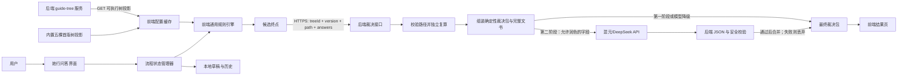
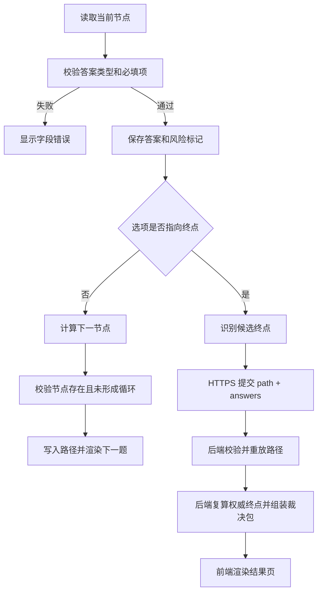

# 她行·维权导航交互式决策树技术方案

## 1. 文档目的

本文档依据《她行·维权导航交互式决策树优化方案》，说明交互式决策树的技术架构、模块划分、数据结构、规则执行方式、前后端职责、大模型调用边界、后端文书生成与前端渲染流程、测试方法和上线步骤，可作为开发、法学审核和验收的共同依据。

本项目聚焦女性在求职和职场中遭遇的：

- 招聘与面试性别歧视；
- 职场性骚扰及投诉后的报复性不利对待；
- 孕期、产期、哺乳期调岗降薪等孕产歧视；
- 与性别、婚育、孕产相关的同工不同酬和晋升受限；
- 产假、哺乳假被拒或产假工资、生育津贴争议。

普通违法解除、经济性裁员、合同到期不续签、一般薪资争议和与性别歧视或性骚扰无关的逼迫离职不在服务范围内。后端必须通过 `OOS` 权威终点明确拦截，不生成本项目法律文书，前端不展示文书区。

## 2. 现有技术基础

项目当前采用原生 HTML、CSS 和 JavaScript，无前端框架和生产依赖：

- `features.html`：她行模块目前为文本框 `guideInput` 和查询按钮 `guideBtn`；
- `js/guide.js`：提交整段案情，调用 `callYuanqiAPI('guide', content)`，并将回复渲染为时间轴；
- `js/core.js`：保留其他现有模块的旧 AI 调用；她行新决策树改用独立 `guide-tree` 后端服务；
- `js/ui-common.js`：使用 `localStorage` 保存各模块历史记录；
- `css/style.css`：已有时间轴、热线、时效提醒等展示样式。

现有 AI 代理源代码不在本仓库中。新方案要求第一阶段即新增独立的 `guide-tree` 后端服务，同时提供树配置 GET 接口和后端裁决接口。第二阶段需要大模型时，由该服务直接调用混元或 DeepSeek API。

## 3. 技术目标

1. 用户每次只回答一个问题，程序根据确定性规则计算下一节点。
2. 决策树在断网时仍可继续逐题作答并保存待提交状态；正式结果必须联网由后端复算生成，大模型失败不影响确定性裁决包。
3. 大模型不负责决定法律路径，不在每个问答节点临时生成问题。
4. 决策树、终点结果和文书之间存在可追踪的确定映射。
5. 每次结果都能还原使用的树版本、答案和终点，便于法学复核。
6. 首版完整实现五个场景的决策树、后端裁决和文书映射，不设置基础指引或占位场景。
7. 不收集与生成结果无关的敏感信息，默认仅在本地保存问答状态；提交裁决时通过 HTTPS 加密传输且默认不持久化案情正文。

## 4. 总体架构

### 4.1 推荐架构

采用“后端配置与裁决中心 + 前端探路引擎 + 后端 AI 增强”的前后端分离架构。核心原则是：**后端拥有裁决权，前端拥有探路权。** 前端本地计算下一题以保证零延迟，但不生成正式终点结果或法律文书。

本文所称“裁决包”是后端权威规则输出的内部技术名称，前端面向用户统一展示为“专属维权方案”。它不表示劳动仲裁裁决、法院判决或律师出具的个案法律意见。



配置接口和裁决接口都是第一阶段正式链路的一部分。配置拉取失败时前端可使用对应场景的最新有效缓存或五棵内置首版树投影继续答题；裁决接口不可用时只能保存待提交状态，不能在本地伪造正式结果。模型链路从第二阶段启用，由后端直接调用和校验；第四阶段增加审核发布、回滚、裁决审计和匿名统计。

接口职责必须严格分离：`GET /api/guide-tree` 是配置接口，只返回供前端本地探路的可执行树投影，不返回终点规则、法律依据或文书模板；`POST /api/guide-tree/resolve` 是唯一的裁决结果接口，接收 `path + answers`，由后端独立复算后返回包含法律依据和完整成品文书的裁决包。除 `resolve` 成功响应外，前端不得从任何接口或本地配置取得正式结果与文书正文。

### 4.2 分阶段形态

| 阶段 | 决策树位置 | 跳转计算 | 文书模板 | 大模型调用 | 目标 |
|---|---|---|---|---|---|
| 第一阶段：基础架构 + 五棵树全部跑通 | 后端保存五棵完整配置，前端仅缓存执行投影 | 前端本地探路，后端复算裁决 | 后端保存并生成五类文书 | 不依赖模型 | 五个场景统一端到端上线 |
| 第二阶段：大模型润色 + 入口分类 | 后端完整配置 | 前端探路，后端裁决 | 后端生成，模型仅润色允许字段 | 后端直连混元/DeepSeek API | 自由描述分类和裁决包润色 |
| 第三阶段：体验完善 + 模块闭环 | 五棵树持续优化 | 前端探路，后端裁决 | 二轮法学复核和下载增强 | 后端按需直连模型 | 结果页、下载、联动和历史体验完善 |
| 第四阶段：合规治理 + 运营化 | 后端版本化配置 | 后端裁决加审计与告警 | 后端版本化模板 | 后端统一直连模型 | 法学审核、回滚、统计和长期维护 |

## 5. 核心技术决策

### 5.1 决策树不由大模型逐题生成

节点问题、选项、下一跳、终点和文书映射由法学同学审核后写入结构化配置。规则引擎只执行配置，不自行推测法律结论。

这样可以保证：

- 相同答案得到相同路径；
- 每条路径可测试、可解释、可复核；
- API 不可用时不影响问答；
- 法律规则更新可以通过版本差异审核；
- 避免模型生成范围外问题或遗漏关键节点。

#### 5.1.1 规则来源与法律依据

决策树的节点、选项、跳转、终点和文书映射，不由开发人员或大模型凭经验决定。每个场景的子树由法学负责人依据现行法律法规、公开典型案例和常见维权程序提出规则草案；法学负责人完成法律内容审核，开发校验人完成配置、路径和渲染校验后，才能标记为 `published`。

核心法律来源包括：

- [《中华人民共和国妇女权益保障法》（2022 年修订）](https://gzca.miit.gov.cn/zwgk/zcwj/zcfg/art/2022/art_47b4c78a8f52484587e1b198c52fa909.html)：性骚扰的禁止与投诉、用人单位预防制止义务、招聘性别歧视、同工同酬、晋升平等、孕产期特别保护及劳动保障监察；
- [《中华人民共和国就业促进法》](https://www.moe.gov.cn/s78/A15/s8355/moe_782/tnull_39856.html)：公平就业以及不得以性别拒绝录用或提高录用标准；
- [《女职工劳动保护特别规定》](https://wjw.beijing.gov.cn/zwgk_20040/zcwj2022/flfg/202304/t20230408_2993024.html)：孕产哺乳期工资、辞退、解除保护，以及孕期不能适应原劳动时的劳动安排；
- [《中华人民共和国劳动合同法》](https://www.samr.gov.cn/zw/zfxxgk/fdzdgknr/bgt/art/2023/art_0abfdd261c03417b949df19d869add8d.html)：劳动合同变更与“三期”女职工解除保护等规则；
- [《中华人民共和国劳动争议调解仲裁法》](https://www.mohrss.gov.cn/SYrlzyhshbzb/ztzl/ldrszytjzc/fgzc/202207/t20220714_457857.html)：劳动争议处理程序和仲裁时效。

孕期调岗降薪子树的节点依据示例：

| 节点 | 规则目的 | 主要依据与审核注意点 |
|---|---|---|
| `P2` 关系状态 | 区分求职者、在职职工和已离职人员，确定后续事实、证据与救济路径 | 关系状态会影响适用的就业歧视、劳动合同和劳动争议处理规则；不能仅凭“已离职”认定范围外 |
| `P4` 时效判断 | 识别可能的仲裁时效风险 | 《劳动争议调解仲裁法》第 27 条规定一般仲裁时效为一年，同时存在时效中断、中止及劳动关系存续期间拖欠劳动报酬的特别规则，因此“不确定”必须继续收集事实，不能直接判定过期 |
| `P4、P6-P7` 实施状态、行为与影响 | `P4=not_started` 直接进入线索固定；只有已经实际发生的调岗、降薪行为才进入 `P6-P7` 评估 | 《女职工劳动保护特别规定》第 5 条禁止因怀孕、生育、哺乳降低工资、辞退或解除；第 6 条要求对有医疗证明且不能适应原劳动的孕期职工减轻劳动量或安排适应劳动。系统不得把所有调岗一概表述为违法，应结合原因、待遇、劳动强度、身体安全和协商过程判断 |
| `P8` 签署情况 | 提醒固定自愿性、签署过程和文件内容 | 已签署不等于系统可以直接判断权利消灭，应标记风险并建议专业复核 |

法律依据键保存在独立的“终点法律依据映射”中，并指向版本化法律依据库；不得写入文书模板。用户界面展示裁决包返回的经审核法条原文，法学审核报告和后台管理页另行展示完整来源、审核日期和适用备注。

### 5.2 大模型仅承担语言任务

大模型允许用于：

- 将自由描述分类为候选场景，但必须由用户确认；
- 将结构化答案整理为案情摘要；
- 在不改变规则结论的前提下润色行动说明；
- 仅在后端固定文书模板允许的段落中润色已经确认的事实。

大模型不得：

- 自行决定下一节点或终点；
- 修改时效、热线、救济路径和文书映射；
- 补充用户未提供的事实；
- 将范围外普通劳动争议包装成性别歧视案件；
- 输出“保证胜诉”“一定违法”等确定性承诺。

## 6. 前后端模块设计

### 6.1 后端模块

第一阶段建议新增独立 `guide-tree` 云函数或 HTTP 服务。示例模块边界：

| 模块 | 职责 |
|---|---|
| `guide-tree/config-store` | 从 JSON 文件或数据库读取 `published` 树和文书模板 |
| `guide-tree/config-controller` | 实现 `GET /api/guide-tree`、参数校验、缓存头和错误码 |
| `guide-tree/schema-validator` | 校验树协议、节点引用、终点和模板映射 |
| `guide-tree/resolution-service` | 第一阶段校验并重放 `path + answers`，复算权威终点并组装裁决包 |
| `guide-tree/document-service` | 根据权威终点选择模板并生成完整文书 |
| `guide-tree/model-client` | 第二阶段直接调用混元或 DeepSeek API |
| `guide-tree/safety-validator` | 第二阶段执行 JSON Schema、字段白名单和承诺性语言校验 |
| `guide-tree/audit-service` | 第四阶段记录裁决异常、规则版本和非敏感审计信息 |

第一版配置可直接维护为受版本控制的 JSON 文件；若使用 CloudBase 数据库，接口返回结构必须与 JSON 文件完全一致，前端无需感知存储方式。

### 6.2 前端文件调整

建议新增：

| 文件 | 职责 |
|---|---|
| `js/guide-tree-api.js` | 调用配置、裁决和分类接口，处理 HTTPS 请求、超时和返回结构 |
| `js/guide-tree-config.js` | 校验、缓存后端配置，并保存五棵首版树的内置可执行投影 |
| `js/guide-tree-engine.js` | 节点校验、条件判断、下一跳、回退和候选终点识别 |
| `js/guide-tree-ui.js` | 问题、选项、进度、导航和结果页渲染 |
| `js/guide-documents.js` | 只渲染后端返回的完整成品文书，并提供复制与下载；不在前端填充正文 |
| `js/guide-tree-storage.js` | 草稿、历史、版本迁移和过期清理 |
| `js/guide-tree-result.js` | 提交 `path + answers`，校验并渲染后端裁决包；不得在本地生成替代结论 |

建议修改：

| 文件 | 修改内容 |
|---|---|
| `features.html` | 增加决策树入口、问答区、进度区、结果区和文书区；保留自由输入备用入口 |
| `js/guide.js` | 保留旧时间轴和历史兼容逻辑，初始化新的决策树模块 |
| `js/core.js` | 保留现有模块调用；她行新流程改为调用 `guide-tree` 后端 API，不从前端直接调用模型 |
| `js/ui-common.js` | 历史列表兼容 `guide_tree` 结构化记录 |
| `css/style.css` | 增加节点选项、步骤导航、风险提示和文书卡片样式 |

脚本加载顺序应为：API 客户端 → 配置与兜底 → 引擎 → 存储 → 裁决包与文书渲染 → UI → 原有 `guide.js`。

### 6.3 页面状态

前端只维护一个当前流程状态：

```js
const guideTreeState = {
  schemaVersion: 1,
  treeId: 'pregnancy_pay_cut',
  treeVersion: '1.3.0',
  sessionId: 'guide_1720000000000_xxx',
  status: 'in_progress',
  caseType: 'pregnancy_pay_cut',
  currentNodeId: 'P1',
  answers: {},
  flags: [],
  path: ['P1'],
  candidateTerminalId: null,
  startedAt: '2026-07-18T10:00:00.000Z',
  updatedAt: '2026-07-18T10:00:00.000Z'
};
```

字段约束：

- `answers` 只存选项值和必要的补充文本，不存渲染 HTML；
- `path` 保存实际走过的节点，支持回退和复核；
- 前端 `flags` 保存由当前 `path + answers` 本地重放得到的 `{ node, flag }` 派生数组，仅用于零延迟探路和界面提示；它可以随草稿保存，但不是后端裁决的可信输入；
- `candidateTerminalId` 仅表示前端探路到达的位置，不是法律结论，也不随裁决请求作为可信字段提交；
- `treeVersion` 一旦开始流程不得自动切换，避免中途规则变化。

### 6.4 界面状态机

```text
idle
  -> in_progress
  -> reviewing
  -> resolving
  -> completed

任意进行中状态 -> abandoned
裁决 API 失败时 resolving -> resolve_pending
resolve_pending -> resolving
```

状态说明：

- `idle`：尚未开始；
- `in_progress`：正在问答；
- `reviewing`：展示答案摘要，允许返回修改；
- `resolving`：已通过 HTTPS 提交路径和答案，等待后端复算；
- `completed`：已收到后端裁决包；模型是否参与由 `aiEnhanced` 标记说明；
- `resolve_pending`：裁决接口暂不可用，问答已保存，尚无正式结果；
- `abandoned`：用户主动重新开始或删除草稿。

### 6.5 首版五场景入口状态

首版入口展示五类完整场景，入口列表由后端目录配置驱动，前端不维护场景枚举。所有场景统一使用 `availability: 'full'` 和 `action.type: 'tree'`，协议中不定义 `basic`、`safety_basic` 或 `basic_guide`：

```js
const sceneCatalogResponse = {
  schemaVersion: 1,
  scenes: [
    {
      caseType: 'pregnancy_pay_cut',
      availability: 'full',
      classificationKeywords: ['怀孕', '孕期', '调岗', '降薪'],
      action: { type: 'tree', treeId: 'pregnancy_pay_cut' }
    },
    {
      caseType: 'recruit_discrimination',
      availability: 'full',
      classificationKeywords: ['面试', '招聘', '限男性', '男性优先', '婚育'],
      action: { type: 'tree', treeId: 'recruit_discrimination' }
    },
    {
      caseType: 'harassment',
      availability: 'full',
      classificationKeywords: ['骚扰', '性暗示', '开黄腔', '强迫', '摸', '搂'],
      action: { type: 'tree', treeId: 'harassment' }
    },
    {
      caseType: 'equal_pay_promotion',
      availability: 'full',
      classificationKeywords: ['同工不同酬', '工资差异', '晋升', '升职', '性别'],
      action: { type: 'tree', treeId: 'equal_pay_promotion' }
    },
    {
      caseType: 'leave_benefits',
      availability: 'full',
      classificationKeywords: ['产假', '哺乳假', '哺乳时间', '产假工资', '生育津贴'],
      action: { type: 'tree', treeId: 'leave_benefits' }
    }
  ]
};
```

目录接口发布前必须验证五个 `treeId` 都存在对应的 `published` 完整配置。任何一棵树缺失、未通过法学审核或配置校验时，整批首版不得标记为可发布，避免入口出现半成品能力。性骚扰树的紧急安全提示配置在 `H3/HC` 等节点和裁决包中，不依赖独立占位页面。

## 7. 决策树配置协议

### 7.1 树级结构

```js
const fullGuideTreeConfigInBackend = {
  schemaVersion: 1,
  treeId: 'pregnancy_pay_cut',
  treeVersion: '1.3.0',
  conditionIndexVersion: '1.3.0',
  status: 'published',
  startNodeId: 'P1',
  scope: ['gender_discrimination', 'pregnancy_discrimination'],
  reviewedBy: ['legal_reviewer_id'],
  reviewedAt: '2026-07-19',
  nodes: {},
  terminals: {},
  documentTemplates: {},
  legalBasis: {}
};
```

上述完整配置只在后端使用。`GET /api/guide-tree?treeId=...` 返回的前端投影必须移除 `terminals` 的结果正文、`documentTemplates` 和完整 `legalBasis`，仅保留：

```js
const executableTreeProjection = {
  schemaVersion: 1,
  treeId: 'pregnancy_pay_cut',
  treeVersion: '1.3.0',
  startNodeId: 'P1',
  nodes: {},
  terminalRefs: ['PA', 'PB', 'PC', 'PD', 'PE', 'PF']
};
```

### 7.2 节点结构

`P2` 完整配置如下，确保“不确定关联”继续进入专树而不是被提前拒绝：

```js
{
  id: 'P2',
  type: 'single',
  title: '你目前和单位的关系是？',
  required: true,
  answerKey: 'relationStatus',
  options: [
    { label: '仍在职', value: 'employed', next: 'P3' },
    { label: '因孕产问题已离职', value: 'left_due_to_pregnancy', next: 'P4' },
    { label: '因孕产问题被口头辞退但没办离职', value: 'oral_dismissal_related', next: 'P4' },
    { label: '因孕产问题已收到解除通知', value: 'termination_notice_related', next: 'P4' },
    {
      label: '不确定解除是否与孕产有关',
      value: 'relation_uncertain',
      next: 'P4',
      setFlags: ['relation_uncertain']
    },
    {
      label: '明确确认解除与孕产、性别或婚育无关',
      value: 'confirmed_unrelated',
      terminal: 'OOS'
    }
  ],
  sideTips: ['不确定时不会被直接排除，后续会继续确认时间关联、公司表述和证据。']
}
```

`answerKey` 仅用于案情摘要字段和旧数据兼容，不得用于文书条件判断。文书条件统一引用节点 `id + option.value`；后端重放 `setFlags` 时同时记录来源节点，例如 `{ node: 'P2', flag: 'relation_uncertain' }`。完整技术值和标记词表以《她行五场景完整决策树与法律文书模板编制手册》10.5 的版本化条件索引为准。

当 `relation_uncertain` 存在时，`P4` 的时效提示文案必须先说明“记录时间不代表系统已认定应当仲裁”，并在后续继续补充解除原因与孕产状态的关联事实。

`P3` 配置：

```js
{
  id: 'P3',
  type: 'single',
  title: '公司是否已经发过调岗、降薪或取消待遇的通知？',
  helpText: '书面通知包括邮件、聊天、OA 通知和纸质文件。',
  required: true,
  answerKey: 'noticeType',
  options: [
    { label: '有书面通知', value: 'written', next: 'P4' },
    { label: '只有口头通知', value: 'oral', next: 'P4' },
    { label: '还没有正式通知但已暗示', value: 'implied', next: 'P3A' }
  ],
  sideTips: ['先保存原始通知，不要只保留转发后的截图。']
}
```

`P3A` 是一个必答单选过渡节点：

```js
{
  id: 'P3A',
  type: 'single',
  title: '公司暗示的具体内容是什么？',
  helpText: '请根据对方的原话或行为选择最接近的选项。',
  required: true,
  answerKey: 'hintContent',
  options: [
    {
      label: '明确表示将调岗、降薪或取消待遇',
      value: 'action_hinted',
      next: 'P4',
      setFlags: ['anticipated_action']
    },
    {
      label: '明确要求主动辞职或暗示离开',
      value: 'exit_hinted',
      next: 'P4',
      setFlags: ['anticipated_exit']
    },
    {
      label: '只说“岗位/待遇可能调整”但没有具体安排',
      value: 'vague',
      terminal: 'PE'
    },
    {
      label: '只有态度变化、边缘化感受，没有具体内容',
      value: 'attitude_only',
      terminal: 'PE'
    }
  ],
  sideTips: ['仅凭暗示无法得出法律结论，建议先记录原话和时间。']
}
```

`P4` 配置必须包含尚未实施选项，避免预告路径被迫选择仲裁时效：

```js
{
  id: 'P4',
  type: 'single',
  title: '这件事是否可能仍在劳动仲裁一般时效内？',
  required: true,
  options: [
    {
      label: '措施尚未实施，暂不适用',
      value: 'not_started',
      rules: [
        {
          when: { field: 'flags', op: 'contains', value: { node: 'P3A', flag: 'anticipated_exit' } },
          terminal: 'PF'
        },
        { otherwise: true, terminal: 'PE' }
      ]
    },
    { label: '可能在一年内', value: 'within_one_year', next: 'P5' },
    { label: '不确定', value: 'uncertain', next: 'P5', setFlags: ['time_uncertain'] },
    { label: '可能超过一年', value: 'over_one_year', next: 'P5', setFlags: ['time_risk'] }
  ],
  sideTips: ['如果公司只是明确预告、尚未执行相关安排，请选择“措施尚未实施，暂不适用”。']
}
```

只有已经发生或执行状态可判断的三个时效选项继续进入 `P5`。`not_started` 不产生时效风险：离职暗示进入 `PF`，其余进入 `PE`，并跳过不适用的 `P5-P7`，不能被摘要为“在一年内”。

`P6` 只询问已经实际发生的行为，因此无需再设置实施状态节点：

```js
{
  id: 'P6',
  type: 'single',
  title: '公司已经实际采取了什么行为？',
  required: true,
  options: [
    { label: '仅调岗', value: 'transfer_only', next: 'P7' },
    { label: '仅降薪或扣绩效', value: 'salary_reduced', next: 'P7' },
    { label: '调岗并降薪', value: 'both', next: 'P7' },
    { label: '要求主动辞职', value: 'exit_requested', next: 'P8' },
    { label: '解除劳动合同', value: 'terminated', next: 'P8' },
    { label: '无法判断行为是否与孕产有关', value: 'relation_uncertain', next: 'P9', setFlags: ['relation_uncertain'] }
  ]
}
```

`P6=transfer_only/salary_reduced/both` 本身表示措施已经实施，可分别控制恢复岗位或待遇核对段落。仅有通知、暗示或尚未实施的路径已在 `P4` 分流到 `PE/PF`，不得渲染恢复岗位待遇或差额核对段落。`P6=relation_uncertain` 直接进入 `P9` 收集证据，不强迫用户回答签署文件问题。`P2` 与 `P6` 虽使用同名 `relation_uncertain`，消费时必须区分来源：只有 `P2` 来源可参与解除边界判断，`P6` 来源只控制补证和谨慎措辞，不得单独触发 `PF/PC`。

支持的节点类型：

| 类型 | 用途 | 答案类型 |
|---|---|---|
| `single` | 单选分流 | `string` |
| `multi` | 证据、已采取行动等多选 | `string[]` |
| `text` | 必要的补充事实 | `string` |
| `date` | 事件或通知日期 | `YYYY-MM-DD` |
| `confirm` | 最终确认 | `boolean` |
| `terminal` | 停止提问并生成结果 | 无 |

自由文本必须限制长度，第一版建议最多 500 字；姓名、公司名称等文书字段在提交后端裁决前单独收集，不混入法律分流节点。

#### 7.2.1 本地关键词分类规则

第一阶段使用确定性的字符串包含匹配，不依赖浏览器分词库。关键词库随后端场景目录下发，新增场景时前端算法无需修改。提交前先对用户描述执行 `NFKC` 归一化、转小写并移除空白和常见标点，再与场景关键词逐项执行 `includes`。

```js
const sceneKeywordConfigFromBackend = {
  pregnancy_pay_cut: ['怀孕', '孕期', '产假', '哺乳', '调岗', '降薪', '被调', '降工资', '绩效取消'],
  recruit_discrimination: ['面试', '招聘', '求职', '限男性', '男性优先', '婚育', '结婚', '生育计划'],
  harassment: ['骚扰', '黄色', '性暗示', '开黄腔', '强迫', '摸', '搂'],
  equal_pay_promotion: ['同工不同酬', '工资比男同事低', '晋升', '升职', '男性优先晋升'],
  maternity_benefits: ['产假不批', '哺乳假', '生育津贴', '产假工资', '哺乳时间']
};

function normalizeGuideClassifyText(input) {
  return String(input || '')
    .normalize('NFKC')
    .toLowerCase()
    .replace(/[\s，。！？、,.!?；;：:（）()【】\[\]“”"']/g, '');
}

function classifyGuideTextByKeywords(input, sceneCatalog) {
  const normalized = normalizeGuideClassifyText(input);
  return sceneCatalog.scenes
    .map((scene, priority) => {
      const matchedKeywords = [...new Set(
        scene.classificationKeywords.filter(keyword =>
          normalized.includes(normalizeGuideClassifyText(keyword))
        )
      )];
      return { caseType: scene.caseType, matchedKeywords, score: matchedKeywords.length, priority };
    })
    .filter(item => item.score >= 1)
    .sort((a, b) => b.score - a.score || a.priority - b.priority)
    .slice(0, 2);
}
```

规则说明：

- 命中至少一个关键词即成为候选，`score` 为去重后的命中数量；
- 多场景命中时按 `score` 降序排列，分数相同按后端目录顺序保证结果稳定；
- 最多返回两个候选，由用户确认，不因关键词匹配直接写入 `caseType`；
- 没有候选时进入 `OOS-unclassified`；
- 短词可能产生误匹配，因此第一版把关键词结果称为“可能场景”而不是法律判断，第二阶段再由分类模型增强。

### 7.3 条件跳转

简单分支直接使用 `option.next`。只有跨节点组合判断时使用声明式条件，禁止在配置中保存可执行 JavaScript：

```js
{
  id: 'P10',
  type: 'single',
  answerKey: 'actionStage',
  preRules: [
    {
      when: { field: 'answers.P10', op: 'eq', value: 'arbitration_started' },
      terminal: 'PD'
    },
    {
      when: {
        all: [
          { field: 'answers.P10', op: 'neq', value: 'arbitration_started' },
          {
            any: [
              { field: 'answers.P2', op: 'in', value: ['left_due_to_pregnancy', 'oral_dismissal_related', 'termination_notice_related', 'relation_uncertain'] },
              { field: 'answers.P6', op: 'in', value: ['exit_requested', 'terminated'] },
              { field: 'answers.P8', op: 'eq', value: 'voluntary_resignation_submitted' },
              { field: 'flags', op: 'contains', value: { node: 'P3A', flag: 'anticipated_exit' } }
            ]
          }
        ]
      },
      terminal: 'PF'
    }
  ],
  options: [
    {
      label: '还没有正式行动',
      value: 'none',
      rules: [
        {
          when: {
            field: 'flags',
            op: 'contains',
            value: { node: 'P4', flag: 'time_risk' }
          },
          terminal: 'PC'
        },
        {
          when: {
            field: 'flags',
            op: 'containsAny',
            value: [
              { node: 'P8', flag: 'signed_under_pressure' },
              { node: 'P8', flag: 'document_uncertain' }
            ]
          },
          terminal: 'PB'
        },
        { otherwise: true, terminal: 'PA' }
      ]
    },
    {
      label: '只进行过口头沟通',
      value: 'oral_communication',
      setFlags: ['need_written_record'],
      rules: [
        {
          when: { field: 'flags', op: 'contains', value: { node: 'P4', flag: 'time_risk' } },
          terminal: 'PC'
        },
        {
          when: {
            field: 'flags',
            op: 'containsAny',
            value: [
              { node: 'P8', flag: 'signed_under_pressure' },
              { node: 'P8', flag: 'document_uncertain' }
            ]
          },
          terminal: 'PB'
        },
        { otherwise: true, terminal: 'PA' }
      ]
    },
    {
      label: '已内部书面投诉',
      value: 'internal_written_complaint',
      rules: [
        {
          when: { field: 'flags', op: 'contains', value: { node: 'P4', flag: 'time_risk' } },
          terminal: 'PC'
        },
        { otherwise: true, terminal: 'PB' }
      ]
    },
    {
      label: '已向外部渠道投诉',
      value: 'external_complaint',
      rules: [
        {
          when: { field: 'flags', op: 'contains', value: { node: 'P4', flag: 'time_risk' } },
          terminal: 'PC'
        },
        { otherwise: true, terminal: 'PB' }
      ]
    },
    {
      label: '已申请仲裁',
      value: 'arbitration_started',
      terminal: 'PD',
      setFlags: ['arbitration_started']
    }
  ]
}
```

`P6` 的要求离职、解除路径进入 `P8`；关联不确定路径直接进入 `P9`；调岗、降薪路径经 `P7` 进入 `P8`。`P8` 不直接指向终点，只写入签署风险标记，然后进入 `P9/P10`。`P3` 的书面、口头选项和 `P3A` 的明确暗示均先进入 `P4`；模糊预告、态度变化以及尚未实施且无离职暗示的路径进入 `PE`。

节点求值时，后端先把当前合法选项写入临时 `canonicalNodeAnswers`，再依次计算 `preRules` 和该选项的 `rules/terminal`。因此 `P10` 的第一条守卫可以读取 `answers.P10=arbitration_started`。PF 守卫自身还必须显式包含 `answers.P10 != arbitration_started`，完整条件为 `notArbitrationStarted AND boundaryMatched`，不得仅依赖“PD 规则排在前面”。权威顺序固定为：已仲裁 → 孕产关联解除/逼迫离职边界 → 时效风险 → 签署风险 → 行动状态。

`rules` 数组按顺序求值：命中第一个满足条件的规则后立即停止，不再计算后续规则。配置校验器必须保证每个 `rules` 数组至多包含一个 `otherwise`，且它只能位于最后一项；`preRules` 不得包含 `otherwise`，并且只能引用后端重放得到的权威答案和标记。

跨节点组合条件统一采用有限操作符，前端探路引擎与第一阶段即上线的后端裁决引擎执行同一语义：

```js
{
  when: {
    all: [
      { field: 'answers.P6', op: 'in', value: ['salary_reduced', 'both'] },
      { field: 'flags', op: 'contains', value: { node: 'P8', flag: 'signed_under_pressure' } }
    ]
  },
  terminal: 'PB'
}
```

允许的操作符仅包括 `eq`、`neq`、`in`、`contains`、`containsAny`、`exists`、`before` 和 `after`，由规则引擎解释执行。对 `field: 'flags'` 使用 `contains/containsAny` 时，`value` 必须是 `{ node, flag }` 或其数组；`['signed_under_pressure']` 这类省略来源节点的字符串写法属于非法配置，校验器必须拒绝发布。多选节点答案使用的 `containsAny` 仍传技术值数组，两者由 `field` 明确区分。

#### 7.3.1 风险标记（flag）的完整生命周期

`flag` 是由某个节点选项产生、用于后续跨节点规则判断的结构化风险事实。它不是用户直接填写的事实字段，也不是大模型生成的标签。完整生命周期分为产生、派生存储、终点消费、文书消费和权威校验五个环节。

**1. 产生**

法学同学在节点设计和条件索引中定义“哪个选项产生哪个标记”，开发忠实转换为选项的 `setFlags`。例如，用户在 `P8` 选择“已签但不情愿”时，对应选项配置为：

```js
{
  label: '已签，但并非真实自愿',
  value: 'signed_under_pressure',
  next: 'P9',
  setFlags: ['signed_under_pressure']
}
```

前端探路和后端裁决都不能直接相信状态中已有的标记，而应在从起点重放 `path + answers` 时，找到用户实际选择的合法选项，再执行该选项的 `setFlags`。写入时必须补充来源节点并去重：

```js
{ node: 'P8', flag: 'signed_under_pressure' }
```

如果用户回退并修改答案，系统从头重放保留路径，原选项产生的标记自动消失，不能只在旧数组上追加或手工删除最后一个标记。

**2. 派生存储**

统一结构为带来源节点的数组：

```js
const flags = [
  { node: 'P8', flag: 'signed_under_pressure' },
  { node: 'P9', flag: 'evidence_weak' }
];
```

- 前端 `guideTreeState.flags` 是本地重放得到的派生缓存，用于即时跳转、风险提示和草稿恢复；
- 前端调用 `POST /api/guide-tree/resolve` 时不需要提交 `flags`，即使提交后端也必须忽略；
- 后端在每次裁决请求中重新生成 `canonicalFlags`，它才是终点规则、文书段落和法律依据条件使用的权威数据；
- 历史结果保存裁决时使用的标记快照、树版本和模板版本，不能用新版配置静默重算旧结果；
- 同一 `{node, flag}` 只保留一份，不同来源节点产生同名标记时分别保存。

**3. 消费：影响终点判断**

后端重放到含 `rules` 的选项时，用 `contains` 或 `containsAny` 检查 `canonicalFlags`。`voluntary_resignation_submitted` 已由 `P10.preRules` 优先分流到 `PF`；以其余 `P10=none` 路径为例，再检查是否存在来自 `P8` 的签署背景或文件不明风险，存在则进入 `PB`，否则由兜底规则进入 `PA`：

```js
{
  when: {
    field: 'flags',
    op: 'containsAny',
    value: [
      { node: 'P8', flag: 'signed_under_pressure' },
      { node: 'P8', flag: 'document_uncertain' }
    ]
  },
  terminal: 'PB'
},
{
  otherwise: true,
  terminal: 'PA'
}
```

规则仍按数组顺序执行并在首个命中项停止。标记只参与已审核的声明式规则，不能由大模型读取后自行改变终点。

**4. 消费：控制文书条件段落**

后端得到权威终点并加载该终点允许的模板后，条件段落通过来源节点和标记名读取 `canonicalFlags`：

```js
{
  blockId: 'signed_risk_notice',
  type: 'conditional',
  when: { node: 'P8', flag: 'signed_under_pressure' },
  text: '本人同时说明，相关文件的签署背景及真实意思表示仍需结合当时沟通过程核实。'
}
```

条件为真才渲染整段，条件为假则省略。标记只能控制法学预先审核的段落，不能新增事实、扩张文书白名单或替代用户必须补充的姓名、日期、金额等字段。

**5. 权威性与配置约束**

- `setFlags` 中的标记必须登记在编制手册 10.5.7 的完整标记索引，并与来源节点一致；
- 终点规则和文书条件必须使用 `{ node, flag }`，不得因标记当前看似唯一而省略来源节点；配置校验器必须拒绝字符串 flag 和缺少 `node` 的条件；
- 后端只消费重放产生的 `canonicalFlags`，不信任客户端状态、请求体中的 `flags` 或模型输出；
- 树、条件索引或 `setFlags` 发生变化时必须提升相应版本，并重新执行终点路径测试和条件段落快照审核；
- 配置校验器应检查未知标记、错误来源节点、重复标记、无法到达的标记及引用了从未产生标记的规则，任一失败均阻止发布。

#### 7.3.2 生育待遇争议的责任主体守卫

`leave_benefits` 不得把单位劳动争议和社保、医保经办争议共用同一时效规则。`L3` 后必须经过 `L3A`：

```js
{
  id: 'L3A',
  type: 'single',
  title: '当前争议主要涉及谁的处理？',
  required: true,
  options: [
    { label: '单位工资、转付或补差处理', value: 'employer_payment', next: 'L4' },
    { label: '单位未参保、断缴或未办理手续', value: 'employer_insurance', next: 'L4' },
    { label: '社保/医保经办机构核定、支付或医疗费用处理', value: 'agency_assessment', next: 'L5', setFlags: ['administrative_channel_needed'] },
    { label: '暂不清楚责任主体', value: 'responsible_party_uncertain', next: 'L3B', setFlags: ['responsible_party_uncertain'] }
  ]
}
```

```js
{
  id: 'L3B',
  type: 'single',
  title: '现有记录更接近哪种情况？',
  required: true,
  options: [
    { label: '单位未参保、未办理或收到待遇后未支付', value: 'employer_nonpayment_or_no_insurance', next: 'L4', setFlags: ['responsibility_employer_clue'] },
    { label: '已有经办机构核定、拒付、金额或拨付记录', value: 'agency_decision_or_payment_record', next: 'L5', setFlags: ['administrative_channel_needed'] },
    { label: '暂时没有参保、核定或拨付记录', value: 'records_unavailable', next: 'L5', setFlags: ['responsible_party_uncertain'] }
  ]
}
```

`L4` 只允许从 `L3A=employer_payment/employer_insurance` 或 `L3B=employer_nonpayment_or_no_insurance` 到达。`LC` 的入口规则必须同时验证单位责任路径与 `{ node: 'L4', flag: 'time_risk' }`。经办机构和责任不明路径不得进入 `LC`，也不得自动返回《劳动争议调解仲裁法》第二十七条。存在 `{node:L0, flag:region_uncertain/region_partly_confirmed}` 且路径需要地方规则时，后端必须阻止地方天数、金额、比例和期限装配，只返回全国性依据和补充地区信息提示。

#### 7.3.3 性骚扰报复分级兜底

`H8A` 必须包含 `need_more_info → HD` 并设置 `{node:H8A, flag:retaliation_uncertain}`。该标记只表示暂时无法分级，不得触发 `HE`、仲裁文书或“已构成报复”的措辞；若 `{node:H4A, flag:civil_route}` 存在，`HD` 的文书白名单增加 `personality_rights_civil_materials`。

#### 7.3.4 比较线索与证据薄弱的覆盖规则

`E2=general_impression/information_unavailable` 进入 `E3A`。`E3A` 的直接性别、婚育和时间/模式选项，以及 `E4` 的四个实体关联选项，均产生带来源的 `gender_link_clue`。`E5=none` 仍保留 `evidence_weak`，但 `E6=no_written_query` 只有在“存在 `E5.evidence_weak` 且不存在 `E3A/E4.gender_link_clue`”时进入 `EA`；否则进入 `EB`。后端不删除重放历史标记，以显式覆盖规则保证结果可审计。

### 7.4 终点结构

```js
{
  id: 'PA',
  title: '先提出书面异议并固定证据',
  matchSummary: '尚未正式行动或仅进行过口头沟通',
  actionKeys: ['preserve_notice', 'send_salary_objection', 'request_written_reply'],
  evidenceKeys: ['notice', 'chat', 'payroll', 'pregnancy_record', 'contract'],
  warningKeys: ['do_not_sign', 'keep_original_files'],
  documentKeys: ['salary_objection', 'evidence_catalog'],
  hotlineKeys: [],
  aiEnhanceAllowed: true
}
```

`PE` 用于尚无明确措施、暂时无法回答实际影响问题的路径：

```js
{
  id: 'PE',
  title: '尚无明确措施，先固定线索',
  matchSummary: '目前只有模糊暗示、态度变化或可能调整，尚无具体调岗降薪安排',
  actionKeys: ['record_words_and_time', 'preserve_current_position_and_pay', 'request_written_confirmation'],
  evidenceKeys: ['chat', 'meeting_note', 'current_position', 'current_payroll'],
  warningKeys: ['do_not_assume_final_action'],
  documentKeys: ['evidence_catalog'],
  hotlineKeys: [],
  aiEnhanceAllowed: false
}
```

`PF` 用于孕产关联解除、辞退或逼迫离职的服务边界。它不是 OOS：系统仍可展示与孕产歧视关联直接相关的简明依据，但不得裁决解除合法性或生成解除、辞职效力、赔偿及调岗降薪文书。

```js
{
  id: 'PF',
  title: '涉及解除或离职，请进一步专业核对',
  matchSummary: '当前材料可能涉及孕产歧视关联，但违法解除、辞职效力和赔偿请求不在本项目服务范围内',
  actionKeys: ['preserve_exit_documents', 'record_pregnancy_timeline'],
  evidenceKeys: ['termination_notice', 'resignation_document', 'chat', 'pregnancy_record', 'delivery_record'],
  warningKeys: ['no_termination_legality_decision', 'no_compensation_calculation'],
  documentKeys: ['evidence_catalog'],
  hotlineKeys: [],
  aiEnhanceAllowed: false
}
```

`OOS` 终点固定为：

```js
{
  id: 'OOS',
  title: '当前问题不在她行服务范围内',
  messageKey: 'guide_oos_default',
  actionKeys: ['show_scope', 'refer_public_services'],
  documentKeys: [],
  hotlineKeys: ['12333', '12348'],
  buttons: [
    { key: 'rewrite', label: '重新描述', action: 'restart_with_previous_text', style: 'primary' },
    { key: 'radar', label: '去她眼判断', action: 'open_module', target: 'radar' },
    { key: 'home', label: '返回功能首页', action: 'open_home' }
  ],
  aiEnhanceAllowed: false
}
```

`guide_oos_default` 对应的用户文案：

> 很抱歉，您描述的情况不属于「她行」当前的服务范围。
>
> 我们专注的是：招聘性别歧视、职场性骚扰、孕产期歧视、同工同酬及晋升中的性别歧视。
>
> 如果您遇到的是普通劳动争议，例如违法解除、合同到期不续签等，建议联系：劳动监察 12333、法律援助 12348，或当地劳动争议仲裁委员会。
>
> 您也可以重新描述，或使用「她眼·言行雷达」判断是否涉及性别歧视。

交互要求：

- “重新描述”返回入口并把原描述放回文本框，不要求用户重新输入；
- “去她眼判断”先保存她行草稿，再携带本地 `contextId` 切换模块；
- `12333`、`12348` 在支持拨号的设备上渲染为 `tel:` 链接；
- OOS 页面不显示“继续下一题”“生成文书”或“AI 个性化”；
- 埋点只记录 `terminalId=OOS` 和来源场景，不记录用户原文。

无法识别自由描述时使用 `OOS-unclassified` 变体：它复用 OOS 布局和“无文书”规则，但文案是“暂时无法判断您的情况属于哪类场景”，按钮为“修改描述”“去她眼判断”“返回选择场景”，不能直接断言用户问题不属于服务范围。

### 7.5 树版本与前端版本兼容

树版本号独立于前端代码版本号：

- `clientVersion` 表示前端发布版本；
- `schemaVersion` 表示树配置协议版本；
- `treeVersion` 表示某一 `treeId` 的法律规则版本；
- 修改节点、选项、跳转、终点或文书映射时必须提升 `treeVersion`；
- 仅修改前端样式不要求同步提升树版本。

前端按配置协议能力声明支持范围，不为每一棵树维护硬编码白名单：

```js
const GUIDE_CLIENT_COMPAT = {
  clientVersion: '1.0.0',
  supportedSchemaVersions: [1],
  supportedNodeTypes: ['single', 'multi', 'text', 'date', 'confirm', 'terminal'],
  supportedOperators: ['eq', 'neq', 'in', 'contains', 'containsAny', 'exists', 'before', 'after'],
  builtinTreeVersions: {
    pregnancy_pay_cut: '1.3.0',
    recruit_discrimination: '1.3.0',
    harassment: '1.3.0',
    equal_pay_promotion: '1.3.0',
    leave_benefits: '1.3.0'
  }
};
```

加载规则：

1. 第一阶段将五棵 `1.3.0` 树的可执行投影全部作为 `builtinTrees` 打包进前端，保证任一场景离线可继续答题；正式结果仍需联网裁决；
2. 后端新增或更新树时，只要 `schemaVersion`、节点类型和操作符均受支持，前端即可直接渲染，无需发布场景专用代码；
3. 配置包含未知 Schema、节点类型或操作符时，前端不尝试渲染，并降级到该树的有效缓存或内置版本；
4. 已开始的会话继续使用创建时的树版本，不中途升级；后端至少在草稿有效期内保留该版本的裁决能力；
5. 只有配置协议本身升级时，才需要先发布支持新 Schema 的前端，再发布新协议配置；
6. 历史结果始终保留原 `treeVersion`，不使用新树重算旧结果。

首版五棵树均有内置投影。若某场景的后端配置和内置投影都无法通过协议校验，前端应显示“该流程暂时无法加载”并允许返回场景选择，不得回退到其他场景或展示基础指引页。

已保存结果与版本迁移：

- 历史结果固定保留创建时的 `treeVersion`、结果快照和文书快照，新版树不自动覆盖或重算；
- 用户查看旧结果时，如果当前已发布版本不同，页面显示：“该结果基于 v1.0.0 版本的决策树生成，当前版本为 v2.0.0。如有疑问，建议使用最新规则重新评估。”；
- 页面提供“用最新规则重新评估”按钮，但点击前明确提示“重新评估后的路径、提示和文书可能与历史记录不同”；
- 重新评估创建一个新会话和新历史记录，原结果继续保留，二者不能覆盖；
- 如果旧答案无法映射到新树，系统从最早的不兼容节点重新提问，不猜测或静默迁移答案。

## 8. 规则引擎设计

### 8.1 执行流程



### 8.2 核心接口

```js
function createGuideSession(treeId) {}
function getCurrentNode(tree, state) {}
function validateAnswer(node, answer) {}
function submitAnswer(tree, state, answer) {}
function goBack(tree, state) {}
function resolveNextTarget(node, answer, state) {}
function buildResolutionRequest(state) {}
function validateTreeDefinition(tree) {}
```

`submitAnswer` 返回统一结果：

```js
{
  ok: true,
  state: guideTreeState,
  nextNode: {},
  candidateTerminalId: null,
  errors: []
}
```

### 8.3 回退规则

用户点击“上一步”时：

1. 从 `path` 移除当前节点；
2. 删除被撤销节点及其后续节点写入的答案；
3. 重新根据保留路径计算 `flags`，不能只删除最后一个标记；
4. 清空候选终点、后端裁决包和 AI 润色文本；
5. 回到上一个节点重新渲染。

因此建议保存每一步快照，或通过 `path + answers` 从头重放规则。五棵首版树均应设置最大路径长度且规模可控，优先采用从头重放方式，保证回退和后端裁决语义一致。

### 8.4 树配置自检

页面初始化和测试阶段必须校验：

- `startNodeId` 存在；
- 每个 `next` 和 `terminal` 引用存在；
- 每个选项 `value` 在同节点内唯一；
- 所有非终点节点至少有一条可达路径；
- 所有已发布终点至少可由一条路径到达；
- 不存在无条件循环；
- `OOS` 不包含文书；
- 每个正式终点至少有一项行动建议；
- `documentKeys` 都能在模板库中找到。

树配置发布检查还必须联动文书模板校验器：

- 每个模板的 `conditionIndexVersion` 必须等于当前树版本绑定的已发布条件索引版本；
- 模板条件引用的节点 ID、技术值和标记必须存在于该条件索引；
- 模板声明的互斥段落组不得存在可同时为真的条件组合；
- 模板的 `applicableTreeIds/applicableTerminals` 必须与终点文书白名单一致；
- 任一模板校验失败时，相关树和模板均不能进入 `published`，不能只记录警告后继续发布。

条件索引独立版本化。树配置应显式绑定 `conditionIndexVersion`；当条件索引因节点、技术值、标记或条件语义变化而升级时，旧模板不得用于新的裁决。开发先将模板状态降为 `reviewing`，由法学同学确认条件段落仍然成立并提升模板版本，重新通过路径快照审核后才能发布。历史裁决继续使用生成时的模板和条件索引快照，不自动迁移。

#### 8.4.1 条件索引升级与影响评估流程

条件索引是节点 ID、选项技术值、标记及其来源节点的版本化唯一词表，由场景法学负责人在审核决策树时同步维护，开发负责结构校验、差异计算和发布工具。任何一方都不能单独修改后直接发布。

升级流程：

1. 法学同学在树规则草案中提出新增、删除、重命名或语义调整，并说明法律和业务原因；
2. 开发生成新 `conditionIndexVersion` 候选版本，并与旧版比较节点、技术值、标记及来源变化；
3. 条件索引发生实质变化时原则上同时提升 `treeVersion`；仅修正文档说明且不改变机器语义时可以只提升索引补丁版本，但仍需留下审核记录；
4. 树发布前运行“条件索引使用报告”，反向扫描文书模板、终点规则、条件法律依据映射和测试用例；
5. 报告列出每个受影响配置的键、当前版本、引用位置、变化类型、是否失效以及建议复核人，不能只给出受影响数量；
6. 所有依赖旧索引的待用于新裁决的模板先转为 `reviewing`。法学同学逐项确认条件仍成立，必要时修改自然语言条件或互斥声明，并提升模板版本；
7. 开发重新转换 JSON，完成条件可达性、flag 来源、互斥组和路径快照测试；全部通过后，按“条件索引 -> 树 -> 终点映射 -> 文书模板”的依赖顺序原子发布；
8. 任一受影响模板未完成复核时，不得让新树版本引用该模板，也不得静默沿用旧索引配置。

条件索引使用报告至少包含：

| 字段 | 含义 |
|---|---|
| `changedCondition` | 发生变化的节点、技术值或 `{node,flag}` |
| `changeType` | `added/removed/renamed/semantic_changed` |
| `affectedType` | `terminal_rule/document_template/legal_basis_rule/test_case` |
| `affectedKey/version` | 受影响配置及当前版本 |
| `referenceLocation` | 具体规则、`blockId` 或映射位置 |
| `requiredAction` | 无需修改、法学复核、必须改版或禁止发布 |
| `reviewStatus/reviewer` | 审核状态与负责人 |

旧历史结果不受升级影响：继续展示裁决时保存的树、条件索引、模板和文书快照；只有用户主动“用最新规则重新评估”时才创建新会话并使用新版本。

## 9. 后端裁决包设计

前端到达候选终点后只提交路径事实，不提交可被信任的 `terminalId`、`flags`、规则结果或文书键。后端从已发布的完整树配置重放路径并生成裁决包。结构如下：

```js
{
  treeVersion: '1.3.0',
  terminalId: 'PA', // 后端复算结果
  caseSummaryData: {
    caseType: 'pregnancy_pay_cut',
    relationStatus: 'employed',
    noticeType: 'oral',
    evidence: ['chat', 'payroll', 'pregnancy_record']
  },
  currentStage: '在职争议，尚未正式书面提出异议',
  recommendedActions: [],
  evidenceChecklist: [],
  warnings: [],
  timeLimitWarnings: [],
  hotlines: [],
  documents: [
    { key: 'salary_objection', title: '调岗/降薪异议函', content: '...' },
    { key: 'evidence_catalog', title: '证据目录', content: '...' }
  ],
  disclaimerKey: 'general_legal_information'
}
```

结果页展示顺序：

1. 当前判断和适用范围说明；
2. 现在最应优先完成的 1-3 项行动；
3. 证据补强清单；
4. 时效和签字风险提醒；
5. 当前路径匹配的文书；
6. 热线和模块联动；
7. 非法律意见免责声明。

终点结果中的法律结论、时效、热线和文书映射来自后端已发布配置，不允许被前端或 AI 输出覆盖。

### 9.1 法律依据展示规则

五类决策树结果页都要让用户直接看到核心法律文本，不能只显示法规名称或外部链接：

- 默认展示“法规名称 + 条款号 + 与当前路径相关的条文摘录”；
- 每条摘录不超过 200 字，超出时保留关键内容并以“……”结尾；
- 摘录下方提供“查看完整条文”，在当前页面的折叠区或弹窗中展示经法学审核的完整条文和官方来源链接；
- 一个终点默认展开最相关的 1-2 条，其余放入“更多法律依据”折叠区；
- 法律文本来自版本化 `legal_basis` 配置，记录法规版本、条款号、官方 URL、审核日期和生效状态；
- AI 只能润色条文之外的说明，不能改写、概括后冒充条文原文。

建议结果结构：

```js
{
  legalBasis: [
    {
      key: 'women_rights_48',
      lawName: '中华人民共和国妇女权益保障法',
      article: '第四十八条',
      excerpt: '与当前路径直接相关、且不超过 200 字的经审核摘录',
      fullText: '经法学同学核对的完整条文文本',
      officialUrl: 'https://...',
      reviewedAt: '2026-07-19'
    }
  ]
}
```

## 10. 后端文书生成服务

### 10.1 模板结构

本节定义的是**后端运行态 JSON 配置**，不是要求法学同学直接编写的交付格式。法学同学按照《她行五场景完整决策树与法律文书模板编制手册》10.8 提交元数据表、带条件标记的自然语言正文和字段来源说明；开发只能做忠实、可追踪的结构化转换，不能改变正文、条件含义、字段来源或适用终点。

交付态与运行态的转换关系如下：

| 编制手册 10.8 的法学材料 | 后端运行态字段 | 转换规则 |
|---|---|---|
| 元数据表中的 `documentKey/title/version` | `documentKey/title/version` | 原值复制，不重新命名文书 |
| `applicableTreeIds/applicableTerminals` | 同名字段 | 与树和终点白名单交叉校验后复制 |
| `requiredFields/optionalFields/conditionalRequiredFields` | `fieldDefinitions` | 按材料三补齐类型、来源、必填条件和校验规则 |
| `conditionIndexVersion` | `conditionIndexVersion` | 必须与树绑定的当前已发布条件索引版本一致 |
| 自然语言固定段落 | `bodyBlocks[].type = 'fixed'` | 保留原文，分配稳定 `blockId` 和 `order` |
| `[条件：P3 = oral]` | `bodyBlocks[].when = { node: 'P3', value: 'oral' }` | 仅按 10.5 的正式语法转换，不做语义扩写 |
| `[条件：P9 包含 chat_email]` | `{ node: 'P9', contains: 'chat_email' }` | 多选值必须来自条件索引 |
| `[条件：P8 标记 signed_under_pressure]` | `{ node: 'P8', flag: 'signed_under_pressure' }` | 标记必须保留来源节点 |
| `[条件：A 且 B]` / `[条件：A 或 B]` | `{ all: [...] }` / `{ any: [...] }` | 保持法学稿中的逻辑关系和顺序 |
| `[字段条件：replyDeadline 已填写]` | `bodyBlocks[].when = { fieldPresent: 'replyDeadline' }` | 只控制选填段落；字段为空时省略整段，不返回缺失字段错误，也不得由模型补值 |
| `[字段条件：A 与 B 均已填写]` / `[字段条件：A、B 任一已填写]` | `{ allFieldsPresent: ['A', 'B'] }` / `{ anyFieldsPresent: ['A', 'B'] }` | 分别要求全部字段有值或至少一个字段有值；常用于避免空标题、空清单分组 |
| 同一段前连续的 `[条件：...]` 与 `[字段条件：...]` | `{ all: [nodeCondition, fieldCondition] }` | 两类条件必须同时满足；转换差异报告应保留两个自然语言来源标记 |
| 法学声明的互斥段落 | `mutuallyExclusiveGroups` | 使用稳定 `blockId` 建组，发布前执行冲突校验 |
| 正文法规引用后的 `[引用核对：legalBasisKey]` | 转换差异报告中的 `legalCitationNotes` | 仅用于核对终点映射，不进入模板控制逻辑和用户成文 |
| 正文中的 `{{字段名}}` 和材料三字段来源表 | `bodyBlocks[].text` + `fieldDefinitions` | 占位符名称原样保留，且每个字段必须有唯一来源 |

法学自然语言条件只用于交接和审核，后端不直接解析任意中文句子。开发转换为受限 JSON 条件后，应生成“自然语言条件 -> JSON 条件”的差异报告并交法学确认。

```js
{
  documentKey: 'salary_objection',
  version: '1.2.0',
  title: '调岗/降薪异议函',
  applicableTreeIds: ['pregnancy_pay_cut'],
  applicableTerminals: ['PA'],
  conditionIndexVersion: '1.3.0',
  allowedConditionNodes: ['P3', 'P5', 'P6', 'P8'],
  allowedFlags: [{ node: 'P8', flag: 'signed_under_pressure' }],
  fieldDefinitions: {
    userName: { type: 'string', required: true, source: 'documentFields' },
    companyName: { type: 'string', required: true, source: 'documentFields' },
    eventDate: { type: 'date', required: true, source: 'documentFields' },
    noticeDate: { type: 'date', required: false, source: 'documentFields' },
    replyDeadline: { type: 'date', required: false, source: 'documentFields' },
    generatedDate: { type: 'date', required: true, source: 'system' }
  },
  mutuallyExclusiveGroups: [
    {
      groupId: 'notice_form',
      blockIds: ['written_notice_fact', 'oral_notice_fact'],
      cardinality: 'at_most_one'
    }
  ],
  bodyBlocks: [
    { blockId: 'recipient', type: 'fixed', order: 10, text: '致：{{companyName}}' },
    { blockId: 'written_notice_fact', type: 'conditional', order: 20, when: { node: 'P3', value: 'written' }, text: '本人已收到公司书面通知。' },
    { blockId: 'written_notice_date', type: 'conditional', order: 21, when: { fieldPresent: 'noticeDate' }, text: '收到通知的日期为{{noticeDate}}。' },
    { blockId: 'oral_notice_fact', type: 'conditional', order: 20, when: { node: 'P3', value: 'oral' }, text: '上述安排系口头告知，现请求公司书面确认。' },
    { blockId: 'request', type: 'fixed', order: 30, text: '现就上述安排提出异议，并请求公司书面说明依据。' },
    { blockId: 'reply_deadline', type: 'conditional', order: 40, when: { fieldPresent: 'replyDeadline' }, text: '请于{{replyDeadline}}前书面回复。' }
  ]
}
```

模板仅保存在后端完整配置或独立版本化模板库中，不随可执行树投影下发。

文书模板不得包含控制裁决包法律依据区的 `legalBasisKeys` 或条件法条映射。正文可以由法学同学直接写入法规名称、条款号和必要的自然语言引用，这是成品文书正文的一部分；随附的 `[引用核对：legalBasisKey]` 只进入转换差异报告，用于检查对应终点映射是否已登记，不渲染给用户，也不作为选择法条的控制逻辑。裁决包中的法规名称、条款定位、`displayText/fullText`、展示顺序和官方链接统一由第 11 章法律依据库及终点法律依据映射生成。

### 10.2 条件段落动态渲染机制

同一份文书模板可以根据用户答案、风险标记和选填字段是否存在显示不同段落。核心机制是：**法学同学在模板中预先定义条件段落；用户完成问答后提交路径和答案；后端重放规则得到权威终点和风险标记，再决定渲染哪些段落。**

条件段落只能改变当前文书内部的事实表达、提醒和请求细节，不能改变权威终点、文书白名单、法定时效、热线或法律依据原文。

#### 10.2.1 环节一：法学定义条件段落

法学同学在编制手册 10.8 的自然语言正文中用 `[条件：...]` 标记节点/标记条件段落，用 `[字段条件：fieldName 已填写]` 标记选填字段段落，并在字段来源表中登记占位符。开发转换时才将正文拆成有稳定 `blockId` 的固定段落和条件段落，并为每个条件段落配置：

- 段落正文；
- 出现条件；
- 依赖的节点 ID、技术选项值或带来源节点的后端权威 `flag`；
- 排列顺序；
- 条件不满足时是否完全省略；
- 所引用的字段和缺失字段处理方式；
- 法学审核人、模板版本和适用终点。

示例：

```js
{
  documentKey: 'salary_objection',
  version: '1.2.0',
  conditionIndexVersion: '1.3.0',
  applicableTerminals: ['PA'],
  mutuallyExclusiveGroups: [
    {
      groupId: 'notice_form',
      blockIds: ['written_notice_fact', 'oral_notice_fact'],
      cardinality: 'at_most_one'
    }
  ],
  bodyBlocks: [
    {
      blockId: 'recipient',
      type: 'fixed',
      order: 10,
      text: '致：{{companyName}}'
    },
    {
      blockId: 'written_notice_fact',
      type: 'conditional',
      order: 20,
      when: { node: 'P3', value: 'written' },
      text: '本人已收到公司发出的书面调岗/降薪通知。'
    },
    {
      blockId: 'oral_notice_fact',
      type: 'conditional',
      order: 20,
      when: { node: 'P3', value: 'oral' },
      text: '本人经口头获知相关安排，现请求公司书面确认。'
    },
    {
      blockId: 'notice_date',
      type: 'conditional',
      order: 21,
      when: { fieldPresent: 'noticeDate' },
      text: '本人获知相关安排的日期为{{noticeDate}}。'
    },
    {
      blockId: 'communication_target',
      type: 'conditional',
      order: 22,
      when: { fieldPresent: 'communicationTarget' },
      text: '相关沟通对象为{{communicationTarget}}。'
    },
    {
      blockId: 'signed_risk_notice',
      type: 'conditional',
      order: 30,
      when: { node: 'P8', flag: 'signed_under_pressure' },
      text: '本人同时说明，相关文件的签署背景及真实意思表示仍需结合当时沟通过程核实。'
    },
    {
      blockId: 'request',
      type: 'fixed',
      order: 40,
      text: '现就上述安排提出异议，并请求公司书面说明具体内容及依据。'
    }
  ]
}
```

条件表达式必须使用受限声明式规则，不允许法学模板嵌入 JavaScript 或任意可执行表达式。单选条件使用 `{ node, value }`，多选条件使用 `{ node, contains }` 或 `{ node, containsAny }`，标记条件使用 `{ node, flag }`；复杂条件使用显式 `all`、`any` 组合。选填字段段落只允许使用 `fieldPresent/allFieldsPresent/anyFieldsPresent`，且引用字段必须存在于 `fieldDefinitions` 并声明为非必填。节点 ID、技术值和标记必须来自《她行五场景完整决策树与法律文书模板编制手册》10.5 的版本化条件索引。

模板转换和发布校验必须执行：

1. `conditionIndexVersion` 与当前树绑定版本完全一致；
2. 所有条件都能在该版本索引中解析，未知节点、技术值或标记直接报错；
3. 每个 `mutuallyExclusiveGroups` 中的 `blockId` 均存在且不重复；
4. 对互斥组内条件做可满足性检查，并用该树的全部可达路径组合验证不存在同时为真；
5. 同一单选节点的不同技术值天然互斥，例如 `P3 = written` 与 `P3 = oral`；但开发仍需保留互斥组声明，以便检测错误转换、复杂 `all/any` 条件和未来树变更；
6. 非必填字段不得出现在 `fixed` 段落或仅由节点条件控制的段落中；必须由对应 `fieldPresent` 条件保护，否则阻止发布；
7. `fieldPresent` 引用的字段必须存在且为选填字段，条件段落省略后不得留下孤立标点、标题或编号；
8. 检测到互斥冲突、条件索引版本不匹配、选填字段裸引用或无法证明条件安全时，将模板保持在 `reviewing` 并阻止发布。

#### 10.2.2 环节二：用户完成决策树并提交数据

前端到达候选终点后，通过 HTTPS 调用 `POST /api/guide-tree/resolve`：

```json
{
  "treeId": "pregnancy_pay_cut",
  "treeVersion": "1.3.0",
  "path": ["P1", "P2", "P3", "P4", "P5", "P6", "P7", "P8", "P9", "P10"],
  "answers": {
    "P2": "employed",
    "P3": "oral",
    "P4": "within_one_year",
    "P5": "pregnancy",
    "P6": "salary_reduced",
    "P7": "salary_benefit_reduced",
    "P8": "unsigned",
    "P9": ["chat_email", "payroll"],
    "P10": "oral_communication"
  },
  "documentFields": {
    "noticeDate": "2026-07-10",
    "communicationTarget": "直属领导"
  }
}
```

安全边界：

- 前端提交的可信业务事实只有通过 Schema 校验并能由当前路径证明的 `answers`；
- 前端不需要提交 `flags`、`terminalId` 或 `documentKeys`；
- 即使客户端提交了这些字段，后端也必须忽略，不能作为裁决和段落渲染依据；
- 后端从起点重放 `path + answers`，得到按节点 ID 保存的 `canonicalNodeAnswers`、带来源节点的 `canonicalFlags` 和权威 `terminalId`；
- 文书字段缺失时返回 `MISSING_DOCUMENT_FIELDS`，前端补充字段后重新调用 `resolve`，仍由后端重新复算。

后端规范化上下文示例：

```js
const canonicalNodeAnswers = {
  P3: 'oral',
  P4: 'within_one_year',
  P5: 'pregnancy',
  P6: 'salary_reduced',
  P7: 'salary_benefit_reduced',
  P8: 'unsigned',
  P9: ['chat_email', 'payroll']
};

const canonicalFlags = [
  { node: 'P10', flag: 'need_written_record' }
];
```

#### 10.2.3 环节三：后端选择并渲染段落

后端文书服务按以下固定顺序执行：

1. 加载当前 `treeId + treeVersion` 的完整已发布树；
2. 重放路径，得到权威终点、`canonicalNodeAnswers` 和带来源节点的 `canonicalFlags`；
3. 根据权威终点取得允许生成的 `documentKeys`；
4. 加载匹配版本的后端文书模板；
5. 校验模板适用终点和必填字段；
6. 按 `order` 排序遍历 `bodyBlocks`；
7. 固定段落直接纳入，条件段落使用 `canonicalNodeAnswers + canonicalFlags` 求值；
8. 条件为真时进行字段转义和占位符替换，条件为假时整段省略；
9. 检查是否存在未替换的必填占位符、互斥段落同时出现或空文书；
10. 生成确定性成品文书，放入裁决包返回前端。

伪代码：

```js
function renderDocument(template, canonicalNodeAnswers, canonicalFlags, documentFields, terminalId) {
  assert(template.applicableTerminals.includes(terminalId));

  const context = {
    nodeAnswers: canonicalNodeAnswers,
    flags: new Set(canonicalFlags.map(item => `${item.node}:${item.flag}`))
  };

  return template.bodyBlocks
    .slice()
    .sort((a, b) => a.order - b.order)
    .filter(block => block.type === 'fixed' || evaluateCondition(block.when, context))
    .map(block => interpolateEscaped(block.text, documentFields))
    .join('\n\n');
}
```

`evaluateCondition` 的语义固定为：

- `{ node, value }`：`canonicalNodeAnswers[node] === value`；
- `{ node, contains }`：该节点答案是数组且包含指定值；
- `{ node, containsAny }`：该节点答案数组与指定值数组至少有一个交集；
- `{ node, flag }`：`canonicalFlags` 中存在同一 `node + flag` 记录；
- `{ all: [...] }`：全部子条件为真；
- `{ any: [...] }`：至少一个子条件为真。

求值约束：

- 条件引用不存在的答案或标记时默认 `false`，除非条件明确使用 `exists=false`；
- `mutuallyExclusiveGroups` 中的段落必须在模板校验阶段证明不会同时出现；`order` 只控制展示顺序，不作为互斥判断依据；
- 段落只能读取模板白名单声明的字段；
- 所有插值均按纯文本转义，禁止将结果直接写入 `innerHTML`；
- 模型润色只能发生在确定性文书生成之后，且不得改变段落是否出现、增加事实或删除必要提示；
- 后端应在裁决日志中记录模板键、模板版本和实际渲染的 `blockId`，不记录非必要的文书正文。

#### 10.2.4 端到端渲染示例

以下示例展示法学稿、前端提交、后端规范化和最终成文之间的完整对应关系：

1. 法学稿包含 `[条件：P3 = oral] 上述安排系口头告知……` 和 `[条件：P3 = written] 本人已收到书面通知……`；
2. 开发忠实转换为 `oral_notice_fact.when = { node: 'P3', value: 'oral' }` 与 `written_notice_fact.when = { node: 'P3', value: 'written' }`；
3. 用户在 `P3` 选择 `oral`，前端在 `answers` 中提交 `"P3": "oral"`，不提交条件结果；
4. 后端重放合法路径后得到 `canonicalNodeAnswers = { P3: 'oral', ... }`，客户端伪造值和 `flags` 均不参与渲染；
5. 后端加载《调岗/降薪异议函》，按 `order` 遍历 `bodyBlocks`；
6. `oral_notice_fact` 条件为真，完成字段转义和替换后纳入正文；
7. `written_notice_fact` 条件为假，整段跳过，也不要求只被该段使用的 `noticeDate`；
8. 互斥组 `notice_form` 最终只命中一个段落，校验通过；
9. 后端返回成品文书，前端只负责展示、复制或下载。

简化输入：

```js
canonicalNodeAnswers = { P3: 'oral' };
documentFields = {
  userName: '某某',
  companyName: '某公司',
  eventDate: '2026-07-10'
};
```

简化输出：

```text
致：某公司

上述安排系口头告知，现请求公司书面确认。

现就上述安排提出异议，并请求公司书面说明依据。
```

输出中不包含“已收到书面通知”的段落，也不会由模型补写通知日期。

#### 10.2.5 条件段落测试要求

每个条件段落至少有一组“应出现”和一组“不应出现”测试。测试必须覆盖：

- 书面通知与口头通知段落互斥；
- 每个 `mutuallyExclusiveGroups` 至少有一组单独命中测试和一组冲突检测测试；
- `conditionIndexVersion` 不匹配、条件引用未知节点或未知技术值时阻止发布；
- 风险 `flag` 存在和不存在；
- 多条件 `all/any` 的边界组合；
- 修改上一步答案后，旧段落不会残留；
- 客户端伪造 `flags` 不会触发段落；
- 缺失必填字段返回 `MISSING_DOCUMENT_FIELDS`；
- 模板版本变化不会改写历史裁决包中的文书快照；
- AI 失败时，确定性条件段落文书仍可正常返回。

### 10.3 完整生成流程

1. 后端复算得到权威终点；
2. 后端按终点白名单选择 `documentKeys`，拒绝前端指定额外模板；
3. 后端验证答案中的模板字段并进行统一转义；
4. 后端模板服务生成确定性基础文书；
5. 第二阶段可将允许润色的文书段落提交模型，模型不得新增事实或改变法律结论；
6. 后端完成结构和禁用词校验，将完整文书放入裁决包；
7. 前端只负责展示、复制和下载后端返回的成品文书，不补充或改写正文；`.docx` 放到后续阶段实现。

### 10.4 模板安全

- 后端生成时对用户字段做长度、类型和控制字符校验；前端使用文本节点或统一转义函数渲染，禁止直接拼接到 `innerHTML`；
- 不允许模板执行表达式或脚本；
- 必填文书字段缺失时，后端不返回半成品文书，而是返回结构化缺失字段列表供前端补充后重新提交；非必填且无法确认的事实由后端标记“待核实”，不由模型猜测；
- 每份文书显示模板版本、生成日期和“请核对事实后使用”的提示；
- AI 增强失败时后端自动返回确定性基础模板，不影响下载。

## 11. 大模型接入方案

### 11.1 第二阶段调用方式

前端不直接持有模型密钥，也不直接调用任何模型接口。到达候选终点后仍调用第一阶段已有的裁决接口：

```js
postGuideTreeResolve({
  treeId: state.treeId,
  treeVersion: state.treeVersion,
  path: state.path,
  answers: selectAllowedAnswers(state.answers),
});
```

后端 `POST /api/guide-tree/resolve` 先完成树版本校验、路径重放、权威终点复算和确定性裁决包生成，再直接调用混元或 DeepSeek API 润色允许字段。模型 API Key 由后端环境变量或密钥管理服务保存；后端负责超时、最多一次有限重试、JSON 解析和安全校验。个性化结果不得跨用户缓存，提交内容不得包含不必要的个人敏感信息。

模型调用失败、超时或响应未通过校验时，`resolve` 仍返回后端确定性裁决包，并将 `aiEnhanced` 标记为 `false`。模型不参与终点计算，不能阻断裁决。

### 11.2 请求结构

发送给模型的不是整段聊天历史，而是白名单字段组成的结构化摘要：

```json
{
  "task": "tree_result_enhance",
  "tree_version": "1.0.0",
  "terminal_id": "PA",
  "confirmed_facts": {
    "relation_status": "employed",
    "notice_type": "oral",
    "event_stage": "pregnancy",
    "evidence": ["chat", "payroll", "pregnancy_record"]
  },
  "fixed_actions": ["send_salary_objection", "preserve_notice"],
  "allowed_documents": ["salary_objection", "evidence_catalog"]
}
```

### 11.3 响应协议

要求模型只返回 JSON：

```json
{
  "case_summary": "",
  "action_intro": "",
  "document_drafts": {
    "salary_objection": ""
  },
  "uncertain_fields": [],
  "safety_notice": ""
}
```

后端必须校验：

- 响应可解析为 JSON；
- 字段类型正确；
- `document_drafts` 的键属于 `allowed_documents`；
- 不包含新的人名、日期、金额或公司行为事实；
- 不包含保证性结论和范围外服务；
- 响应长度在限制内。

大模型响应安全约束：

- `case_summary`、`action_intro` 和文书草稿不得包含“保证胜诉”“一定胜诉”“100% 胜诉”等结果承诺；
- 不得包含“肯定违法”“绝对违法”等脱离事实核验的绝对定性；
- 不得包含“法院一定会支持”“仲裁一定会赢”等裁判结果承诺；
- 不得使用“必须按照以下方式操作”等容易被理解为强制法律指令的表达；
- 同义、变体、插入空格或标点后的表达同样应被拦截。

第一版可采用归一化文本加规则模式检测：

```js
const BLOCKED_LEGAL_CLAIM_PATTERNS = [
  /(?:保证|一定|百分之百|100%).{0,6}胜诉/u,
  /(?:肯定|绝对).{0,4}违法/u,
  /(?:法院|仲裁).{0,8}(?:一定|肯定).{0,4}(?:支持|胜诉|会赢)/u,
  /必须.{0,4}按照以下.{0,4}(?:方式|步骤).{0,4}操作/u
];

function validateGuideAiSafety(payload) {
  const text = collectAllowedTextFields(payload)
    .join(' ')
    .normalize('NFKC')
    .replace(/[\s，。！？、,.!?；;：:]/g, '');
  return !BLOCKED_LEGAL_CLAIM_PATTERNS.some(pattern => pattern.test(text));
}
```

安全校验必须在后端 `safety-validator` 中执行。命中规则、字段越界或 JSON 校验失败时，丢弃整份 AI 响应并返回确定性裁决包；前端仅根据 `aiEnhanced: false` 展示：“个性化表达未启用，以下为经规则复算的基准方案。”前端可保留显示层禁用词检测作为纵深防御，但不能据此生成替代内容。

### 11.4 入口自由输入分类

自由输入分类是可选增强，不直接跳转：

1. 用户在 placeholder 为“请用 1-2 句话简单描述您遇到的情况”的文本框输入 1-500 字；
2. 第一阶段由本地关键词返回候选；第二阶段起由模型返回最多两个 `candidateCaseTypes`、各自 `confidence` 和已抽取的非敏感字段，API 不可用时回退本地匹配；
3. 前端展示“根据您的描述，这可能属于【候选场景 1】或【候选场景 2】，请确认或修改”；
4. 用户确认后才进入对应完整子树，分类结果本身不直接修改决策树答案；
5. 用户选择“都不是”时保存草稿并提供“去她眼判断”；
6. 模型无法识别且本地关键词无匹配时进入 `OOS-unclassified`；
7. `confidence` 低于阈值或疑似普通劳动争议时进入范围确认节点；
8. 模型返回 `out_of_scope` 也必须允许用户选择“可能与性别/婚育/性骚扰有关，继续判断”。

## 12. 后端技术方案

### 12.1 第一阶段：树配置服务

第一阶段必须新增 `guide-tree` 云函数或 HTTP 服务。五场景目录和完整树配置均由后端维护，同一个 GET 接口根据参数返回目录或可执行树投影：

```http
GET /api/guide-tree
GET /api/guide-tree?treeId=pregnancy_pay_cut&version=latest
```

不传 `treeId` 时返回五个完整场景的入口目录；传入 `treeId` 时只返回该树的可执行投影。首版后端可以读取受版本控制的 JSON 文件，也可以查询 CloudBase 数据库。无论存储方式如何，接口都必须：

- 只返回 `published` 配置；
- 返回 `schemaVersion`、`treeId`、`treeVersion` 和审核元数据；
- 只返回前端探路所需的节点、选项、跳转规则和候选终点标识，不返回基础结果、完整法律依据或文书模板；
- 支持 `ETag` 或 `Last-Modified`，便于前端缓存；
- 不保存本次用户答案，不逐题参与跳转；
- 配置不存在或校验失败时返回稳定错误码，前端降级到缓存或内置树。

### 12.2 第一阶段：后端裁决服务

```http
POST /api/guide-tree/resolve
```

请求通过 HTTPS 加密传输：

```json
{
  "treeId": "pregnancy_pay_cut",
  "treeVersion": "1.3.0",
  "path": ["P1", "P2", "P3", "P4", "P5", "P6", "P7", "P8", "P9", "P10"],
  "answers": {}
}
```

后端处理顺序固定为：

1. 按 `treeId + treeVersion` 加载后端完整已发布配置；
2. 校验节点是否存在、答案类型与选项值是否合法；
3. 从起点按顺序重放路径，验证每一个 `next`，拒绝跳步、伪造节点和循环路径；
4. 忽略客户端提供的 `terminalId`、`flags`、文书键或规则结果，独立计算权威终点；
5. 根据权威终点组装标题、行动建议、证据清单、时效、法律依据、完整文书、热线和免责声明；
6. 第二阶段起可调用模型润色允许字段，失败时保留确定性内容；
7. 返回带 `treeVersion`、`terminalId`、`decisionId` 和完整内容的裁决包。

请求体限制总长度，答案仅接受配置声明的字段。默认只在请求生命周期内处理，不持久化自由文本、姓名、公司名或文书正文。HTTPS/TLS 是传输加密边界，不设计由前端持钥的自定义加密协议。

### 12.3 第二阶段：模型分类与润色服务

新增：

```http
POST /api/guide-tree/classify
```

后端直接调用混元或 DeepSeek API，模型供应商通过后端环境变量切换。入口分类接口以及 `resolve` 内部的润色步骤负责超时、最多一次有限重试、JSON Schema、字段白名单、敏感字段过滤和承诺性语言拦截。模型不可用时，分类回退本地关键词，裁决接口返回未润色的确定性裁决包。

`POST /api/guide-tree/resolve` 响应：

```json
{
  "success": true,
  "data": {
    "decisionId": "dec_xxx",
    "terminalId": "PA",
    "caseSummary": "",
    "actionIntro": "",
    "recommendedActions": [],
    "legalBasis": [],
    "documents": [],
    "hotlines": [],
    "treeVersion": "1.3.0",
    "aiEnhanced": true
  },
  "requestId": "req_xxx"
}
```

### 12.4 第四阶段：审核与运营

后端复算从第一阶段就是裁决必经步骤。第四阶段在此基础上增加审核状态、版本发布、回滚、法学审核报告、裁决异常告警和匿名路径统计，不再新增另一套复算接口。

统一错误码：

| 错误码 | 含义 | 前端处理 |
|---|---|---|
| `TREE_NOT_FOUND` | 树不存在 | 使用该树的有效缓存或内置版本；均不存在时提示流程暂不可用并返回场景选择 |
| `TREE_VERSION_EXPIRED` | 版本已超过可结算保留期 | 保留旧答案并提示按最新版重新评估，不在本地生成旧版结论 |
| `INVALID_PATH` | 裁决接口发现路径不符合后端规则 | 不生成裁决包，提示重新核对答案 |
| `MISSING_DOCUMENT_FIELDS` | 当前终点的文书必填字段缺失 | 前端补充结构化字段后重新调用 `resolve`；若重复提交后仍缺失，后端继续返回具体字段列表和字段路径供定位，不得降级返回半成品文书 |
| `OUT_OF_SCOPE` | 范围外 | 展示 `OOS` 结果 |
| `MODEL_UNAVAILABLE` | 模型不可用 | 返回后端确定性裁决包并标记 `aiEnhanced: false` |
| `RATE_LIMITED` | 请求过频 | 保存待提交问答状态，稍后允许重试 |

### 12.5 后端数据集合

如使用 CloudBase 数据库，建议建立：

| 集合 | 主要字段 | 是否保存用户案情 |
|---|---|---|
| `guide_tree_versions` | `treeId`、`version`、`status`、`nodes`、审核信息 | 否 |
| `guide_document_versions` | `key`、`version`、`template`、适用终点、审核信息 | 否 |
| `guide_release_log` | 发布人、发布时间、差异摘要、回滚版本 | 否 |
| `guide_anonymous_events` | 树版本、节点 ID、终点 ID、错误码、耗时 | 否 |

默认不上传自由文本、姓名、公司名、聊天内容和文书正文。确需云端保存历史时，应另行取得用户明确同意并制定保存期限。

## 13. 本地存储与历史兼容

建议使用独立键名：

```text
guideTreeDraft:v1
guideTreeHistory:v1
guideTreeConfigCache:v1
```

配置缓存结构：

```js
{
  catalog: {
    etag: 'catalog-etag',
    fetchedAt: '2026-07-19T10:00:00.000Z',
    data: {}
  },
  trees: {
    'pregnancy_pay_cut@1.0.0': {
      etag: 'tree-etag',
      fetchedAt: '2026-07-19T10:00:00.000Z',
      data: {}
    }
  }
}
```

前端在线时发起条件请求，收到 `304` 直接复用缓存；网络失败时使用对应场景最后一份通过 Schema 校验的缓存。无效或不完整的接口响应不得覆盖已有有效缓存。任一场景既无有效缓存又无法访问接口时，使用该场景打包的内置首版投影。

历史记录结构：

```js
{
  id: 'guide_result_xxx',
  createdAt: '2026-07-18T10:00:00.000Z',
  treeId: 'pregnancy_pay_cut',
  treeVersion: '1.3.0',
  terminalId: 'PA',
  answerSummary: {},
  resultSnapshot: {},
  documentSnapshots: [],
  aiEnhanced: false
}
```

兼容策略：

- 旧 `guideHistory` 继续按原时间轴显示，不强行迁移；
- 新结果单独写入 `guideTreeHistory:v1`；
- 历史页可分为“专属流程”和“旧版查询”；
- 草稿默认保存 7 天，结果默认由用户主动删除；
- 读取存储时捕获 JSON 损坏和配额不足异常，不阻塞主流程。

草稿采用自动保存，不提供显式“保存草稿”按钮：

1. 用户每次成功提交答案后立即更新 `guideTreeDraft:v1`；
2. 页面初始化时检查 `sessionId`、`status`、`updatedAt` 和 7 天有效期；
3. 发现未完成草稿时显示“检测到未完成的流程，是否继续？”，提供“继续上次流程”和“重新开始”；
4. “继续上次流程”恢复树版本、当前节点、答案、标记和路径；
5. “重新开始”经确认后删除旧草稿并创建新 `sessionId`；
6. 页面刷新、跨模块跳转和 AI 请求前都触发一次同步保存。

### 13.1 与现有模块联动

第一版采用同页跨模块切换。URL 仅携带路由和本地上下文标识，实际案情不写入 URL：

```text
features.html?tab=radar&from=guide&contextId=guide_ctx_xxx
features.html?tab=evidence&from=guide&contextId=guide_ctx_xxx
features.html?tab=guide&from=radar&contextId=guide_ctx_xxx
```

上下文单独保存：

```js
{
  id: 'guide_ctx_xxx',
  sourceModule: 'guide',
  targetModule: 'radar',
  guideSessionId: 'guide_xxx',
  caseType: 'pregnancy_pay_cut',
  terminalId: null,
  presetKey: 'possible_pregnancy_discrimination',
  missingEvidenceKeys: ['written_notice'],
  expiresAt: '2026-07-25T10:00:00.000Z'
}
```

实现机制：

1. 新增 `openFeatureWithContext(targetTab, context)`，先保存 `guideTreeDraft:v1` 和上下文；
2. 使用 `history.pushState` 更新 `tab`、`from` 和 `contextId`，再调用统一的 `activateFeatureTab(tab)`；
3. `ui-common.js` 初始化时读取 `URLSearchParams`，自动打开目标侧栏模块；
4. 目标模块读取 `contextId` 并展示预设内容，用户确认后才发起分析；
5. 目标模块结果页在 `from=guide` 时显示“返回她行继续”；
6. 返回后按 `guideSessionId` 恢复原节点、答案和路径；
7. 第一版不自动把她眼结论写回她行答案，仅以“辅助判断结果”展示，用户需自行确认对应选项。

建议新增通用方法：

```js
function activateFeatureTab(tabName) {}
function createModuleContext(source, target, payload) {}
function openFeatureWithContext(targetTab, context) {}
function restoreGuideFromContext(contextId) {}
function renderReturnToGuideButton(contextId) {}
```

`contextId` 默认 7 天过期。上下文不存在时仍允许返回她行，并尝试读取最近一份未完成草稿；不能因跨模块失败丢失她行进度。

她声采用单向推荐，不建立案情上下文：结果页只传递 `sceneTag`（例如 `pregnancy_discrimination`）筛选相似故事，不传递用户答案、自由描述、终点风险标记或文书字段，也不要求用户离开当前她行流程。

## 14. 隐私、安全与合规

### 14.1 数据最小化

- 决策分流优先使用枚举选项，不要求用户输入身份证号、住址等信息；
- 文书需要姓名、公司名时，在裁决提交前单独填写，并随 `path + answers` 通过 HTTPS 传给后端模板服务；
- 第二阶段启用 AI 润色前显示将要发送给模型的去标识化事实摘要，允许用户取消；取消后仍返回确定性裁决包；
- 默认不把文书正文和个人信息写入匿名统计。

### 14.2 前端安全

- 所有用户输入统一 HTML 转义；
- 禁止通过 `innerHTML` 直接插入用户文本或模型文本；
- 下载文件名过滤路径字符和控制字符；
- 文书模板不支持动态执行代码；
- 对后端裁决包做 JSON、长度和字段白名单校验；前端不信任并执行后端返回的 HTML 或脚本。

### 14.3 法律内容治理

- 每棵树和每份模板必须记录法学审核人、审核日期和版本；
- 发布状态分为 `draft`、`reviewing`、`published`、`retired`；
- 未经审核的树不得进入生产配置；
- 法律条文或政策更新后创建新版本，不直接覆盖旧版本；
- 历史结果显示当时使用的版本，并提示用户核对最新规定。

## 15. 异常与降级策略

| 异常 | 降级行为 |
|---|---|
| 大模型超时或返回空内容 | 后端返回未润色的确定性裁决包和基础文书 |
| 模型返回非 JSON | 后端丢弃模型结果并返回确定性裁决包 |
| 后端配置拉取失败 | 使用打包在前端的已审核树 |
| 后端裁决接口不可用 | 保存 `resolve_pending` 会话并提示联网重试，不展示正式结果 |
| 后端判定路径非法 | 返回 `INVALID_PATH`，前端回到最早不一致节点重新确认 |
| 本地存储不可用 | 当前会话继续，提示无法保存草稿 |
| 树节点引用错误 | 停止该流程并记录错误，不跳到任意节点 |
| 用户选择范围外事项 | 后端复算进入 `OOS` 且不生成文书，前端不展示文书区 |
| 发现紧急人身安全风险 | 优先展示安全提醒和求助渠道，不等待 AI |
| 用户返回修改答案 | 清空候选终点和旧裁决包，重新探路并提交后端复算 |

## 16. 测试方案

### 16.1 前后端规则测试

前端探路引擎和后端裁决引擎必须使用同一规则协议，但分别测试。后端测试结果是正式验收依据。即使项目暂未引入测试框架，也应先建立可由 Node.js 直接执行的测试脚本。至少覆盖：

- 每个选项都能跳到存在的节点或终点；
- 五棵树的正式终点 `PA-PF`、`RA-RC`、`HA-HE`、`EA-EC`、`LA-LD` 各至少一条完整路径；
- 明确范围外的普通解除进入 `OOS`；
- 无法归类的自由描述进入 `OOS-unclassified`，文案不得断言范围外；
- 与孕产或性骚扰报复有关的解除不会被错误拦截；
- `P3=implied` 必须经过 `P3A`，模糊暗示可到达 `PE`；
- `P3/P3A` 的明确通知或暗示先经过 `P4`；`P4=over_one_year` 不提前结束，而是产生 `time_risk` 并继续收集事实和证据；
- `P10=arbitration_started` 在任何解除、主动辞职或时效风险守卫之前进入 `PD`；尚未仲裁时，`voluntary_resignation_submitted` 等边界路径才进入 `PF`；
- 招聘歧视树的证据不足、企业/平台沟通和行政投诉路径分别到达 `RA/RB/RC`；
- 性骚扰树的紧急安全、内部投诉、外部求助、民事咨询和投诉后报复路径分别到达对应终点，`H8A=need_more_info` 必须可到达 `HD`；
- 同工同酬/晋升树的补事实、询问标准和申诉准备路径分别到达 `EA/EB/EC`；`E3A/E4.gender_link_clue` 必须覆盖 `E5.evidence_weak` 的终点降级效果；
- 假期与待遇树的申请核对、责任主体核对、投诉准备、时效风险和已仲裁路径分别到达 `LA/LB/LC/LD`；`L3B` 的三项均须覆盖，地区不明时不得装配地方规则；
- 多选答案去重、空答案拦截、自由文本长度限制；
- 回退后风险标记和终点重新计算；
- `OOS` 文书列表始终为空；
- 每个 `documentKey` 都存在模板。
- 后端忽略客户端伪造的 `terminalId`、`flags`、`documentKeys` 和规则结果；
- 跳过节点、调换路径顺序、提交不存在选项或混用其他树版本时返回 `INVALID_PATH`；
- 同一组合法 `path + answers` 在前端产生的候选终点与后端权威终点一致；

测试用例建议采用表驱动：

```js
{
  name: '孕期口头调岗降薪且未行动 -> PA',
  answers: {
    P1: 'pregnancy_pay_cut',
    P2: 'employed',
    P3: 'oral',
    P4: 'within_one_year',
    P5: 'pregnancy',
    P6: 'both',
    P7: 'salary_benefit_reduced',
    P8: 'unsigned',
    P9: ['chat_email', 'payroll', 'pregnancy_record'],
    P10: 'none'
  },
  expectedTerminal: 'PA',
  expectedDocuments: ['salary_objection', 'evidence_catalog']
}
```

首版路径测试目标：

- 每棵树表驱动测试用例不少于 20 个，五棵树合计不少于 100 个；
- 每条可达的逻辑路径至少有 1 个端到端用例；
- 逻辑路径覆盖率 100%；
- 配置覆盖率 100%，即每个非终点节点和每个选项分支至少被一条测试到达；
- 全部 20 个正式终点、各子树 `OOS` 分支和入口 `OOS-unclassified` 均有正向用例；
- `relation_uncertain` 的 `P2/P6` 来源区别、三类 P8 风险标记、`anticipated_action`、`anticipated_exit`、`time_uncertain`、`gender_link_clue`、`retaliation_uncertain` 和 `evidence_weak` 均有独立断言；
- 至少两个负向用例断言：未完成 `requiresLegalReview` 专项复核时，招聘与性骚扰裁决包均不得包含 `women_rights_77`。

这里的“逻辑路径”按节点和分支去重：多选证据中若不同组合产生完全相同的下一跳、标记和终点，只需选择代表性组合测试，不把所有多选排列组合视为不同路径；一旦组合会改变标记、终点或文书，则必须作为独立路径覆盖。

### 16.2 配置覆盖率

构建树遍历脚本，输出：

- 节点总数、可达节点数和不可达节点；
- 终点总数和每个终点的最短路径；
- 未被任何终点使用的文书；
- 没有法学审核信息的树和模板；
- 存在循环或悬空引用的节点。

验收要求为已发布树可达节点覆盖率 100%，悬空引用为 0。

### 16.3 页面测试

桌面和移动端至少验证：

- 单选、多选、上一步、重新开始和恢复草稿；
- 长问题和长选项不溢出；
- 进度条与真实路径一致；
- 结果、警告和文书卡片不重叠；
- 裁决提交、待联网重试和非法路径状态清晰；模型失败时仍展示后端确定性裁决包；
- 复制、下载和删除历史可用；
- 刷新页面后草稿可恢复。
- 五个场景分别完成桌面端和移动端的完整主路径测试，不能只以孕期树代表通用引擎验收。

### 16.4 法学验收

法学同学不只审核问题文字，还需要逐路径验收：

| 审核对象 | 审核内容 |
|---|---|
| 节点 | 问题是否必要、选项是否穷尽、是否存在诱导 |
| 跳转 | 每个选项下一跳是否正确 |
| 终点 | 停止提问条件是否充分 |
| 行动建议 | 顺序、渠道、时效和风险提示是否准确 |
| 文书映射 | 后端是否只生成并返回当前阶段需要的文书 |
| 服务边界 | 是否误收普通劳动争议或遗漏歧视/骚扰报复 |

首版五棵树必须分别完成法学审核并各自形成审核报告。下面的孕期调岗降薪子树仅作为报告格式示例，不能替代招聘歧视、性骚扰、同工同酬/晋升、假期与待遇四棵树的逐路径审核。

| 审核点 | 审核问题 | 预期审核结论或处理方式 |
|---|---|---|
| `P2` 范围判断 | “解除与孕产无关 → OOS”是否会把实际存在孕产关联、但用户暂时不知道原因的解除误拦？ | 只有用户明确确认无关时才进入 `OOS`；“不确定”继续询问时间关联、公司表述和对照事实 |
| `P7` 影响程度 | “影响不明显 → harm_low”中的“不明显”是否有可执行标准？ | 不能只凭用户主观感觉；应列出工资福利、岗位级别、劳动强度、夜班/禁忌劳动、通勤和职业发展等维度，`harm_low` 仅调整提示优先级，不代表合法 |
| `PA` 文书映射 | 未正式行动时后端是否只生成《调岗/降薪异议函》？ | 后端默认同时生成并返回《证据目录》，保证文书与证据准备形成闭环 |
| `PC` 时效判断 | 超过一年是否直接认定无法仲裁？ | 否；必须提示第 27 条中的起算、中断、中止和劳动报酬特别规则，并建议专业核实 |
| 行动建议边界 | 终点建议是否构成个案法律结论或胜诉承诺？ | 只能作为法律信息与材料准备参考，使用“可能、建议核实、可考虑”等审慎表述 |

审核报告最少包含以下字段：

```text
树 ID / 版本：pregnancy_pay_cut / 1.3.0
审核范围：P1-P10、P3A、PA-PF、关联文书
审核依据：法律名称、条款、官方链接、检索日期
路径结论：通过 / 修改后通过 / 不通过
问题记录：节点 ID、问题描述、风险等级、修改建议、责任人
边界测试：OOS 误拦截、时效例外、已签署文件、报复性不利处理
法学负责人 / 开发校验人 / 日期：
```

## 17. 实施计划

### 17.1 第一阶段：基础架构 + 五棵树全部跑通

核心目标：完成“后端配置接口 + 前端通用探路引擎 + 后端裁决接口 + 五棵完整树”的统一端到端链路。

| 工作项 | 技术内容 | 产出 |
|---|---|---|
| 后端配置接口 | 实现 `GET /api/guide-tree`，按参数返回场景目录或已发布树的可执行投影 | 可部署接口 |
| 后端裁决接口 | 实现 `POST /api/guide-tree/resolve`，校验路径、重放规则、复算终点并组装裁决包 | 权威结果接口 |
| 配置管理 | 以 JSON 文件或数据库保存五棵 `1.0.0` 完整树 | 五份经审核配置 |
| 前端通用引擎 | 投影拉取、协议校验、缓存、动态渲染、本地跳转和候选终点识别 | `guide-tree-api.js`、`guide-tree-engine.js`、`guide-tree-ui.js` |
| 五棵完整树 | 同期录入 `P/R/H/E/L` 全部节点、正式终点和 OOS 分支 | 五场景完整能力 |
| 完整文书库 | 后端录入五场景全部首版终点映射模板，前端只展示与复制 | 文书功能 |
| 本地状态 | 自动草稿、刷新恢复、历史快照 | 进度不丢失 |
| 降级链路 | 配置失败时使用对应缓存或五棵内置投影；裁决失败时保存待提交会话 | 任一场景断网可答题、不伪造结果 |
| 测试 | 五树配置校验、每棵树不少于 20 个路径用例和页面测试 | 五场景测试报告 |

交付标准：五棵树的全部正式终点和 OOS 分支均可达，后端可独立复算并返回对应裁决包，文书可复制，刷新不丢进度；任一场景断网时可继续答题并在恢复网络后提交。

时间估算：约 10-15 天，取决于五树规则和文书的法学审核速度。

### 17.2 第二阶段：大模型润色 + 入口分类

| 工作项 | 技术内容 | 产出 |
|---|---|---|
| 模型客户端 | 后端直接调用混元或 DeepSeek API，管理 API Key、超时和一次有限重试 | 模型调用模块 |
| 入口分类 | `POST /api/guide-tree/classify` 返回最多两个候选场景 | 自由描述入口 |
| 结果润色 | `resolve` 完成确定性裁决后，在后端内部调用模型润色允许字段 | 个性化摘要与行动说明 |
| 安全校验 | 后端执行 JSON Schema、字段白名单和禁用表达校验 | 合规拦截模块 |
| 降级 | 模型失败时返回后端确定性裁决包和基础文书 | 无模型可用性保证 |

时间估算：约 2-3 天。

### 17.3 第三阶段：体验完善 + 模块闭环

| 工作项 | 技术内容 | 产出 |
|---|---|---|
| 结果页体验 | 优化五类裁决包的层级、法律依据折叠和安全提醒 | 更易读的方案页 |
| 文书二轮复核 | 法学和产品共同校对五场景成品文书 | 稳定文书库 |
| 下载 | 支持复制和 `.txt`，`.docx` 后续实现 | 文件下载 |
| 模块联动 | 她行与她眼、她证、她权的安全上下文和返回机制 | 模块闭环 |
| 历史管理 | 新决策树历史与旧时间轴分开展示 | 清晰历史 |

时间估算：约 3-5 天。

### 17.4 第四阶段：合规治理 + 运营化

| 工作项 | 技术内容 | 产出 |
|---|---|---|
| 审核状态 | `draft/reviewing/published/retired` 状态流转 | 可审核配置 |
| 版本管理 | 新版本、差异记录和回滚 | 可追溯变更 |
| 法学审核 | 审核报告导出或简易审核界面 | 法学参与工具 |
| 裁决审计 | 对第一阶段裁决链路增加异常告警、版本追踪和非敏感审计日志 | 可审计裁决 |
| 匿名统计 | 终点到达率、节点停留时长和退出率 | 运营数据 |
| 合规治理 | 数据最小化、保留期限、免责声明和法律依据更新提醒 | 长期维护能力 |

## 18. 首版验收标准

首版达到以下条件方可作为稳定 Demo，不允许以其中一棵树替代五场景验收：

- `GET /api/guide-tree` 返回五个 `treeId` 的目录和各自 `1.0.0` 可执行投影，不下发正式结果和文书模板；
- `POST /api/guide-tree/resolve` 能拒绝跳步、非法答案和伪造路径，并独立复算权威终点；
- 前端从接口加载并缓存配置，通用引擎中不存在任何场景专用跳转代码；
- `P/R/H/E/L` 五棵树的全部正式终点均可取得后端裁决包；
- 每个节点的全部选项都有确定下一跳；
- 修改上一步答案后，后续答案、标记和结果会正确重算；
- 普通违法解除由后端复算进入 `OOS`，后端不生成法律文书，前端不展示文书区；
- 与孕产歧视相关的要求离职或解除仍在孕产子树内处理，性骚扰投诉后报复完整经过 `H8A/HE` 分级；
- 结果页只展示当前终点匹配的 1-3 份文书；
- 不调用大模型时，后端仍能生成完整确定性方案和基础文书；
- 配置接口失败时五个场景均可依次使用各自有效缓存和内置首版投影；
- 裁决接口不可用时不展示本地伪造结论，而是保存待提交状态；大模型失败不会造成白屏、流程丢失或结果不可用；
- 刷新页面后可恢复未完成草稿；
- 五棵树所有已发布路径通过程序测试和法学逐路径审核。

## 19. 团队协作与变更流程

建议将每次规则更新作为一个可审核变更包：

1. 法学同学提交节点、选项、下一跳、终点、法律依据和模板修改；
2. 产品同学检查问题顺序、用户理解成本和服务边界；
3. 开发同学转换为配置并运行树校验和路径测试；
4. 法学同学按生成的路径报告进行复核；
5. 审核通过后提升版本号并发布；
6. 保留旧版本和变更摘要，发现问题时可回滚。

以 `P7` 文案调整为例，变更包应包含：

```text
变更编号：GUIDE-PREG-001
涉及版本：1.0.0 -> 1.0.1
涉及节点：P7
变更原因：“影响不明显”缺少判断维度，可能让用户误以为行为合法
原规则：影响不明显 -> P9 + harm_low
新规则：逐项确认工资福利、岗位级别、劳动强度、身体安全和职业发展；均无明显变化 -> P9 + harm_low
法律依据：《妇女权益保障法》第47-48条；《女职工劳动保护特别规定》第5-6条
路径影响：不改变终点，只调整风险标记的生成条件
测试变化：新增 P7-05、P7-06 两个边界用例
法学审核：审核人、结论、日期
开发验证：配置校验结果、路径测试结果
```

版本建议遵循语义化规则：

- 修正文案但不改变路径：补丁版本，例如 `1.0.1`；
- 新增节点、终点或文书但保持兼容：次版本，例如 `1.1.0`；
- 改变核心分流或答案含义：主版本，例如 `2.0.0`。

该流程能够把法学专业判断沉淀为可执行、可测试、可追踪的产品规则，同时把大模型限制在其更擅长的语言理解和表达环节。


