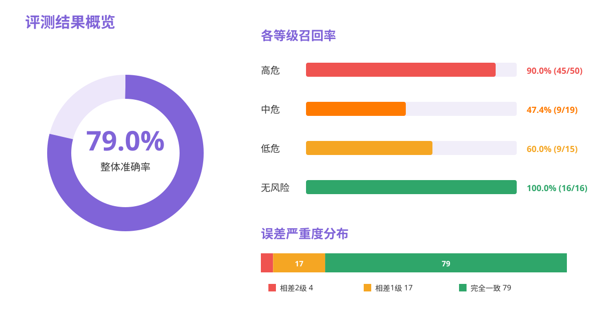
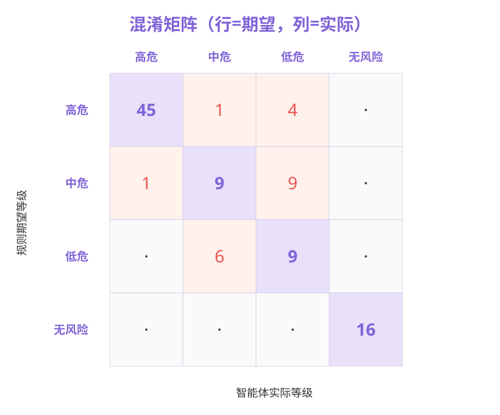
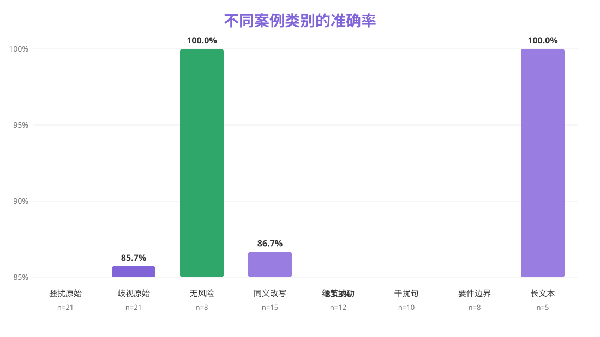

# 她眼·言行雷达智能体评测结果数据分析报告

> [!CAUTION]
> **本报告已被独立复核结果取代。** 第 101-1000 条 F-Q 已在不使用智能体要件输出的情况下重新标注，并由 `risk_level.py` 重算答案。请以 [独立复核后评测结果.md](独立复核后评测结果.md) 为准；复核后的完整数据集准确率为 **76.3%**（763/1,000）。

> **评测样本：** 1,000 条
> **评测日期：** 2026-08-09
> **期望等级：** 根据人工要件标注（F-Q 列）运行 `risk_level.py` 得到的 `final_level`
> **实际等级：** 元器平台智能体返回的 `agent_result`
> **标签口径：** “无关”与“无风险”统一为“无风险”

---

## 一、评测结论

本次评测共覆盖 1,000 条职场性骚扰、性别歧视、无风险及多类变体案例。智能体严格等级准确率为 **96.5%**（965/1,000，95% CI：95.2%-97.5%），宏平均 F1 为 **95.7%**。在允许相差 1 个风险等级的情况下，准确率达到 **99.6%**（996/1,000，95% CI：99.0%-99.8%）。

核心指标如下：

| 指标 | 结果 | 说明 |
|---|---:|---|
| 整体准确率 | **96.5%**（965/1,000） | 智能体等级与规则等级完全一致 |
| 高危召回率 | **97.8%**（453/463） | 10 条高危案例被低估 |
| 中危召回率 | **94.3%**（164/174） | 10 条中危案例被错分 |
| 低危召回率 | **92.6%**（175/189） | 各等级中召回率最低 |
| 无风险召回率 | **99.4%**（173/174） | 仅 1 条无风险案例被判为低危 |
| 宏平均 F1 | **95.7%** | 四个等级的 F1 等权平均 |
| ±1 级容忍准确率 | **99.6%**（996/1,000） | 仅 4 条案例相差 2 个等级 |

### 总体判断

智能体已具备较稳定的风险分级能力，尤其是高危识别和无风险排除表现突出。主要误差集中在低危与中危之间的边界判断；严重漏判数量较少，但仍有 4 条高危案例被判为低危，应作为后续优化的最高优先级。

---

## 二、数据集与评测方法

### 2.1 数据构成

规则期望等级的分布如下：

| 期望等级 | 样本数 | 占比 |
|---|---:|---:|
| 高危 | 463 | 46.3% |
| 中危 | 174 | 17.4% |
| 低危 | 189 | 18.9% |
| 无风险 | 174 | 17.4% |
| **合计** | **1,000** | **100.0%** |

数据集包含 500 条基础案例和 500 条变体案例。变体覆盖同义改写、细节扰动、干扰句、要件边界和长文本，用于检验智能体在表达变化与无关信息干扰下的稳定性。

### 2.2 计算口径

1. 使用 F-Q 列的人工要件标注构造 `elements_check`、`aggravating_factors` 和 `discrimination_severity`。
2. 逐行调用 `risk_level.py` 的 `compute_risk_level()`，得到规则期望等级 `final_level`。
3. 将智能体返回的“无关”统一映射为“无风险”。
4. 当 `final_level == agent_result` 时记为 `T`，否则记为 `F`。
5. 置信区间采用二项分布 Wilson 95% 置信区间。

> **解释边界：** 本报告衡量的是智能体与当前人工要件标注及规则代码的一致性，不等同于对真实司法结论或法律责任的独立验证。

---

## 三、混淆矩阵与各等级表现

### 3.1 混淆矩阵原始数据

行表示规则期望等级，列表示智能体实际等级。

| 期望 \ 实际 | 高危 | 中危 | 低危 | 无风险 | 合计 |
|---|---:|---:|---:|---:|---:|
| 高危 | **453** | 6 | 4 | 0 | 463 |
| 中危 | 1 | **164** | 9 | 0 | 174 |
| 低危 | 0 | 14 | **175** | 0 | 189 |
| 无风险 | 0 | 0 | 1 | **173** | 174 |
| **合计** | **454** | **184** | **189** | **173** | **1,000** |

### 3.2 分类指标

| 等级 | 精确率 | 召回率 | F1 | 95% CI（召回率） |
|---|---:|---:|---:|---:|
| 高危 | 99.8% | 97.8% | 98.8% | 96.1%-98.8% |
| 中危 | 89.1% | 94.3% | 91.6% | 89.7%-96.8% |
| 低危 | 92.6% | 92.6% | 92.6% | 88.0%-95.5% |
| 无风险 | 100.0% | 99.4% | 99.7% | 96.8%-99.9% |

### 3.3 关键观察

1. **高危判断精确率最高。** 智能体判为高危的 454 条案例中，仅 1 条规则期望为中危，说明高危输出较为可信。
2. **中危是最容易吸收边界误差的等级。** 智能体判为中危的 184 条案例中，有 14 条实际为低危、6 条实际为高危，中危精确率为 89.1%。
3. **低危召回率最低。** 14 条低危案例被提升为中危，说明智能体对轻度、模糊但带有性别或性化信息的案例略偏谨慎。
4. **无风险排除能力稳定。** 174 条无风险案例中仅 1 条被判为低危，没有被判为中危或高危。

---

## 四、稳健性与分组表现

### 4.1 不同案例类别准确率

| 案例类别 | 正确数 | 总数 | 准确率 |
|---|---:|---:|---:|
| 无关-无风险 | 80 | 80 | **100.0%** |
| 变体-同义改写 | 147 | 150 | **98.0%** |
| 变体-要件边界 | 78 | 80 | **97.5%** |
| 歧视原始案例 | 203 | 210 | **96.7%** |
| 变体-细节扰动 | 116 | 120 | **96.7%** |
| 变体-干扰句 | 96 | 100 | **96.0%** |
| 变体-长文本 | 47 | 50 | **94.0%** |
| 骚扰原始案例 | 198 | 210 | **94.3%** |

### 4.2 按问题类型统计

| 类型 | 正确数 | 总数 | 准确率 |
|---|---:|---:|---:|
| 暂不明确/无风险 | 171 | 172 | **99.4%** |
| 性别歧视 | 413 | 424 | **97.4%** |
| 性骚扰 | 380 | 402 | **94.5%** |
| 性骚扰+性别歧视 | 1 | 2 | **50.0%** |

双类型案例仅有 2 条，样本量不足，50.0% 不宜直接解释为稳定性能结论。性骚扰案例准确率低于性别歧视案例 2.9 个百分点，主要原因是“违背意愿”“性化程度”和“轻微言行是否升级为中危”等要件更具解释空间。

### 4.3 稳健性结论

- 同义改写准确率达到 98.0%，说明模型对措辞变化较稳定。
- 要件边界变体准确率为 97.5%，说明规则边界整体可被模型识别。
- 长文本准确率最低（94.0%），提示背景信息增加后，模型可能提高风险判断或忽略关键要件。
- 干扰句准确率为 96.0%，未出现大规模受无关信息诱导的情况。

---

## 五、误差严重度分析

35 条不一致案例可按等级距离分为：

| 误差等级距离 | 数量 | 占全部样本 | 占错误样本 |
|---|---:|---:|---:|
| 相差 1 级 | 31 | 3.1% | 88.6% |
| 相差 2 级 | 4 | 0.4% | 11.4% |
| 相差 3 级/完全相反 | 0 | 0.0% | 0.0% |

误差方向如下：

| 规则等级 → 智能体等级 | 数量 | 方向 |
|---|---:|---|
| 低危 → 中危 | 14 | 高估 1 级 |
| 中危 → 低危 | 9 | 低估 1 级 |
| 高危 → 中危 | 6 | 低估 1 级 |
| 高危 → 低危 | 4 | **低估 2 级** |
| 中危 → 高危 | 1 | 高估 1 级 |
| 无风险 → 低危 | 1 | 高估 1 级 |

### 5.1 严重漏判

4 条高危被判为低危，是本次评测中风险最高的错误：

| ID | 主要事实 | 规则判断 | 智能体判断 |
|---|---|---:|---:|
| H2 | 出差期间强行进入房间，拒绝后持续拍门辱骂 | 高危 | 低危 |
| H15 | 多次单独邀约，拒绝后仍持续，伴随职权关系 | 高危 | 低危 |
| V_bd_05 | 明确以奖金要挟接受单独邀约 | 高危 | 低危 |
| V_pp_01 | 以升职利益交换陪酒，拒绝后仍持续 | 高危 | 低危 |

这些案例共同涉及明确拒绝、持续行为或职权胁迫。建议在智能体提示词或判定逻辑中，将“拒绝后继续”和“以奖金/升职/录用相要挟”设置为不可被弱化的高危触发条件。

### 5.2 高危被判为中危

6 条高危被判为中危：`H14`、`E_DM_005`、`E_DM_029`、`E_DM_037`、`E_DM_053`、`E_PT_066`。

其中 5 条与产假返岗后项目被转移、岗位被实质削弱有关。智能体可能识别了区别对待，但对“已经造成实质就业损害”的权重不足。

### 5.3 低危与中危边界

低危和中危之间共有 23 条双向误差：14 条被高估、9 条被低估。高频事实包括：

- 婚育询问或性别刻板印象，但尚未造成就业后果；
- “美女方案”“靠外貌说服客户”等性化评价；
- 单次荤段子、外貌评价、模糊邀约；
- h1 或 h2 为“存疑”的边界案例。

这些误差更多体现模型与规则对模糊事实权重的差异，而不是完全未识别风险类型。

---

## 六、全部不一致案例清单

| 规则等级 → 智能体等级 | 数量 | 案例 ID |
|---|---:|---|
| 高危 → 低危 | 4 | H2、H15、V_bd_05、V_pp_01 |
| 高危 → 中危 | 6 | H14、E_DM_005、E_DM_029、E_DM_037、E_DM_053、E_PT_066 |
| 中危 → 低危 | 9 | H6、H7、H8、H10、H16、V_pp_06、V_pt_03、V_pt_06、V_dt_10 |
| 中危 → 高危 | 1 | D15 |
| 低危 → 中危 | 14 | H11、D17、D18、V_bd_07、V_dt_03、V_dt_07、E_HM_008、E_HM_016、E_HM_032、E_PP_107、E_PT_084、E_DT_032、E_VB_002、E_VB_042 |
| 无风险 → 低危 | 1 | E_VB_020 |

---

## 七、关键发现与改进建议

### 发现 1：整体等级判断已经稳定

- **观察：** 严格准确率 96.5%，宏平均 F1 为 95.7%。
- **解释：** 模型能够稳定识别高危、无风险及大部分歧视/骚扰案例。
- **影响：** 当前版本已适合用于风险提示和辅助分流，但不应替代法律判断。
- **下一步：** 固定当前版本作为基线，后续修改均以同一测试集回归验证。

### 发现 2：高危漏判数量少但影响最大

- **观察：** 高危召回率 97.8%，仍有 10 条高危被低估，其中 4 条被判为低危。
- **解释：** 模型可能在温和措辞、间接要挟或无直接肢体接触时降低风险等级。
- **影响：** 对用户安全和维权决策可能造成实质影响。
- **下一步：** 增加“职权交换”“明确拒绝后继续”“实质就业损害”的高危硬约束和针对性测试。

### 发现 3：中低危边界仍有摇摆

- **观察：** 35 条错误中有 23 条发生在低危与中危之间。
- **解释：** h1/h2 为“存疑”时，智能体的事实权重与 `risk_level.py` 不完全一致。
- **影响：** 不影响是否存在风险的总体判断，但会影响处置建议的紧迫程度。
- **下一步：** 在输出中显式说明触发的要件状态，并针对“存疑”案例校准风险等级。

### 发现 4：长文本表现略弱

- **观察：** 长文本准确率 94.0%，低于同义改写和边界变体。
- **解释：** 背景、绩效、时间和证据描述可能分散模型对核心行为的注意力。
- **影响：** 真实用户往往会输入长叙述，该差异具有实际意义。
- **下一步：** 扩充长文本样本，并测试“先抽取核心事实，再进行等级判定”的两阶段流程。

---

## 八、最终结论

本次 1,000 条评测表明，智能体与要件标注规则的总体一致率达到 **96.5%**，±1 级容忍准确率达到 **99.6%**。高危与无风险识别表现尤其稳定，说明系统已经具备较好的风险筛查能力。

后续优化应聚焦两类问题：第一，减少职权胁迫、拒绝后持续及实质就业损害案例的严重漏判；第二，统一低危与中危边界案例中“存疑”要件的权重。完成这两类定向优化后，整体表现预计仍有进一步提升空间。

---

## 附录：数据与代码

- 数据文件：`eval/annotation_filled.csv`
- 规则代码：`eval/risk_level.py`
- 核心字段：`final_level`、`agent_result`、`match`
- 图表目录：`eval/analysis_assets/`
