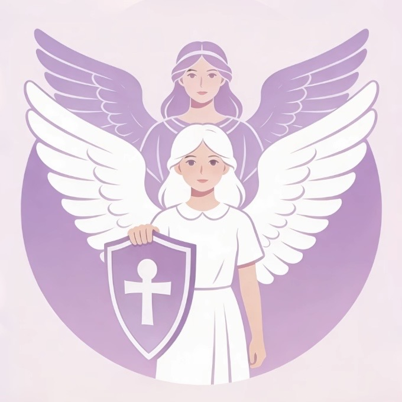

# 「她盾」——职场女性权益守护智能体

<p align="center">
  
</p>

<p align="center">
  <strong>你的身后，站着一个懂法更懂你的"她"</strong><br>
  <em>AI驱动的职场女性权益守护伴侣</em>
</p>

<p align="center">
  精准识别 · 证据保全 · 路径指引 · 情感支持
</p>

<p align="center">
  <a href="#-项目介绍">项目介绍</a> •
  <a href="#-核心功能">核心功能</a> •
  <a href="#-技术架构">技术架构</a> •
  <a href="#-快速开始">快速开始</a>
</p>

---

> **2026 腾讯开悟全球 AI 公开赛 · D06 法律 AI 应用创新与实践**
> 第十七届中国大学生服务外包创新创业大赛 AI 专项赛参赛作品
> 团队：她说了算队

---

## 📖 项目介绍

### 项目宣言

**「她盾」** —— 职场女性权益守护智能体

> 在你犹豫时，给你破局的底气
> 
> 在你受伤时，给你拥抱的温度

### 核心定位

**她盾，不只是一个工具，而是一套「从情绪到行动」的完整解决方案**

当职场女性遭遇性别歧视或性骚扰时，真正的困境从来不是单一问题，而是一条断裂链：

- 🔴 **不确定**这算不算违法
- 🔴 **不知道**该如何应对
- 🔴 **不会**收集证据
- 🔴 **不敢**迈出维权第一步

👉 **她盾的目标，就是把这条断裂链重新接上**

### 核心价值

| 转变前 | → | 转变后 |
|--------|:-:|--------|
| 情绪失控 | → | 认知清晰 |
| 无从下手 | → | 路径明确 |
| 孤立无援 | → | 被支持、有底气 |

**核心创新：** 法律能力 × AI效率 × 情感承接 的融合型智能体

| 方案类型 | 特点 |
|----------|------|
| 传统法律平台 | 专业但冷 |
| 社区平台 | 有共鸣但不专业 |
| **她盾** | 👉 **既能判断，也能陪伴；既给答案，也给支撑** |

---

## ✨ 核心功能

### 六大智能模块

#### 🔍 判断层（让用户"看清"）

| 模块 | 描述 | 核心能力 |
|------|------|----------|
| **她眼·言行雷达** | 识别职场不当言行，提供应对建议 | ⚡ 实时违法判定 · 📖 法条白话解读 · 💬 三档话术生成 |
| **她权·权利指南** | 快速检测权益状况，明确维权方向 | 🎯 场景化匹配 · 📊 权利清单可视化 · 🔍 法律依据可追溯 |

#### 🧾 证据层（让用户"有底气"）

| 模块 | 描述 | 核心能力 |
|------|------|----------|
| **她证·证据保全** | 专业指导证据收集，增强维权底气 | 🔗 证据链思维引导 · 📋 六大典型场景方案 · ⚖️ 合法边界提示 |

#### 🧭 行动层（让用户"能行动"）

| 模块 | 描述 | 核心能力 |
|------|------|----------|
| **她行·行动导航** | 全流程维权路径，专业步骤指导 | 📊 六步阶梯路径 · ⏰ 关键时效提醒 · 🔀 分支决策支持 |

#### 💬 支持层（让用户"不崩溃"）

| 模块 | 描述 | 核心能力 |
|------|------|----------|
| **她心·情绪树洞** | 情感倾诉支持，暖心陪伴倾听 | 💖 情绪优先原则 · 🌈 非评判式回应 · 🫂 共情式交互 |
| **她声·共鸣回响** | 分享维权经历，互助成长社区 | 🎭 匿名化保护 · 📚 真实案例库 · 🤝 同伴互助机制 |

### 典型使用路径

```
📌 不确定是否性别歧视/骚扰？ → 她眼·言行雷达
📌 想知道当前状态受哪些保护？ → 她权·权利指南
📌 准备维权？ → 她证·证据保全 → 她行·行动导航
📌 感到委屈、害怕、纠结？ → 她心·情绪树洞
📌 想看其她人的维权故事？ → 她声·共鸣回响
```

---

## 🎯 使用场景

### 场景一：面试遭遇婚育隐形歧视（求职期）

**用户画像：** 小李 · 25岁应届生 · 面试互联网公司产品经理岗

1. **实时雷达扫描：** 面试结束后立即打开「她眼·言行雷达」，输入HR的追问
2. **AI 法律定性：** 系统判定该问题涉嫌违反《妇女权益保障法》第43条
3. **话术一键生成：** 获取「高情商回怼」建议
4. **维权路径指引：** 若因此未被录用，「她行·维权导航」提供投诉流程

**结果：** ✅ 小李不再内耗，用生成的话术礼貌反问，面试顺利进入下一轮

### 场景二：孕期被恶意调岗降薪（在职博弈）

**用户画像：** 张女士 · 32岁 · 怀孕4个月 · 被口头通知调岗降薪

1. **权益确权：** 在「她权·权益指南」输入现状，系统高亮显示相关法律保护
2. **诱导取证：** 「她证·证据保全」生成取证攻略
3. **全流程导航：** 「她行·维权导航」规划三步走战略

**结果：** ✅ 公司意识到违法成本过高，主动撤回调岗通知

### 场景三：深夜遭遇职场性骚扰（危机应对）

**用户画像：** 王女士 · 28岁 · 深夜收到直属领导露骨的暧昧微信

1. **情感急救：** 第一时间进入「她心·情绪树洞」
2. **隐形取证：** 使用「她证·证据保全」的"无痕指引"模式
3. **共鸣回响：** 在「她声·共鸣回响」看到类似案例的胜诉经历

**结果：** ✅ 证据链闭环，公司介入调查并处理了涉事领导

---

## 🛠️ 技术架构

### 技术栈

| 架构层 | 技术组件 | 作用 |
|--------|----------|------|
| 交互层 | HTML5 + CSS3 + Vanilla JS · Electron 桌面端 | 零依赖纯静态，低门槛高兼容，支持一键部署 |
| 智能层 | 腾讯元器 5 大专用智能体（Bearer Token 鉴权） | 场景识别、法条匹配、证据指导、维权路径、情感支持 |
| 调用层 | `yuanqi.tencent.com/openapi/v1/agent/chat/completions` | 统一 API 入口 |
| 知识层 | 妇女权益保障法 · 劳动合同法 · 民法典 · 劳动法 · 女职工劳动保护特别规定 | 注入各智能体 System Prompt |
| 安全层 | HTTPS · 免责声明 · 不存储用户敏感输入 | 保护用户隐私安全 |

### 技术亮点

- 5 个独立智能体各司其职，职责边界清晰可独立迭代
- 模拟数据降级机制保障演示可用性
- 会话 ID 管理实现多轮对话连续追问
- 清晰的 placeholder 示例与加载反馈降低非技术用户使用门槛

---

## 📁 项目结构

```
Her_shield/
├── index.html          # 主页入口
├── features.html       # 核心功能页面
├── logo.png            # 项目 Logo
├── package.json        # 项目配置文件
├── Dockerfile          # Docker 部署配置
├── css/
│   └── style.css       # 全局样式文件
├── js/
│   └── app.js          # JavaScript 业务逻辑
└── electron/
    └── main.js         # Electron 主进程
```

---

## 🚀 快速开始

### 方式一：Web 端预览

```bash
# 进入项目目录
cd Her_shield

# 方式1：使用 npm script
npm run dev

# 方式2：直接使用 npx
npx http-server . -p 8080 -c-1
```

然后访问 http://localhost:8080

### 方式二：Electron 桌面端

```bash
# 进入项目目录
cd Her_shield

# 安装 Electron（首次运行）
npm run install-electron

# 启动桌面应用
npm start
```

### 方式三：Docker 部署

```bash
# 构建镜像
docker build -t tad-shield .

# 运行容器
docker run -d -p 8080:80 tad-shield

# 访问 http://localhost:8080
```

---

## 🔌 腾讯元器智能体对接

项目已预留与腾讯元器智能体的对接接口，请在 `js/app.js` 中的对应函数位置配置实际的 API：

| 函数名 | 功能模块 |
|--------|---------|
| `callSmartAgent_radar()` | 她眼·言行雷达 |
| `callSmartAgent_selfcheck()` | 她权·权利指南 |
| `callSmartAgent_evidence()` | 她证·证据保全 |
| `callSmartAgent_guide()` | 她行·行动导航 |
| `callSmartAgent_harbor()` | 她心·情绪树洞 |

---

## 🎨 设计规范

### 颜色体系

| 用途 | 色值 | 说明 |
|-----|------|------|
| 主色调 | `#9370DB` | 暖紫色，代表女性力量与温柔 |
| 辅助色 | `#F5F5F5` | 浅灰色背景 |
| 文字色 | `#333333` | 主要文字颜色 |
| 强调色 | `#000000` | 重点强调内容 |

### 设计特点

- 🌸 简洁优雅的界面风格
- 📱 响应式设计，适配多种设备
- ♿ 注重无障碍访问体验

---

## 💡 社会价值

### 她盾的意义，不只是解决问题，而是在改变一种"沉默结构"

现实中，大多数女性不是不维权，而是：

- 不确定自己是否"有资格维权"
- 不知道从哪里开始
- 在犹豫中错过最佳时机

👉 **她盾所做的，是：**

| 降低门槛 | 具体实现 |
|----------|----------|
| 🧠 降低维权的**心理门槛** | 情绪承接、陪伴支持，让用户不再孤单 |
| 📋 降低行动的**信息门槛** | 法条白话解读、权利清单明确 |
| 🔧 降低证据收集的**技术门槛** | 操作级取证指导，一步步教用户如何保存证据 |

### 在冷冰冰的算法与代码之外

我们始终坚信：**技术是理性的，但使用技术的人是有温度的。**

**对于个人而言**，"她盾"是深夜里的一盏灯，是口袋里随时待命的律师，让每一次求助都有回应，让每一份委屈都有归处。

**对于社会而言**，我们不仅是在解决个案，更是在积累一份中国职场性别环境的"风险洞察"，推动职场文明从"事后补救"走向"事前预防"。

---

## 👥 关于团队

- **团队名称**: 她说了算队
- **参赛赛道**: 2026 腾讯开悟全球 AI 公开赛 · D06 法律 AI 应用创新与实践
- **开发工具**: CodeBuddy / 腾讯元器 / 得理开放平台 API
- **技术形态**: 轻量化 Web 应用（HTML5 + CSS3 + Vanilla JS）+ 腾讯元器 5 大专用智能体 API 接入 + Electron 桌面端封装

---

## ⚖️ 法律声明

> **免责声明**: 本智能体仅提供法律信息参考，不构成专业法律意见，具体维权请咨询执业律师。

### 实用热线

- 📞 **全国劳动维权热线**: 12333
- 📞 **法律援助热线**: 12348
- 📞 **妇女权益保护热线**: 12338

---

## 📄 许可证

本项目采用 [MIT License](LICENSE) 开源协议。

---

<p align="center">
  <strong>她盾</strong> —— 用科技守护每一位职场女性的权益 🌸
</p>

<p align="center">
  <em>让每一位职场女性在面对性别歧视或性骚扰时不再孤立无援——<br>
  知道自己有什么权利、知道对方哪里违法、知道下一步怎么办。</em>
</p>

<p align="center">
  © 她说了算队
</p>
